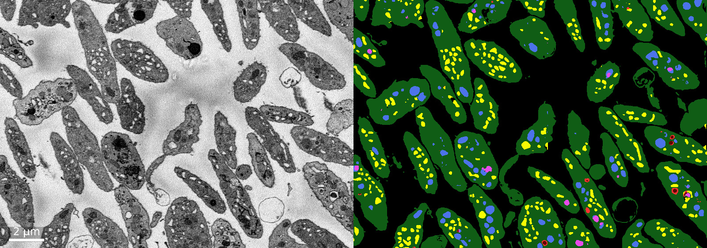

# Dense cellular segmentation using 2D-3D neural network ensembles for electron microscopy

A hub for the paper, data, and code associated with the [(Guay et al., 2019) paper](https://biorxiv.org/cgi/content/short/2020.01.05.895003v1) by [LCIMB, NIBIB](https://www.nibib.nih.gov/labs-at-nibib/laboratory-cellular-imaging-and-macromolecular-biophysics-lcimb).

### Full text

[Read on Biorxiv](https://biorxiv.org/cgi/content/short/2020.01.05.895003v2)

---

<iframe width="560" height="315" src="https://www.youtube.com/embed/ch9uEl9FbNI" frameborder="0" allow="accelerometer; autoplay; encrypted-media; gyroscope; picture-in-picture" allowfullscreen></iframe>

<div style="text-align: center">
<a href="fig1.png"></a>
<a href="fig2.png"></a>
<p style="margin-bottom: 15px;"><i>Click to enlarge</i></p>
</div>

### Abstract

> Modern biological electron microscopy produces nanoscale images from biological samples of unprecedented volume, and researchers now face the problem of making use of the data. Image segmentation has played a fundamental role in EM image analysis for decades, but challenges from biological EM have spurred interest and rapid advances in computer vision for automating the segmentation process. In this paper, we demonstrate dense cellular segmentation as a method for generating rich, 3D models of tissues and their constituent cells and organelles from scanning electron microscopy images. We describe how to use ensembles of 2D-3D neural networks to compute dense cellular segmentations of cells and organelles inside two human platelet tissue samples. We conclude by discussing ongoing challenges for realizing practical dense cellular segmentation algorithms.

### Data

[Download ZIP](https://www.dropbox.com/s/68yclbraqq1diza/platelet_data_1219.zip) (180 MB)

---

# Examples

Examples of training and using neural nets for segmenting 3D biomedical SEM images.

* [Example 1: Try 2D-3D+3x3x3](example1_try_2d3d.html): Download trained 2D-3D+3x3x3 nets, use them to segment downloaded platelet data.

* [Example 2: Train 2D-3D+3x3x3](example2_train_2d3d.html): Download platelet data, train a 2D-3D+3x3x3 net to segment it.

* [Example 3: Train 2D U-Net](example3_train_unet.html): Download platelet data, train a 2D U-Net from (Ronneberger et al., 2015) to segment it. 

---

## Setup

#### Requirements

This setup was tested on Ubuntu 18.04 with an NVIDIA GTX 1080, using Python 3.6 and TensorFlow 1.15. Information for installing TensorFlow 1.15 with GPU support can be found at [https://www.tensorflow.org/install/gpu](https://www.tensorflow.org/install/gpu).

#### Clone repo

To get all examples, we recommend using `git` to clone our example repo. Zipped source code for each example can also be found in the example descriptions below.

```bash
git clone https://github.com/leapmanlab/examples
cd examples
```

#### Python setup

We recommend using a Python virtual environment. Install packages from _examples/requirements.txt_.

```bash
python3 -m venv leapmanlab
source leapmanlab/bin/activate
pip3 install --upgrade pip
pip3 install -r requirements.txt
# Add a jupyter kernel for the venv
ipython kernel install --user --name=leapmanlab
```

You should now be able to run example notebooks! Each folder within _examples_ contains a separate, self-contained example.

---

## Example 1: Try out a 2D-3D+3x3x3 net

Download the top four trained 2D-3D+3x3x3 instances from (Guay et al., 2019) and the platelet SBF-SEM dataset, and use one or more to segment the data.

[View Notebook](example1_try_2d3d.html)

From the _examples_ directory, with the venv active, you can run the Example 1 notebook locally with:

```bash
cd example1
jupyter notebook example1_try_2d3d.ipynb
```

[Download Example 1 Source](https://www.dropbox.com/s/tmpeg1oofk2zxjv/example1_0105.zip?dl=1)

---

## Example 2: Train a 2D-3D+3x3x3 net

Train a 2D-3D+3x3x3 net on the (Guay et al., 2019) platelet SBF-SEM dataset, and try out
the trained network for segmenting new data.

[View Notebook](example2_train_2d3d.html)

From the _examples_ directory, with the venv active, you can run the Example 2 notebook locally with:

```bash
cd example2
jupyter notebook example2_train_2d3d.ipynb
```

[Download Example 2 Source](https://www.dropbox.com/s/wq6tfzfrabg2k8b/example2_0105.zip?dl=1)


---

## Example 3: Train a 2D U-Net

Train the original 2D U-Net from (Ronneberger et al., 2015) [PDF](https://arxiv.org/pdf/1505.04597.pdf) on the (Guay et al., 2019) platelet SBF-SEM dataset, and try out the trained network for segmenting new data.

[View Notebook](example3_train_unet.html)

From the _examples_ directory, with the venv active, you can run the Example 3 notebook locally with:

```bash
cd example3
jupyter notebook example3_train_unet.ipynb
```

[Download Example 3 Source](https://www.dropbox.com/s/0toqhb6tbsny01y/example3_0105.zip?dl=1)

