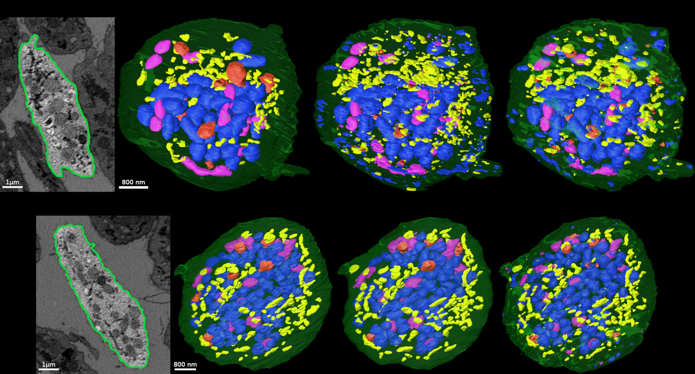

# Dense cellular segmentation for EM using 2D-3D neural network ensembles

### Abstract

>  Cell biologists can now build 3D models from segmentations of electron microscopy (EM) images, but accurate manual segmentation of densely-packed organelles across gigavoxel image volumes is infeasible. Here, we introduce 2D-3D neural network ensembles that produce dense cellular segmentations at scale, with accuracy levels that outperform baseline methods and approach those of human annotators.

A hub for the paper, data, and code associated with the [(Guay et al., 2021) paper](https://biorxiv.org/cgi/content/short/2020.01.05.895003v4) by [LCIMB, NIBIB](https://www.nibib.nih.gov/labs-at-nibib/laboratory-cellular-imaging-and-macromolecular-biophysics-lcimb).

### Publication

[Read the full text from Scientific Reports](https://www.nature.com/articles/s41598-021-81590-0)

---

<div style="text-align: center">
<a href="fig1.png"></a>
<p style="margin-top: -10px; margin-bottom: 15px;"><i>Click to enlarge</i></p>
<a href="fig2.png"></a>
<p style="margin-top: -10px; margin-bottom: 15px;"><i>Click to enlarge</i></p>
    <div style="position: relative; max-width: 2000px; max-height: 1000px; width: 100%; height: 0; padding-bottom: 50%;">
    <iframe style="position: absolute; width: 100%; height: 100%; left: 0; top: 0;" width="600" height="300" src="https://www.youtube.com/embed/VzXZFNKW9mU" frameborder="0" allow="accelerometer; autoplay; encrypted-media; gyroscope; picture-in-picture" allowfullscreen></iframe>
    </div>
</div>

---

# Data

The EM image datasets, manually-created ground-truth segmentation labels, and the training error weighting array used in the [(Guay et al., 2021) paper](https://biorxiv.org/cgi/content/short/2020.01.05.895003v4) paper are freely available for download to facilitate replication of our results.

[Download ZIP](https://www.dropbox.com/s/68yclbraqq1diza/platelet_data_1219.zip) (180 MB)

---

# Examples

Examples of training and using neural nets for segmenting 3D biomedical SEM images.

* [Example 1: Try 2D-3D+3x3x3](example1_try_2d3d.html): Download trained 2D-3D+3x3x3 nets, use them to segment downloaded platelet data.

* [Example 2: Train 2D-3D+3x3x3](example2_train_2d3d.html): Download platelet data, train a 2D-3D+3x3x3 net to segment it.

* [Example 3: Train 2D U-Net](example3_train_unet.html): Download platelet data, train a 2D U-Net from (Ronneberger et al., 2015) to segment it. 

---

## Setup

#### Requirements

This setup was tested on Ubuntu 18.04 with an NVIDIA GTX 1080, using Python 3.6 and TensorFlow 1.15. Information for installing TensorFlow with GPU support can be found at [https://www.tensorflow.org/install/gpu](https://www.tensorflow.org/install/gpu).

The example repo uses Jupyter notebooks to present example applications. See [jupyter.org/install](https://jupyter.org/install) for Jupyter notebook installation instructions.


#### Clone repo

To get all examples, we recommend using `git` to clone our example repo. Zipped source code for individual examples can also be found in the example descriptions below.

```bash
git clone https://github.com/leapmanlab/examples
cd examples
```

#### Python setup

We recommend using a Python virtual environment (venv). Install packages from _examples/requirements.txt_.

```bash
python3 -m venv leapmanlab
source leapmanlab/bin/activate
pip3 install --upgrade pip
pip3 install -r requirements.txt
python3 -m ipykernel install --user --name=leapmanlab
```

You should now be able to run example notebooks. Each folder within _examples_ contains a separate, self-contained example.

---

## Example 1: Try out a 2D-3D+3x3x3 net

Download the top four trained 2D-3D+3x3x3 instances from (Guay et al., 2019) and the platelet SBF-SEM dataset, and use one or more to segment the data.

[View Notebook](example1_try_2d3d.html)

From the _examples_ directory, with the venv active, you can run the Example 1 notebook locally with:

```bash
cd example1
jupyter notebook example1_try_2d3d.ipynb
```

[Download Example 1 Source](https://www.dropbox.com/s/tmpeg1oofk2zxjv/example1_0105.zip?dl=1)

---

## Example 2: Train a 2D-3D+3x3x3 net

Train a 2D-3D+3x3x3 net on the (Guay et al., 2019) platelet SBF-SEM dataset, and try out
the trained network for segmenting new data.

[View Notebook](example2_train_2d3d.html)

From the _examples_ directory, with the venv active, you can run the Example 2 notebook locally with:

```bash
cd example2
jupyter notebook example2_train_2d3d.ipynb
```

[Download Example 2 Source](https://www.dropbox.com/s/wq6tfzfrabg2k8b/example2_0105.zip?dl=1)


---

## Example 3: Train a 2D U-Net

Train the original 2D U-Net from (Ronneberger et al., 2015) [PDF](https://arxiv.org/pdf/1505.04597.pdf) on the [(Guay et al., 2020)](https://biorxiv.org/cgi/content/short/2020.01.05.895003v4) platelet SBF-SEM dataset, and try out the trained network for segmenting new data.

[View Notebook](example3_train_unet.html)

From the _examples_ directory, with the venv active, you can run the Example 3 notebook locally with:

```bash
cd example3
jupyter notebook example3_train_unet.ipynb
```

[Download Example 3 Source](https://www.dropbox.com/s/0toqhb6tbsny01y/example3_0105.zip?dl=1)

