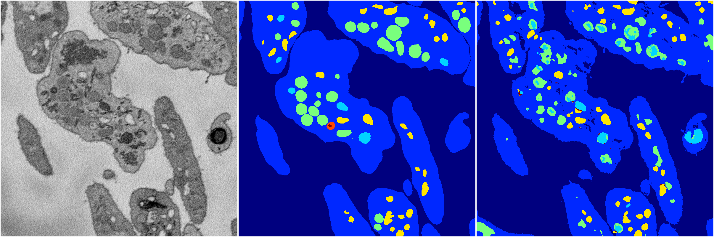

[Back](..)&nbsp;&nbsp;&nbsp;&nbsp;&nbsp;[Home](https://leapmanlab.github.io/snapshots)

---

<a href="weight_volume"><h2>weight_volume</h2></a>
(Created 12 Dec 2018, 22:07:56. Modified 12 Dec 2018, 22:07:56)

<i>Click image for more details</i>

60 nets

**ari**: min 0.7837. max 0.8406. mean 0.8260.  ([best net](weight_volume/1210/001/1))

**miou**: min 0.4114. max 0.6145. mean 0.5323.  ([best net](weight_volume/1210/001/1))

**accuracy**: min 0.9157. max 0.9410. mean 0.9342.  ([best net](weight_volume/1210/001/1))

**n_params**: min 31030983.0000. max 31030983.0000. mean 31030983.0000.  ([best net](weight_volume/1210/0/0))

---

<a href="unet"><h2>unet</h2></a>
(Created 12 Dec 2018, 22:07:56. Modified 12 Dec 2018, 22:07:56)

<i>Click image for more details</i>

1 nets

**ari**: min 0.7698. max 0.7698. mean 0.7698.  ([best net](unet/1212/0))

**miou**: min 0.4304. max 0.4304. mean 0.4304.  ([best net](unet/1212/0))

**accuracy**: min 0.9063. max 0.9063. mean 0.9063.  ([best net](unet/1212/0))

**n_params**: min 31030983.0000. max 31030983.0000. mean 31030983.0000.  ([best net](unet/1212/0))

---

[Back](..)&nbsp;&nbsp;&nbsp;&nbsp;&nbsp;[Home](https://leapmanlab.github.io/snapshots)

---