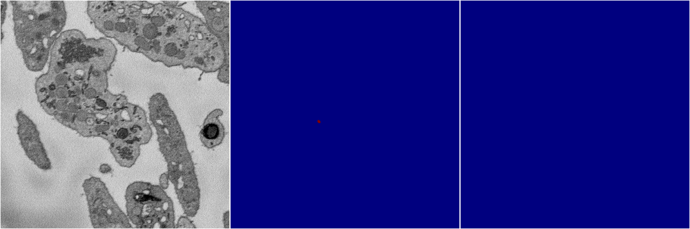

[Back](..)&nbsp;&nbsp;&nbsp;&nbsp;&nbsp;[Home](https://leapmanlab.github.io/snapshots)

---

<a href="weight_volume"><h2>weight_volume</h2></a>
Created 21 Dec 2018, 01:15:55

<i>Click image for more details</i>

60 nets

**ari**: min 0.7837. max 0.8406. mean 0.8260.  ([best net](weight_volume/1210/001/1))

**miou**: min 0.4114. max 0.6145. mean 0.5323.  ([best net](weight_volume/1210/001/1))

**accuracy**: min 0.9157. max 0.9410. mean 0.9342.  ([best net](weight_volume/1210/001/1))

**n_params**: min 31030983.0000. max 31030983.0000. mean 31030983.0000.  ([best net](weight_volume/1210/0/0))

---

<a href="multi_binary"><h2>multi_binary</h2></a>
Created 21 Dec 2018, 01:15:55

<i>Click image for more details</i>

13 nets

**ari**: min -0.0000. max 0.8056. mean 0.4234.  ([best net](multi_binary/1220/5/0))

**miou**: min 0.2369. max 0.4998. mean 0.4749.  ([best net](multi_binary/1220/5/0))

**accuracy**: min 0.4738. max 0.9997. mean 0.9498.  ([best net](multi_binary/1220/5/0))

**n_params**: min 31030658.0000. max 31030658.0000. mean 31030658.0000.  ([best net](multi_binary/1220/0/0))

---

<a href="random_2d_ed"><h2>random_2d_ed</h2></a>
Created 21 Dec 2018, 01:15:55

<i>Click image for more details</i>

969 nets

**ari**: min -0.0000. max 0.8251. mean 0.7016.  ([best net](random_2d_ed/1216/39/1))

**miou**: min 0.0656. max 0.5917. mean 0.3501.  ([best net](random_2d_ed/1210/67/1))

**accuracy**: min 0.4426. max 0.9338. mean 0.8778.  ([best net](random_2d_ed/1210/31/0))

**n_params**: min 40497.0000. max 209610976.0000. mean 15584155.1424.  ([best net](random_2d_ed/1210/46/0))

---

[Back](..)&nbsp;&nbsp;&nbsp;&nbsp;&nbsp;[Home](https://leapmanlab.github.io/snapshots)

---