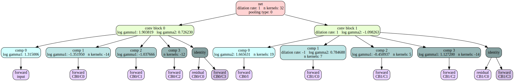
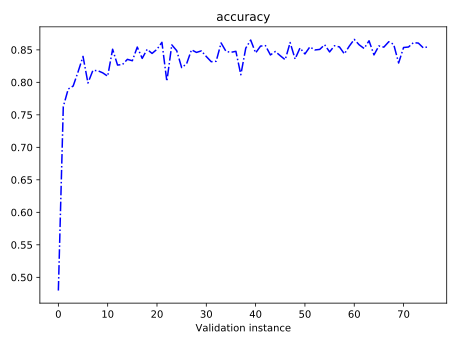
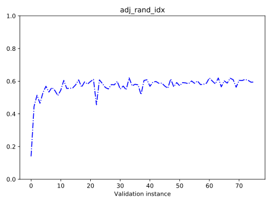
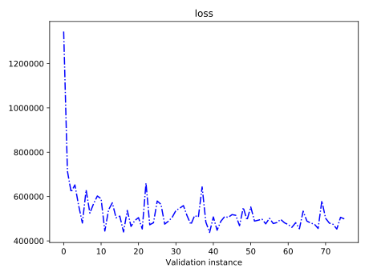
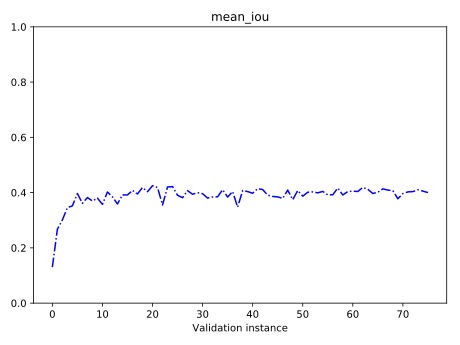
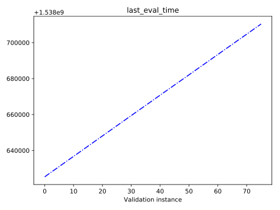
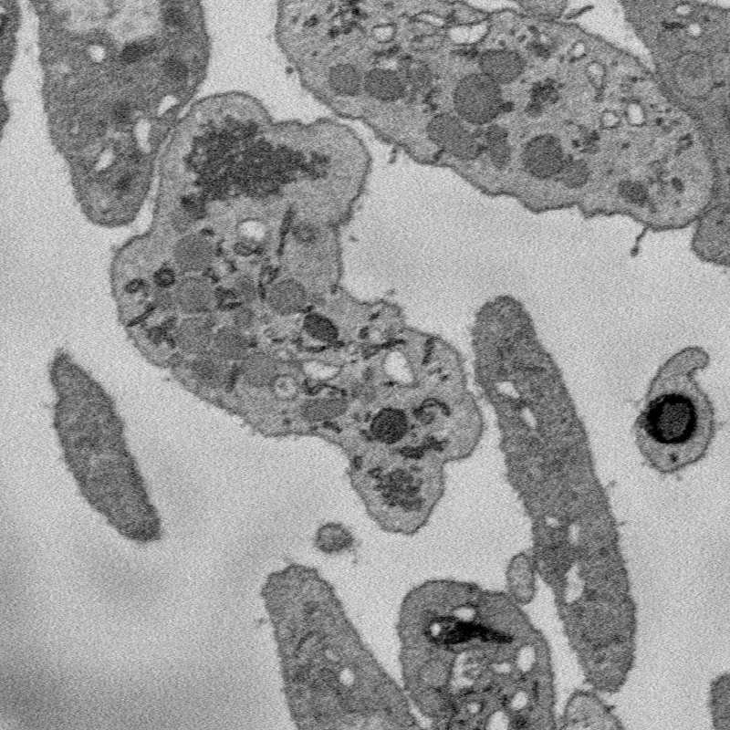
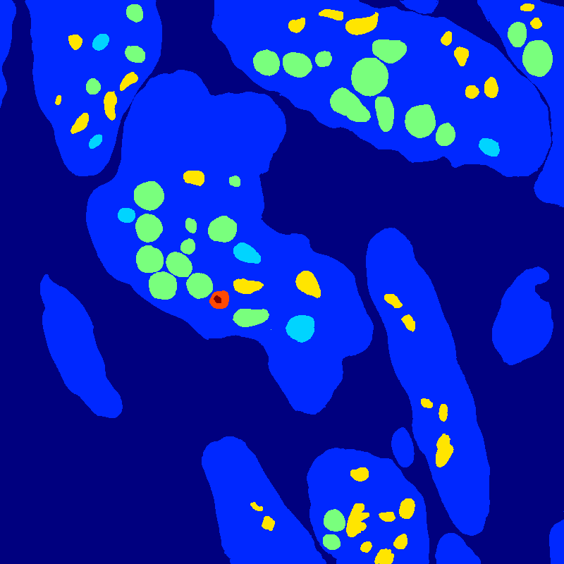
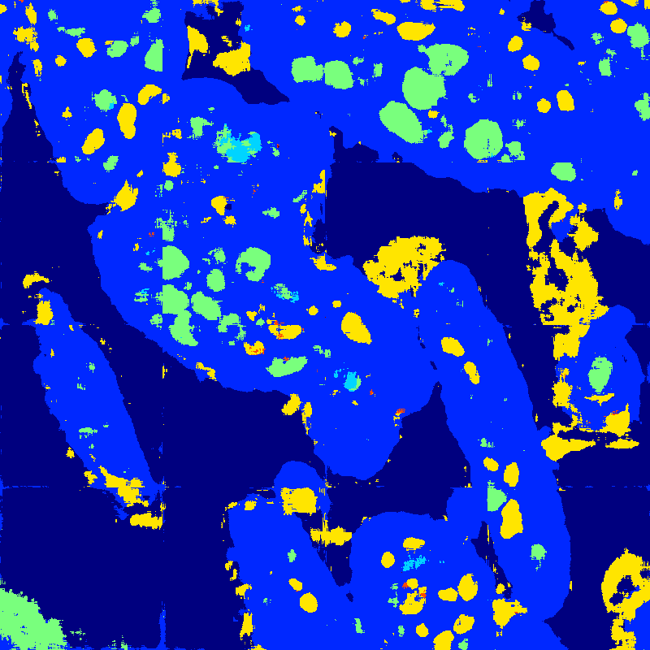

# Random2D_1004_23

### Step 150784 (October 05 2018, 03:33:06)

[_Back_](..)

---

## Summary

summary.png. <i>Click to enlarge</i>

## Gene graph

gene_graph.svg. <i>Click to enlarge</i>

---

## Performance statistics, step 150784

accuracy.svg. <i>Click to enlarge</i>

adj_rand_idx.svg. <i>Click to enlarge</i>

loss.svg. <i>Click to enlarge</i>

mean_iou.svg. <i>Click to enlarge</i>

last_eval_time.svg. <i>Click to enlarge</i>

---

## Data, ground truth label, segmentation

150784_data.png. <i>Click to enlarge</i>

150784_label.png. <i>Click to enlarge</i>

150784_segmentation.png. <i>Click to enlarge</i>

---

