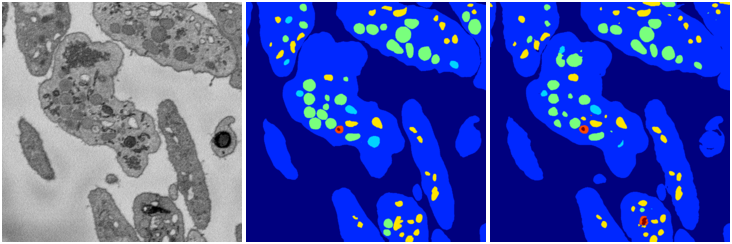
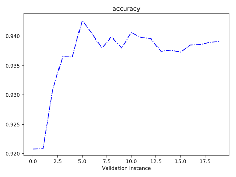
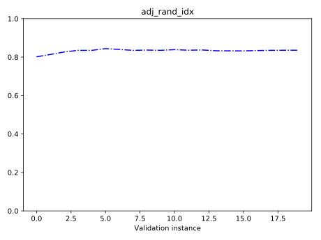
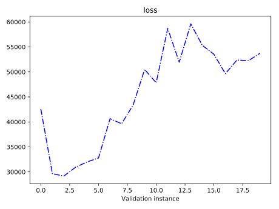
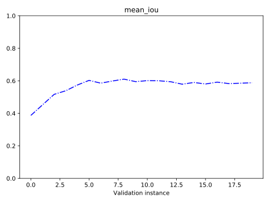
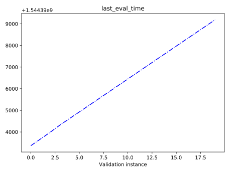
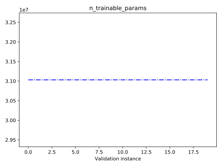
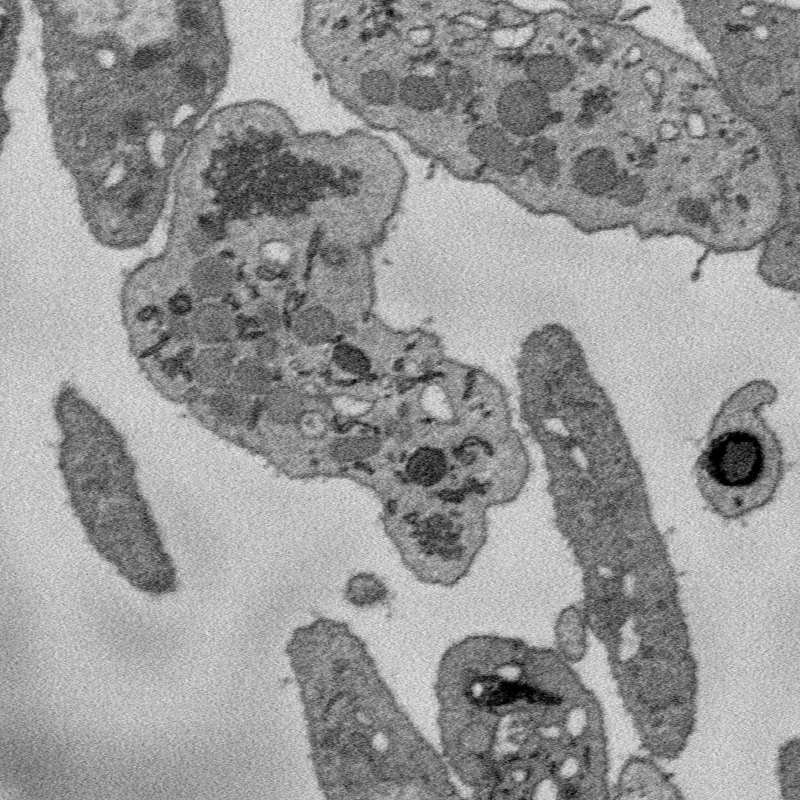
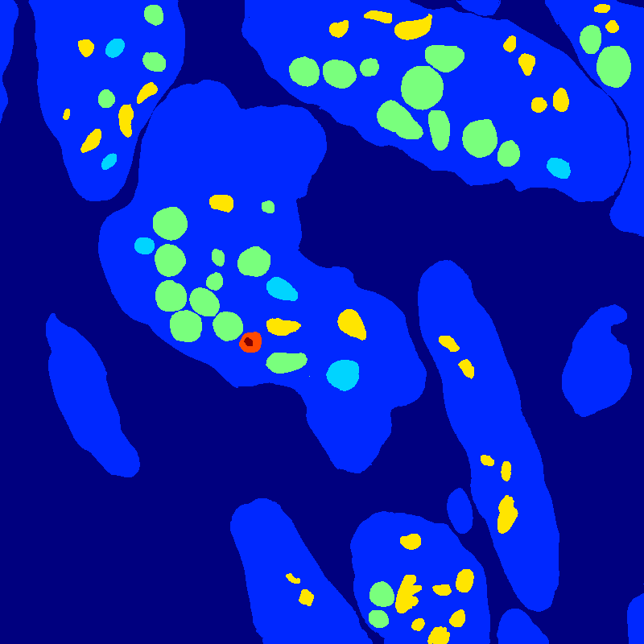
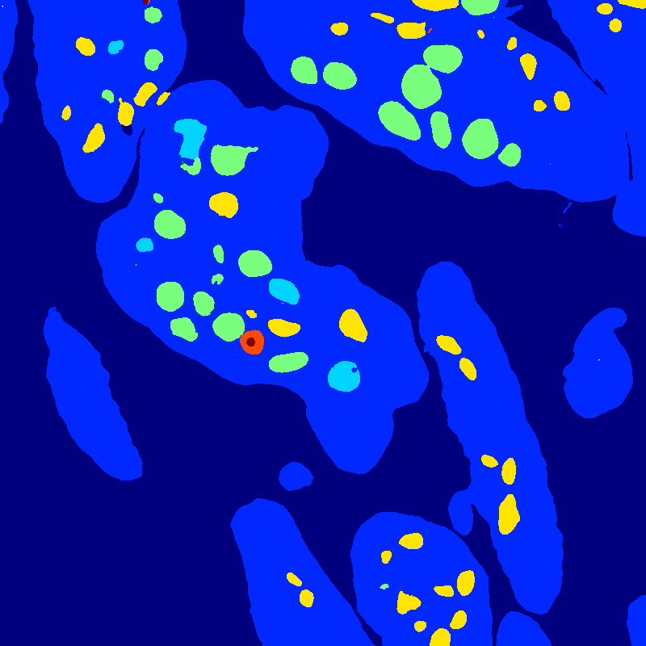

# WeightVolume_025_4

### Step 36000 (December 11 2018, 00:09:23)

[_Back_](..)

---

## Summary

summary.png. <i>Click to enlarge</i>

## Gene graph

gene_graph.svg. <i>Click to enlarge</i>

---

## Performance statistics, step 36000

accuracy.svg. <i>Click to enlarge</i>

adj_rand_idx.svg. <i>Click to enlarge</i>

loss.svg. <i>Click to enlarge</i>

mean_iou.svg. <i>Click to enlarge</i>

last_eval_time.svg. <i>Click to enlarge</i>

n_trainable_params.svg. <i>Click to enlarge</i>

---

## Data, ground truth label, segmentation

36000_data.png. <i>Click to enlarge</i>

36000_label.png. <i>Click to enlarge</i>

36000_segmentation.png. <i>Click to enlarge</i>

---

