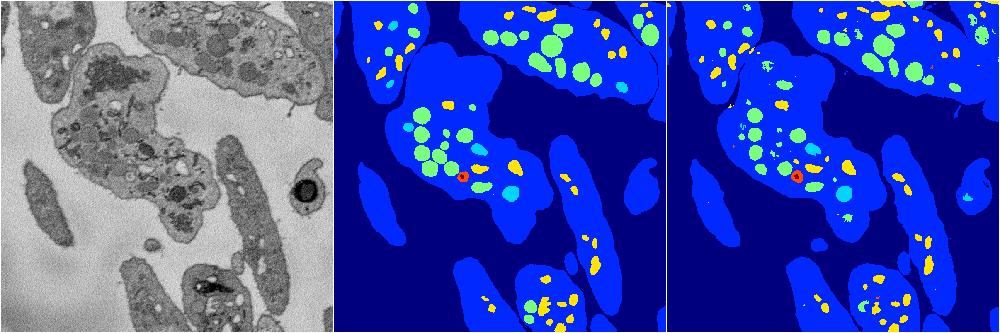
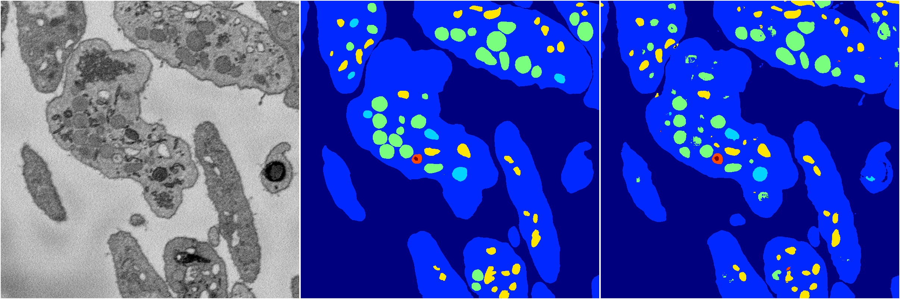
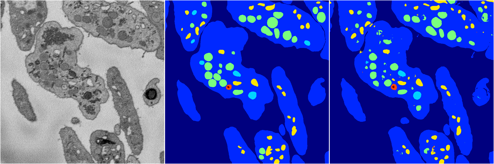

[Back](..)&nbsp;&nbsp;&nbsp;&nbsp;&nbsp;[Home](https://leapmanlab.github.io/snapshots)

---

<a href="1"><h2>hybrid_3d_crf / 0316 / 0 / 1</h2></a>
Created 25 Apr 2019, 13:51:11

<i>Click for more details</i>

**ari**: 0.8357. **miou**: 0.6442. **accuracy**: 0.9391. **n_params**: 691951.0000. 

---

<a href="0"><h2>hybrid_3d_crf / 0316 / 0 / 0</h2></a>
Created 25 Apr 2019, 13:51:11

<i>Click for more details</i>

**ari**: 0.8362. **miou**: 0.6475. **accuracy**: 0.9392. **n_params**: 691951.0000. 

---

<a href="6"><h2>hybrid_3d_crf / 0316 / 0 / 6</h2></a>
Created 25 Apr 2019, 13:51:11

<i>Click for more details</i>

**ari**: 0.8354. **miou**: 0.6449. **accuracy**: 0.9392. **n_params**: 691951.0000. 

---

<a href="10"><h2>hybrid_3d_crf / 0316 / 0 / 10</h2></a>
Created 25 Apr 2019, 13:51:11

<i>Click for more details</i>

**ari**: 0.8356. **miou**: 0.6461. **accuracy**: 0.9389. **n_params**: 691951.0000. 

---

<a href="5"><h2>hybrid_3d_crf / 0316 / 0 / 5</h2></a>
Created 25 Apr 2019, 13:51:11

<i>Click for more details</i>

**ari**: 0.8354. **miou**: 0.6442. **accuracy**: 0.9390. **n_params**: 691951.0000. 

---

<a href="9"><h2>hybrid_3d_crf / 0316 / 0 / 9</h2></a>
Created 25 Apr 2019, 13:51:11

<i>Click for more details</i>

**ari**: 0.8335. **miou**: 0.6469. **accuracy**: 0.9383. **n_params**: 691951.0000. 

---

<a href="18"><h2>hybrid_3d_crf / 0316 / 0 / 18</h2></a>
Created 25 Apr 2019, 13:51:11

<i>Click for more details</i>

**ari**: 0.8358. **miou**: 0.6475. **accuracy**: 0.9392. **n_params**: 691951.0000. 

---

<a href="19"><h2>hybrid_3d_crf / 0316 / 0 / 19</h2></a>
Created 25 Apr 2019, 13:51:11

<i>Click for more details</i>

**ari**: 0.8357. **miou**: 0.6506. **accuracy**: 0.9394. **n_params**: 691951.0000. 

---

<a href="11"><h2>hybrid_3d_crf / 0316 / 0 / 11</h2></a>
Created 25 Apr 2019, 13:51:11

<i>Click for more details</i>

**ari**: 0.8359. **miou**: 0.6302. **accuracy**: 0.9393. **n_params**: 691951.0000. 

---

<a href="12"><h2>hybrid_3d_crf / 0316 / 0 / 12</h2></a>
Created 25 Apr 2019, 13:51:11

<i>Click for more details</i>

**ari**: 0.8356. **miou**: 0.6481. **accuracy**: 0.9392. **n_params**: 691951.0000. 

---

<a href="8"><h2>hybrid_3d_crf / 0316 / 0 / 8</h2></a>
Created 25 Apr 2019, 13:51:11

<i>Click for more details</i>

**ari**: 0.8368. **miou**: 0.6491. **accuracy**: 0.9398. **n_params**: 691951.0000. 

---

<a href="17"><h2>hybrid_3d_crf / 0316 / 0 / 17</h2></a>
Created 25 Apr 2019, 13:51:11

<i>Click for more details</i>

**ari**: 0.8338. **miou**: 0.6466. **accuracy**: 0.9382. **n_params**: 691951.0000. 

---

<a href="7"><h2>hybrid_3d_crf / 0316 / 0 / 7</h2></a>
Created 25 Apr 2019, 13:51:11

<i>Click for more details</i>

**ari**: 0.8359. **miou**: 0.6457. **accuracy**: 0.9391. **n_params**: 691951.0000. 

---

<a href="16"><h2>hybrid_3d_crf / 0316 / 0 / 16</h2></a>
Created 25 Apr 2019, 13:51:11

<i>Click for more details</i>

**ari**: 0.8343. **miou**: 0.6442. **accuracy**: 0.9387. **n_params**: 691951.0000. 

---

<a href="15"><h2>hybrid_3d_crf / 0316 / 0 / 15</h2></a>
Created 25 Apr 2019, 13:51:11

<i>Click for more details</i>

**ari**: 0.8360. **miou**: 0.6505. **accuracy**: 0.9394. **n_params**: 691951.0000. 

---

<a href="13"><h2>hybrid_3d_crf / 0316 / 0 / 13</h2></a>
Created 25 Apr 2019, 13:51:11

<i>Click for more details</i>

**ari**: 0.8353. **miou**: 0.6450. **accuracy**: 0.9389. **n_params**: 691951.0000. 

---

<a href="14"><h2>hybrid_3d_crf / 0316 / 0 / 14</h2></a>
Created 25 Apr 2019, 13:51:11

<i>Click for more details</i>

**ari**: 0.8359. **miou**: 0.6442. **accuracy**: 0.9392. **n_params**: 691951.0000. 

---

<a href="3"><h2>hybrid_3d_crf / 0316 / 0 / 3</h2></a>
Created 25 Apr 2019, 13:51:11

<i>Click for more details</i>

**ari**: 0.8362. **miou**: 0.6472. **accuracy**: 0.9393. **n_params**: 691951.0000. 

---

<a href="4"><h2>hybrid_3d_crf / 0316 / 0 / 4</h2></a>
Created 25 Apr 2019, 13:51:11

<i>Click for more details</i>

**ari**: 0.8361. **miou**: 0.6498. **accuracy**: 0.9397. **n_params**: 691951.0000. 

---

<a href="2"><h2>hybrid_3d_crf / 0316 / 0 / 2</h2></a>
Created 25 Apr 2019, 13:51:11

<i>Click for more details</i>

**ari**: 0.8354. **miou**: 0.6507. **accuracy**: 0.9390. **n_params**: 691951.0000. 

---

[Back](..)&nbsp;&nbsp;&nbsp;&nbsp;&nbsp;[Home](https://leapmanlab.github.io/snapshots)

---