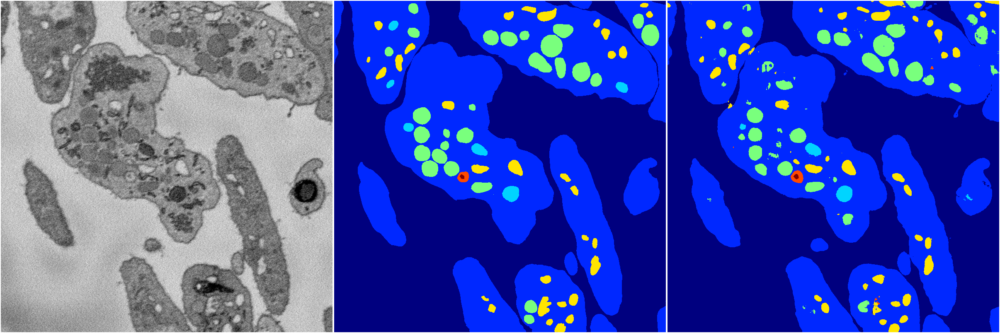

[Back](..)&nbsp;&nbsp;&nbsp;&nbsp;&nbsp;[Home](https://leapmanlab.github.io/snapshots)

---

<a href="0"><h2>hybrid_3d_crf / 0316 / 0</h2></a>
Created 20 Apr 2019, 00:17:24

<i>Click image for more details</i>

20 nets

**ari**: min 0.8335. max 0.8368. mean 0.8355.  ([best net](0/8))

**miou**: min 0.6302. max 0.6507. mean 0.6462.  ([best net](0/2))

**accuracy**: min 0.9382. max 0.9398. mean 0.9391.  ([best net](0/8))

**n_params**: min 691951.0000. max 691951.0000. mean 691951.0000.  ([best net](0/2))

---

[Back](..)&nbsp;&nbsp;&nbsp;&nbsp;&nbsp;[Home](https://leapmanlab.github.io/snapshots)

---