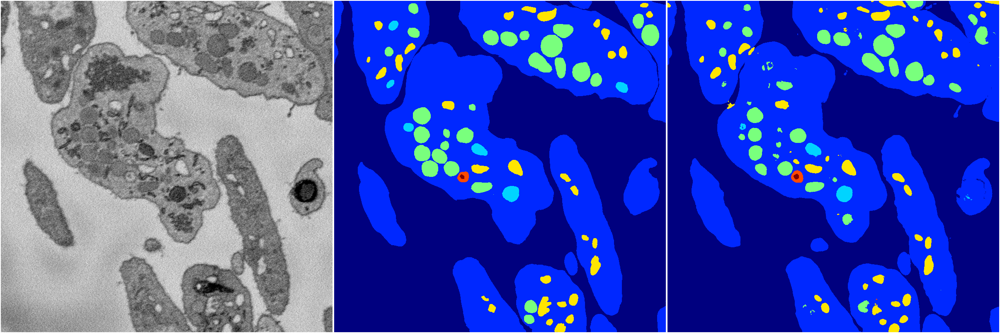
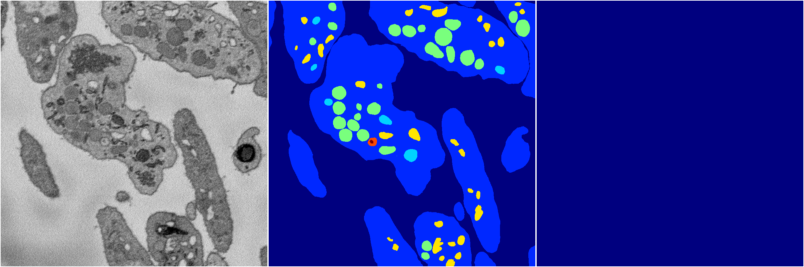
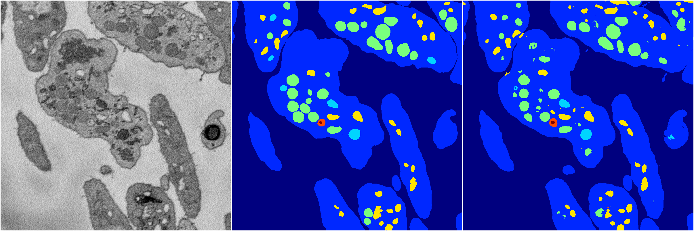
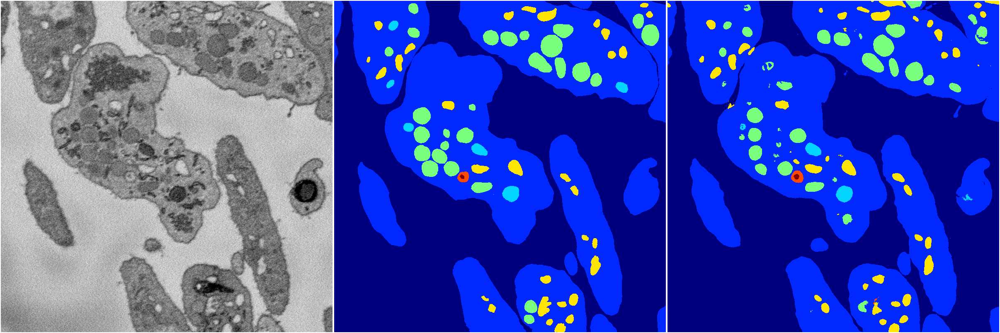
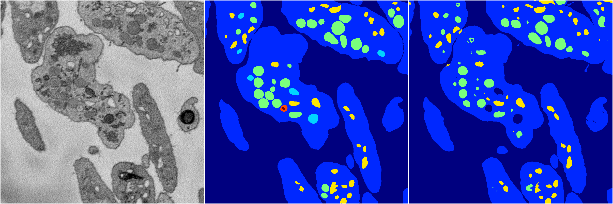

[Back](..)&nbsp;&nbsp;&nbsp;&nbsp;&nbsp;[Home](https://leapmanlab.github.io/snapshots)

---

<a href="0"><h2>hybrid_3d_crf / 0319 / 0 / 0</h2></a>
Created 29 Apr 2019, 14:49:51

<i>Click for more details</i>

**ari**: 0.8360. **miou**: 0.6424. **accuracy**: 0.9396. **n_params**: 691951.0000. 

---

<a href="1"><h2>hybrid_3d_crf / 0319 / 0 / 1</h2></a>
Created 29 Apr 2019, 14:49:51

<i>Click for more details</i>

**ari**: 0.8369. **miou**: 0.6432. **accuracy**: 0.9396. **n_params**: 691951.0000. 

---

<a href="18"><h2>hybrid_3d_crf / 0319 / 0 / 18</h2></a>
Created 29 Apr 2019, 14:49:51

<i>Click for more details</i>

**ari**: 0.8366. **miou**: 0.6483. **accuracy**: 0.9395. **n_params**: 691951.0000. 

---

<a href="20"><h2>hybrid_3d_crf / 0319 / 0 / 20</h2></a>
Created 29 Apr 2019, 14:49:51

<i>Click for more details</i>

**ari**: 0.0000. **miou**: 0.0646. **accuracy**: 0.4522. **n_params**: 691951.0000. 

---

<a href="15"><h2>hybrid_3d_crf / 0319 / 0 / 15</h2></a>
Created 29 Apr 2019, 14:49:51

<i>Click for more details</i>

**ari**: 0.8376. **miou**: 0.6461. **accuracy**: 0.9397. **n_params**: 691951.0000. 

---

<a href="19"><h2>hybrid_3d_crf / 0319 / 0 / 19</h2></a>
Created 29 Apr 2019, 14:49:51

<i>Click for more details</i>

**ari**: 0.8376. **miou**: 0.6510. **accuracy**: 0.9398. **n_params**: 691951.0000. 

---

<a href="7"><h2>hybrid_3d_crf / 0319 / 0 / 7</h2></a>
Created 29 Apr 2019, 14:49:51

<i>Click for more details</i>

**ari**: 0.8377. **miou**: 0.6520. **accuracy**: 0.9401. **n_params**: 691951.0000. 

---

<a href="14"><h2>hybrid_3d_crf / 0319 / 0 / 14</h2></a>
Created 29 Apr 2019, 14:49:51

<i>Click for more details</i>

**ari**: 0.8373. **miou**: 0.6463. **accuracy**: 0.9398. **n_params**: 691951.0000. 

---

<a href="16"><h2>hybrid_3d_crf / 0319 / 0 / 16</h2></a>
Created 29 Apr 2019, 14:49:51

<i>Click for more details</i>

**ari**: 0.8377. **miou**: 0.6407. **accuracy**: 0.9389. **n_params**: 691951.0000. 

---

<a href="21"><h2>hybrid_3d_crf / 0319 / 0 / 21</h2></a>
Created 29 Apr 2019, 14:49:51

<i>Click for more details</i>

**ari**: 0.8373. **miou**: 0.6443. **accuracy**: 0.9396. **n_params**: 691951.0000. 

---

<a href="9"><h2>hybrid_3d_crf / 0319 / 0 / 9</h2></a>
Created 29 Apr 2019, 14:49:51

<i>Click for more details</i>

**ari**: 0.8351. **miou**: 0.6445. **accuracy**: 0.9388. **n_params**: 691951.0000. 

---

<a href="4"><h2>hybrid_3d_crf / 0319 / 0 / 4</h2></a>
Created 29 Apr 2019, 14:49:51

<i>Click for more details</i>

**ari**: 0.8354. **miou**: 0.6438. **accuracy**: 0.9391. **n_params**: 691951.0000. 

---

<a href="17"><h2>hybrid_3d_crf / 0319 / 0 / 17</h2></a>
Created 29 Apr 2019, 14:49:51

<i>Click for more details</i>

**ari**: 0.8374. **miou**: 0.6455. **accuracy**: 0.9399. **n_params**: 691951.0000. 

---

<a href="8"><h2>hybrid_3d_crf / 0319 / 0 / 8</h2></a>
Created 29 Apr 2019, 14:49:50

<i>Click for more details</i>

**ari**: 0.8385. **miou**: 0.6458. **accuracy**: 0.9400. **n_params**: 691951.0000. 

---

<a href="13"><h2>hybrid_3d_crf / 0319 / 0 / 13</h2></a>
Created 29 Apr 2019, 14:49:50

<i>Click for more details</i>

**ari**: 0.8378. **miou**: 0.6490. **accuracy**: 0.9399. **n_params**: 691951.0000. 

---

<a href="12"><h2>hybrid_3d_crf / 0319 / 0 / 12</h2></a>
Created 29 Apr 2019, 14:49:50

<i>Click for more details</i>

**ari**: 0.8376. **miou**: 0.6434. **accuracy**: 0.9396. **n_params**: 691951.0000. 

---

<a href="3"><h2>hybrid_3d_crf / 0319 / 0 / 3</h2></a>
Created 29 Apr 2019, 14:49:50

<i>Click for more details</i>

**ari**: 0.0000. **miou**: 0.0646. **accuracy**: 0.4522. **n_params**: 691951.0000. 

---

<a href="6"><h2>hybrid_3d_crf / 0319 / 0 / 6</h2></a>
Created 29 Apr 2019, 14:49:50

<i>Click for more details</i>

**ari**: 0.8360. **miou**: 0.6418. **accuracy**: 0.9389. **n_params**: 691951.0000. 

---

<a href="5"><h2>hybrid_3d_crf / 0319 / 0 / 5</h2></a>
Created 29 Apr 2019, 14:49:50

<i>Click for more details</i>

**ari**: 0.0000. **miou**: 0.0646. **accuracy**: 0.4522. **n_params**: 691951.0000. 

---

<a href="2"><h2>hybrid_3d_crf / 0319 / 0 / 2</h2></a>
Created 29 Apr 2019, 14:49:50

<i>Click for more details</i>

**ari**: 0.0000. **miou**: 0.0646. **accuracy**: 0.4522. **n_params**: 691951.0000. 

---

<a href="11"><h2>hybrid_3d_crf / 0319 / 0 / 11</h2></a>
Created 29 Apr 2019, 14:49:50

<i>Click for more details</i>

**ari**: 0.8374. **miou**: 0.6426. **accuracy**: 0.9395. **n_params**: 691951.0000. 

---

<a href="22"><h2>hybrid_3d_crf / 0319 / 0 / 22</h2></a>
Created 29 Apr 2019, 14:49:50

<i>Click for more details</i>

**ari**: 0.8375. **miou**: 0.6468. **accuracy**: 0.9399. **n_params**: 691951.0000. 

---

<a href="10"><h2>hybrid_3d_crf / 0319 / 0 / 10</h2></a>
Created 29 Apr 2019, 14:49:50

<i>Click for more details</i>

**ari**: 0.8252. **miou**: 0.4323. **accuracy**: 0.9327. **n_params**: 691951.0000. 

---

<a href="23"><h2>hybrid_3d_crf / 0319 / 0 / 23</h2></a>
Created 29 Apr 2019, 14:49:50

<i>Click for more details</i>

**ari**: 0.0000. **miou**: 0.0646. **accuracy**: 0.4522. **n_params**: 691951.0000. 

---

[Back](..)&nbsp;&nbsp;&nbsp;&nbsp;&nbsp;[Home](https://leapmanlab.github.io/snapshots)

---