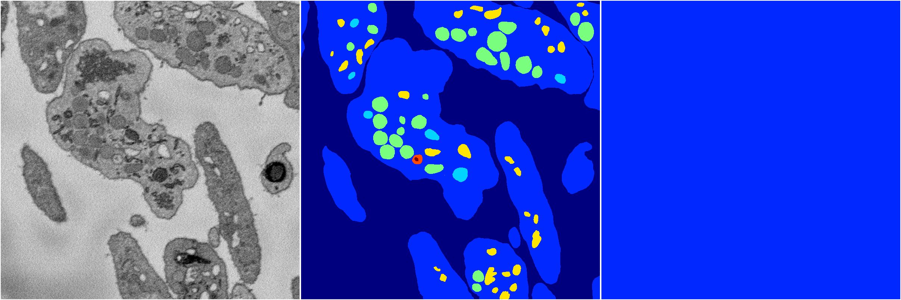

[Back](..)&nbsp;&nbsp;&nbsp;&nbsp;&nbsp;[Home](https://leapmanlab.github.io/snapshots)

---

<a href="0"><h2>hybrid_3d_crf / 0320 / 0</h2></a>
Created 29 Apr 2019, 14:49:51

<i>Click image for more details</i>

23 nets

**ari**: min -0.0000. max -0.0000. mean -0.0000.  ([best net](0/21))

**miou**: min 0.0672. max 0.0672. mean 0.0672.  ([best net](0/17))

**accuracy**: min 0.4707. max 0.4707. mean 0.4707.  ([best net](0/21))

**n_params**: min 986002.0000. max 986002.0000. mean 986002.0000.  ([best net](0/21))

---

[Back](..)&nbsp;&nbsp;&nbsp;&nbsp;&nbsp;[Home](https://leapmanlab.github.io/snapshots)

---