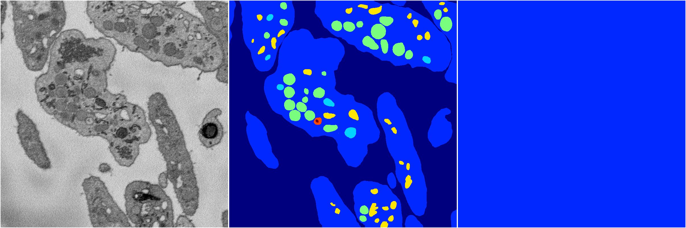

[Back](..)&nbsp;&nbsp;&nbsp;&nbsp;&nbsp;[Home](https://leapmanlab.github.io/snapshots)

---

<a href="15"><h2>hybrid_3d_crf / 0401 / 0 / 15</h2></a>
Created 07 May 2019, 10:53:34

<i>Click for more details</i>

**ari**: -0.0000. **miou**: 0.0653. **accuracy**: 0.4568. **n_params**: 1743930.0000. 

---

<a href="21"><h2>hybrid_3d_crf / 0401 / 0 / 21</h2></a>
Created 07 May 2019, 10:53:34

<i>Click for more details</i>

**ari**: -0.0000. **miou**: 0.0653. **accuracy**: 0.4568. **n_params**: 1743930.0000. 

---

<a href="9"><h2>hybrid_3d_crf / 0401 / 0 / 9</h2></a>
Created 07 May 2019, 10:53:34

<i>Click for more details</i>

**ari**: -0.0000. **miou**: 0.0653. **accuracy**: 0.4568. **n_params**: 1743930.0000. 

---

<a href="14"><h2>hybrid_3d_crf / 0401 / 0 / 14</h2></a>
Created 07 May 2019, 10:53:34

<i>Click for more details</i>

**ari**: -0.0000. **miou**: 0.0653. **accuracy**: 0.4568. **n_params**: 1743930.0000. 

---

<a href="6"><h2>hybrid_3d_crf / 0401 / 0 / 6</h2></a>
Created 07 May 2019, 10:53:34

<i>Click for more details</i>

**ari**: -0.0000. **miou**: 0.0653. **accuracy**: 0.4568. **n_params**: 1743930.0000. 

---

<a href="16"><h2>hybrid_3d_crf / 0401 / 0 / 16</h2></a>
Created 07 May 2019, 10:53:34

<i>Click for more details</i>

**ari**: -0.0000. **miou**: 0.0653. **accuracy**: 0.4568. **n_params**: 1743930.0000. 

---

<a href="8"><h2>hybrid_3d_crf / 0401 / 0 / 8</h2></a>
Created 07 May 2019, 10:53:34

<i>Click for more details</i>

**ari**: -0.0000. **miou**: 0.0653. **accuracy**: 0.4568. **n_params**: 1743930.0000. 

---

<a href="18"><h2>hybrid_3d_crf / 0401 / 0 / 18</h2></a>
Created 07 May 2019, 10:53:34

<i>Click for more details</i>

**ari**: -0.0000. **miou**: 0.0653. **accuracy**: 0.4568. **n_params**: 1743930.0000. 

---

<a href="13"><h2>hybrid_3d_crf / 0401 / 0 / 13</h2></a>
Created 07 May 2019, 10:53:34

<i>Click for more details</i>

**ari**: -0.0000. **miou**: 0.0653. **accuracy**: 0.4568. **n_params**: 1743930.0000. 

---

<a href="20"><h2>hybrid_3d_crf / 0401 / 0 / 20</h2></a>
Created 07 May 2019, 10:53:34

<i>Click for more details</i>

**ari**: -0.0000. **miou**: 0.0653. **accuracy**: 0.4568. **n_params**: 1743930.0000. 

---

<a href="7"><h2>hybrid_3d_crf / 0401 / 0 / 7</h2></a>
Created 07 May 2019, 10:53:34

<i>Click for more details</i>

**ari**: -0.0000. **miou**: 0.0653. **accuracy**: 0.4568. **n_params**: 1743930.0000. 

---

<a href="19"><h2>hybrid_3d_crf / 0401 / 0 / 19</h2></a>
Created 07 May 2019, 10:53:34

<i>Click for more details</i>

**ari**: -0.0000. **miou**: 0.0653. **accuracy**: 0.4568. **n_params**: 1743930.0000. 

---

<a href="3"><h2>hybrid_3d_crf / 0401 / 0 / 3</h2></a>
Created 07 May 2019, 10:53:34

<i>Click for more details</i>

**ari**: -0.0000. **miou**: 0.0653. **accuracy**: 0.4568. **n_params**: 1743930.0000. 

---

<a href="12"><h2>hybrid_3d_crf / 0401 / 0 / 12</h2></a>
Created 07 May 2019, 10:53:34

<i>Click for more details</i>

**ari**: -0.0000. **miou**: 0.0653. **accuracy**: 0.4568. **n_params**: 1743930.0000. 

---

<a href="1"><h2>hybrid_3d_crf / 0401 / 0 / 1</h2></a>
Created 07 May 2019, 10:53:34

<i>Click for more details</i>

**ari**: -0.0000. **miou**: 0.0653. **accuracy**: 0.4568. **n_params**: 1743930.0000. 

---

<a href="0"><h2>hybrid_3d_crf / 0401 / 0 / 0</h2></a>
Created 07 May 2019, 10:53:34

<i>Click for more details</i>

**ari**: -0.0000. **miou**: 0.0653. **accuracy**: 0.4568. **n_params**: 1743930.0000. 

---

<a href="4"><h2>hybrid_3d_crf / 0401 / 0 / 4</h2></a>
Created 07 May 2019, 10:53:34

<i>Click for more details</i>

**ari**: -0.0000. **miou**: 0.0653. **accuracy**: 0.4568. **n_params**: 1743930.0000. 

---

<a href="17"><h2>hybrid_3d_crf / 0401 / 0 / 17</h2></a>
Created 07 May 2019, 10:53:34

<i>Click for more details</i>

**ari**: -0.0000. **miou**: 0.0653. **accuracy**: 0.4568. **n_params**: 1743930.0000. 

---

<a href="23"><h2>hybrid_3d_crf / 0401 / 0 / 23</h2></a>
Created 07 May 2019, 10:53:34

<i>Click for more details</i>

**ari**: -0.0000. **miou**: 0.0653. **accuracy**: 0.4568. **n_params**: 1743930.0000. 

---

<a href="10"><h2>hybrid_3d_crf / 0401 / 0 / 10</h2></a>
Created 07 May 2019, 10:53:34

<i>Click for more details</i>

**ari**: -0.0000. **miou**: 0.0653. **accuracy**: 0.4568. **n_params**: 1743930.0000. 

---

<a href="11"><h2>hybrid_3d_crf / 0401 / 0 / 11</h2></a>
Created 07 May 2019, 10:53:34

<i>Click for more details</i>

**ari**: -0.0000. **miou**: 0.0653. **accuracy**: 0.4568. **n_params**: 1743930.0000. 

---

<a href="2"><h2>hybrid_3d_crf / 0401 / 0 / 2</h2></a>
Created 07 May 2019, 10:53:34

<i>Click for more details</i>

**ari**: -0.0000. **miou**: 0.0653. **accuracy**: 0.4568. **n_params**: 1743930.0000. 

---

<a href="5"><h2>hybrid_3d_crf / 0401 / 0 / 5</h2></a>
Created 07 May 2019, 10:53:34

<i>Click for more details</i>

**ari**: -0.0000. **miou**: 0.0653. **accuracy**: 0.4568. **n_params**: 1743930.0000. 

---

<a href="22"><h2>hybrid_3d_crf / 0401 / 0 / 22</h2></a>
Created 07 May 2019, 10:53:34

<i>Click for more details</i>

**ari**: -0.0000. **miou**: 0.0653. **accuracy**: 0.4568. **n_params**: 1743930.0000. 

---

[Back](..)&nbsp;&nbsp;&nbsp;&nbsp;&nbsp;[Home](https://leapmanlab.github.io/snapshots)

---