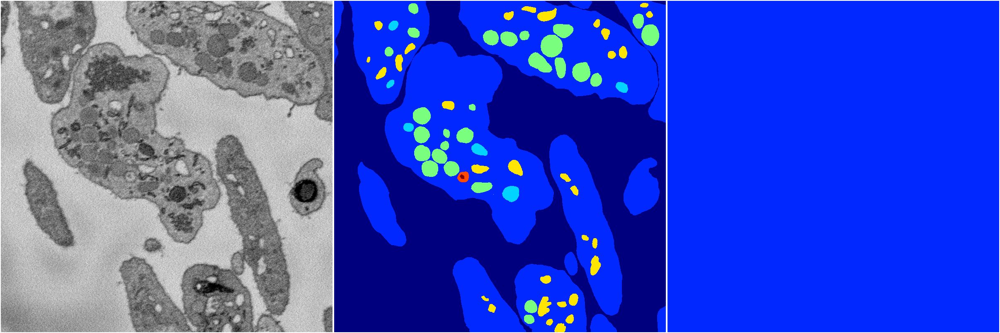

[Back](..)&nbsp;&nbsp;&nbsp;&nbsp;&nbsp;[Home](https://leapmanlab.github.io/snapshots)

---

<a href="0"><h2>hybrid_3d_crf / 0401 / 0</h2></a>
Created 18 Apr 2019, 16:41:08

<i>Click image for more details</i>

24 nets

**ari**: min -0.0000. max -0.0000. mean -0.0000.  ([best net](0/22))

**miou**: min 0.0653. max 0.0653. mean 0.0653.  ([best net](0/22))

**accuracy**: min 0.4568. max 0.4568. mean 0.4568.  ([best net](0/22))

**n_params**: min 1743930.0000. max 1743930.0000. mean 1743930.0000.  ([best net](0/22))

---

[Back](..)&nbsp;&nbsp;&nbsp;&nbsp;&nbsp;[Home](https://leapmanlab.github.io/snapshots)

---