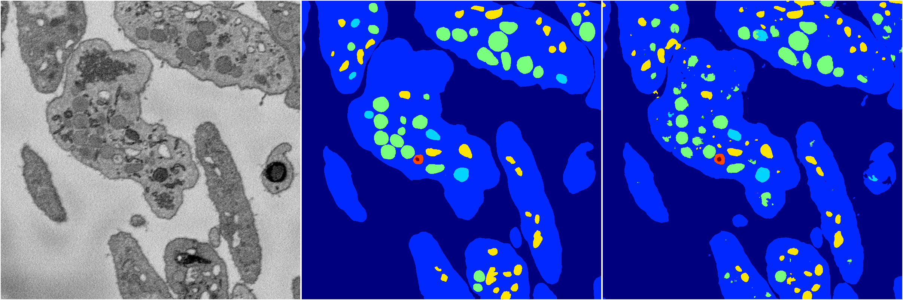
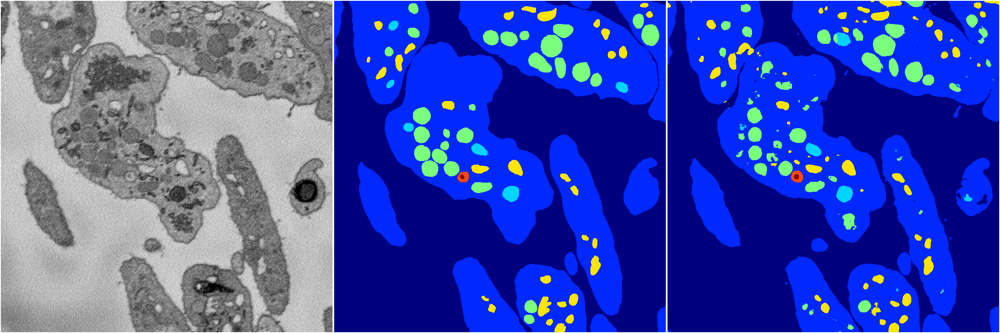

[Back](..)&nbsp;&nbsp;&nbsp;&nbsp;&nbsp;[Home](https://leapmanlab.github.io/snapshots)

---

<a href="1"><h2>hybrid_3d_crf / 0404 / 0 / 1</h2></a>
Created 29 Apr 2019, 14:49:52

<i>Click for more details</i>

**ari**: 0.8282. **miou**: 0.6386. **accuracy**: 0.9369. **n_params**: 1743930.0000. 

---

<a href="2"><h2>hybrid_3d_crf / 0404 / 0 / 2</h2></a>
Created 29 Apr 2019, 14:49:52

<i>Click for more details</i>

**ari**: 0.8284. **miou**: 0.6387. **accuracy**: 0.9370. **n_params**: 1743930.0000. 

---

<a href="3"><h2>hybrid_3d_crf / 0404 / 0 / 3</h2></a>
Created 29 Apr 2019, 14:49:52

<i>Click for more details</i>

**ari**: 0.8276. **miou**: 0.6371. **accuracy**: 0.9366. **n_params**: 1743930.0000. 

---

<a href="0"><h2>hybrid_3d_crf / 0404 / 0 / 0</h2></a>
Created 29 Apr 2019, 14:49:52

<i>Click for more details</i>

**ari**: 0.8261. **miou**: 0.6317. **accuracy**: 0.9358. **n_params**: 1743930.0000. 

---

[Back](..)&nbsp;&nbsp;&nbsp;&nbsp;&nbsp;[Home](https://leapmanlab.github.io/snapshots)

---