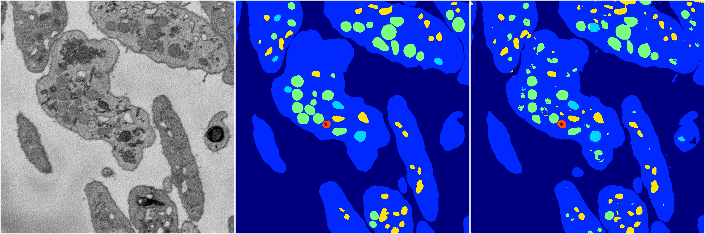
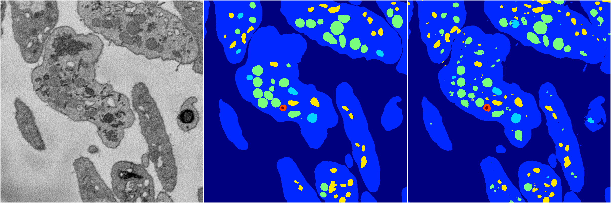
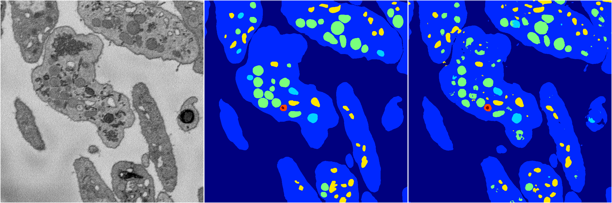

[Back](..)&nbsp;&nbsp;&nbsp;&nbsp;&nbsp;[Home](https://leapmanlab.github.io/snapshots)

---

<a href="2"><h2>hybrid_3d_crf / 0404 / 1 / 2</h2></a>
Created 25 Apr 2019, 13:51:15

<i>Click for more details</i>

**ari**: 0.8282. **miou**: 0.6387. **accuracy**: 0.9366. **n_params**: 1743930.0000. 

---

<a href="0"><h2>hybrid_3d_crf / 0404 / 1 / 0</h2></a>
Created 25 Apr 2019, 13:51:15

<i>Click for more details</i>

**ari**: 0.8260. **miou**: 0.6344. **accuracy**: 0.9357. **n_params**: 1743930.0000. 

---

<a href="3"><h2>hybrid_3d_crf / 0404 / 1 / 3</h2></a>
Created 25 Apr 2019, 13:51:15

<i>Click for more details</i>

**ari**: 0.8269. **miou**: 0.6342. **accuracy**: 0.9362. **n_params**: 1743930.0000. 

---

<a href="1"><h2>hybrid_3d_crf / 0404 / 1 / 1</h2></a>
Created 25 Apr 2019, 13:51:15

<i>Click for more details</i>

**ari**: 0.8264. **miou**: 0.6393. **accuracy**: 0.9360. **n_params**: 1743930.0000. 

---

[Back](..)&nbsp;&nbsp;&nbsp;&nbsp;&nbsp;[Home](https://leapmanlab.github.io/snapshots)

---