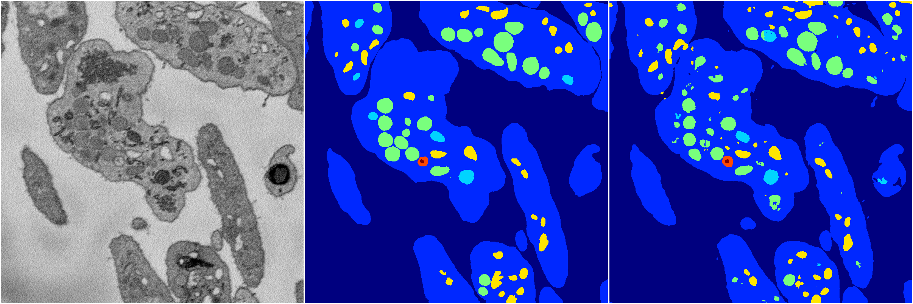

[Back](..)&nbsp;&nbsp;&nbsp;&nbsp;&nbsp;[Home](https://leapmanlab.github.io/snapshots)

---

<a href="2"><h2>hybrid_3d_crf / 0404 / 12 / 2</h2></a>
Created 16 Apr 2019, 17:08:45

<i>Click for more details</i>

**ari**: 0.8276. **miou**: 0.6319. **accuracy**: 0.9365. **n_params**: 1743930.0000. 

---

<a href="3"><h2>hybrid_3d_crf / 0404 / 12 / 3</h2></a>
Created 16 Apr 2019, 17:08:45

<i>Click for more details</i>

**ari**: 0.8273. **miou**: 0.6367. **accuracy**: 0.9364. **n_params**: 1743930.0000. 

---

<a href="0"><h2>hybrid_3d_crf / 0404 / 12 / 0</h2></a>
Created 16 Apr 2019, 17:08:45

<i>Click for more details</i>

**ari**: 0.8275. **miou**: 0.6288. **accuracy**: 0.9364. **n_params**: 1743930.0000. 

---

[Back](..)&nbsp;&nbsp;&nbsp;&nbsp;&nbsp;[Home](https://leapmanlab.github.io/snapshots)

---