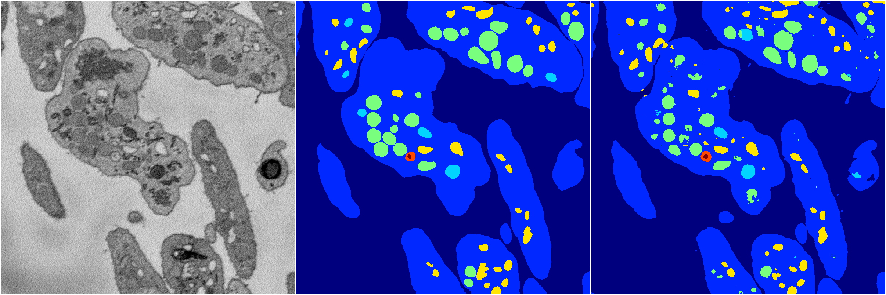
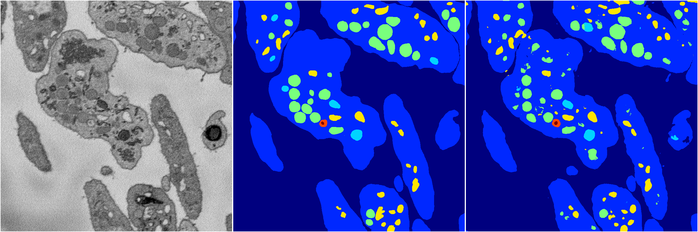

[Back](..)&nbsp;&nbsp;&nbsp;&nbsp;&nbsp;[Home](https://leapmanlab.github.io/snapshots)

---

<a href="1"><h2>hybrid_3d_crf / 0404 / 3 / 1</h2></a>
Created 08 Apr 2019, 16:23:20

<i>Click for more details</i>

**ari**: 0.8285. **miou**: 0.6355. **accuracy**: 0.9366. **n_params**: 1743930.0000. 

---

<a href="0"><h2>hybrid_3d_crf / 0404 / 3 / 0</h2></a>
Created 08 Apr 2019, 16:23:20

<i>Click for more details</i>

**ari**: 0.8287. **miou**: 0.6377. **accuracy**: 0.9369. **n_params**: 1743930.0000. 

---

<a href="2"><h2>hybrid_3d_crf / 0404 / 3 / 2</h2></a>
Created 08 Apr 2019, 16:23:20

<i>Click for more details</i>

**ari**: 0.8275. **miou**: 0.6366. **accuracy**: 0.9364. **n_params**: 1743930.0000. 

---

<a href="3"><h2>hybrid_3d_crf / 0404 / 3 / 3</h2></a>
Created 08 Apr 2019, 16:23:20

<i>Click for more details</i>

**ari**: 0.8270. **miou**: 0.6370. **accuracy**: 0.9360. **n_params**: 1743930.0000. 

---

[Back](..)&nbsp;&nbsp;&nbsp;&nbsp;&nbsp;[Home](https://leapmanlab.github.io/snapshots)

---