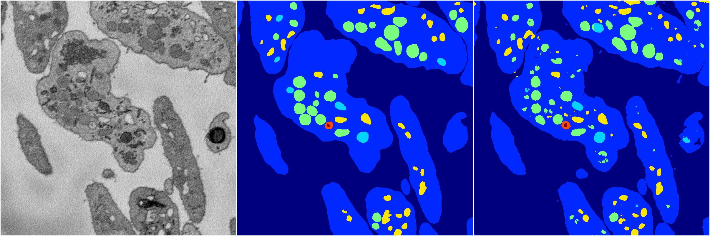
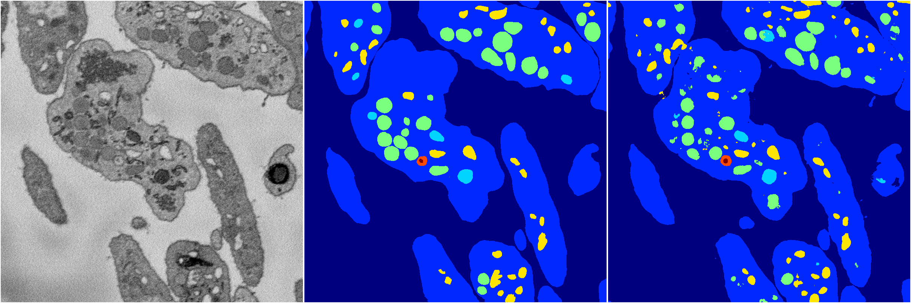

[Back](..)&nbsp;&nbsp;&nbsp;&nbsp;&nbsp;[Home](https://leapmanlab.github.io/snapshots)

---

<a href="3"><h2>hybrid_3d_crf / 0404 / 4 / 3</h2></a>
Created 16 Apr 2019, 17:08:43

<i>Click for more details</i>

**ari**: 0.8270. **miou**: 0.6395. **accuracy**: 0.9362. **n_params**: 1743930.0000. 

---

<a href="2"><h2>hybrid_3d_crf / 0404 / 4 / 2</h2></a>
Created 16 Apr 2019, 17:08:43

<i>Click for more details</i>

**ari**: 0.8276. **miou**: 0.6363. **accuracy**: 0.9363. **n_params**: 1743930.0000. 

---

<a href="0"><h2>hybrid_3d_crf / 0404 / 4 / 0</h2></a>
Created 16 Apr 2019, 17:08:43

<i>Click for more details</i>

**ari**: 0.8268. **miou**: 0.6361. **accuracy**: 0.9360. **n_params**: 1743930.0000. 

---

<a href="1"><h2>hybrid_3d_crf / 0404 / 4 / 1</h2></a>
Created 16 Apr 2019, 17:08:43

<i>Click for more details</i>

**ari**: 0.8280. **miou**: 0.6338. **accuracy**: 0.9365. **n_params**: 1743930.0000. 

---

[Back](..)&nbsp;&nbsp;&nbsp;&nbsp;&nbsp;[Home](https://leapmanlab.github.io/snapshots)

---