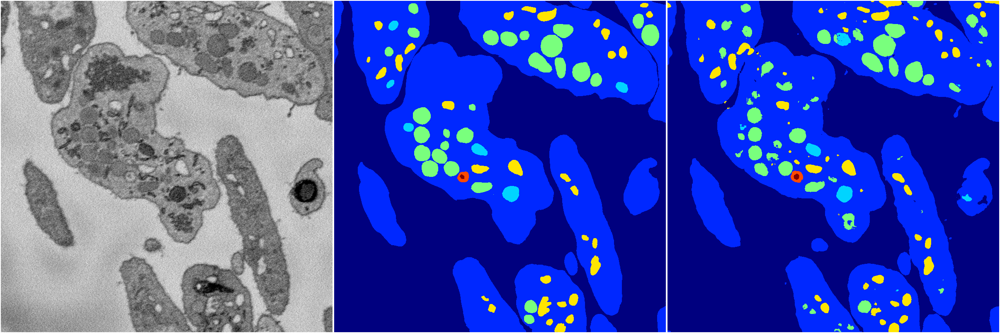
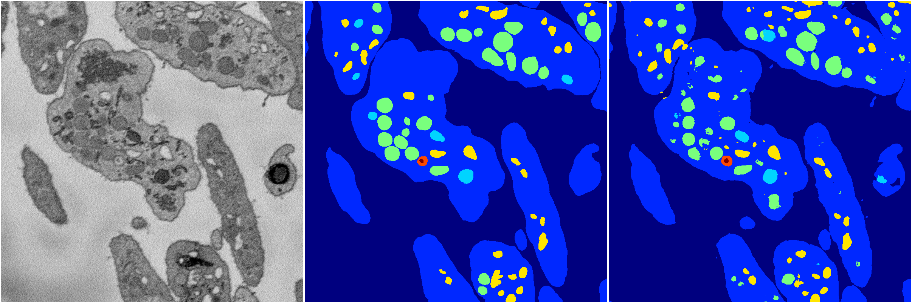

[Back](..)&nbsp;&nbsp;&nbsp;&nbsp;&nbsp;[Home](https://leapmanlab.github.io/snapshots)

---

<a href="3"><h2>hybrid_3d_crf / 0404 / 5 / 3</h2></a>
Created 07 May 2019, 10:53:35

<i>Click for more details</i>

**ari**: 0.8279. **miou**: 0.6378. **accuracy**: 0.9365. **n_params**: 1743930.0000. 

---

<a href="2"><h2>hybrid_3d_crf / 0404 / 5 / 2</h2></a>
Created 07 May 2019, 10:53:35

<i>Click for more details</i>

**ari**: 0.8289. **miou**: 0.6385. **accuracy**: 0.9369. **n_params**: 1743930.0000. 

---

<a href="1"><h2>hybrid_3d_crf / 0404 / 5 / 1</h2></a>
Created 07 May 2019, 10:53:35

<i>Click for more details</i>

**ari**: 0.8276. **miou**: 0.6418. **accuracy**: 0.9364. **n_params**: 1743930.0000. 

---

<a href="0"><h2>hybrid_3d_crf / 0404 / 5 / 0</h2></a>
Created 07 May 2019, 10:53:35

<i>Click for more details</i>

**ari**: 0.8274. **miou**: 0.6349. **accuracy**: 0.9363. **n_params**: 1743930.0000. 

---

[Back](..)&nbsp;&nbsp;&nbsp;&nbsp;&nbsp;[Home](https://leapmanlab.github.io/snapshots)

---