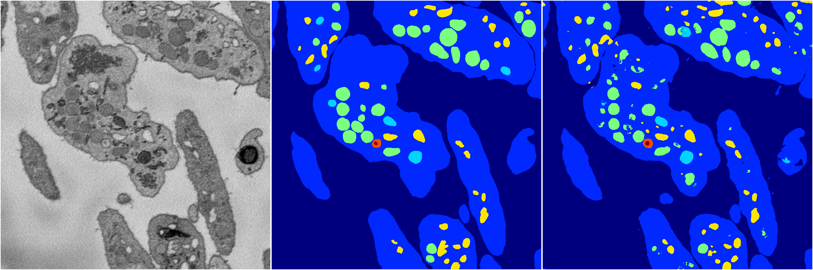
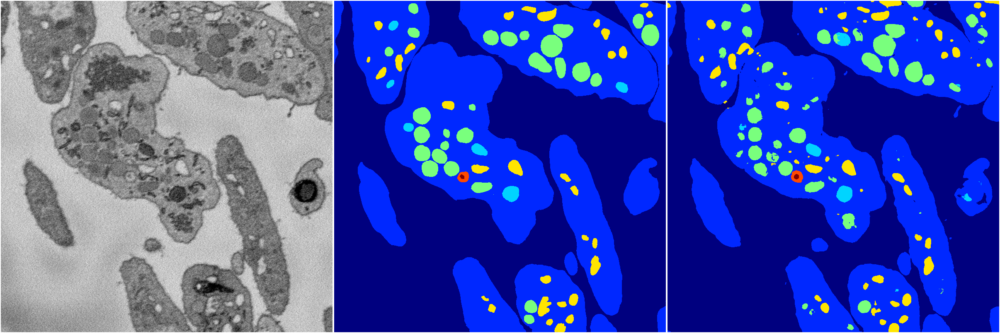

[Back](..)&nbsp;&nbsp;&nbsp;&nbsp;&nbsp;[Home](https://leapmanlab.github.io/snapshots)

---

<a href="3"><h2>hybrid_3d_crf / 0404 / 7 / 3</h2></a>
Created 12 Apr 2019, 15:12:16

<i>Click for more details</i>

**ari**: 0.8275. **miou**: 0.6358. **accuracy**: 0.9364. **n_params**: 1743930.0000. 

---

<a href="2"><h2>hybrid_3d_crf / 0404 / 7 / 2</h2></a>
Created 12 Apr 2019, 15:12:16

<i>Click for more details</i>

**ari**: 0.8277. **miou**: 0.6317. **accuracy**: 0.9362. **n_params**: 1743930.0000. 

---

<a href="1"><h2>hybrid_3d_crf / 0404 / 7 / 1</h2></a>
Created 12 Apr 2019, 15:12:16

<i>Click for more details</i>

**ari**: 0.8280. **miou**: 0.6351. **accuracy**: 0.9365. **n_params**: 1743930.0000. 

---

<a href="0"><h2>hybrid_3d_crf / 0404 / 7 / 0</h2></a>
Created 12 Apr 2019, 15:12:16

<i>Click for more details</i>

**ari**: 0.8276. **miou**: 0.6341. **accuracy**: 0.9363. **n_params**: 1743930.0000. 

---

[Back](..)&nbsp;&nbsp;&nbsp;&nbsp;&nbsp;[Home](https://leapmanlab.github.io/snapshots)

---