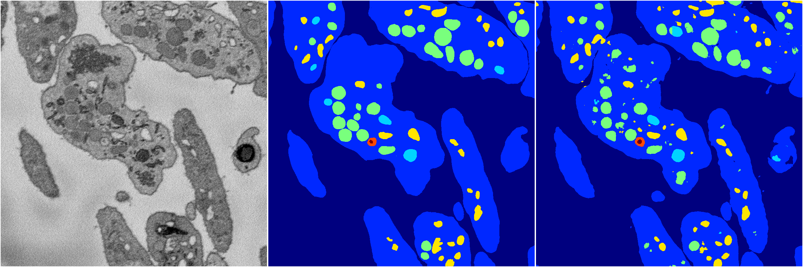
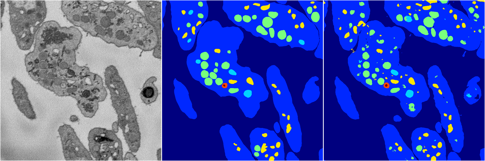

[Back](..)&nbsp;&nbsp;&nbsp;&nbsp;&nbsp;[Home](https://leapmanlab.github.io/snapshots)

---

<a href="1"><h2>hybrid_3d_crf / 0404 / 9 / 1</h2></a>
Created 29 Apr 2019, 14:49:53

<i>Click for more details</i>

**ari**: 0.8274. **miou**: 0.6279. **accuracy**: 0.9362. **n_params**: 1743930.0000. 

---

<a href="3"><h2>hybrid_3d_crf / 0404 / 9 / 3</h2></a>
Created 29 Apr 2019, 14:49:53

<i>Click for more details</i>

**ari**: 0.8274. **miou**: 0.6435. **accuracy**: 0.9364. **n_params**: 1743930.0000. 

---

<a href="0"><h2>hybrid_3d_crf / 0404 / 9 / 0</h2></a>
Created 29 Apr 2019, 14:49:53

<i>Click for more details</i>

**ari**: 0.8270. **miou**: 0.6346. **accuracy**: 0.9361. **n_params**: 1743930.0000. 

---

<a href="2"><h2>hybrid_3d_crf / 0404 / 9 / 2</h2></a>
Created 29 Apr 2019, 14:49:53

<i>Click for more details</i>

**ari**: 0.8273. **miou**: 0.6324. **accuracy**: 0.9362. **n_params**: 1743930.0000. 

---

[Back](..)&nbsp;&nbsp;&nbsp;&nbsp;&nbsp;[Home](https://leapmanlab.github.io/snapshots)

---