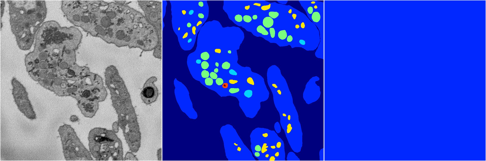
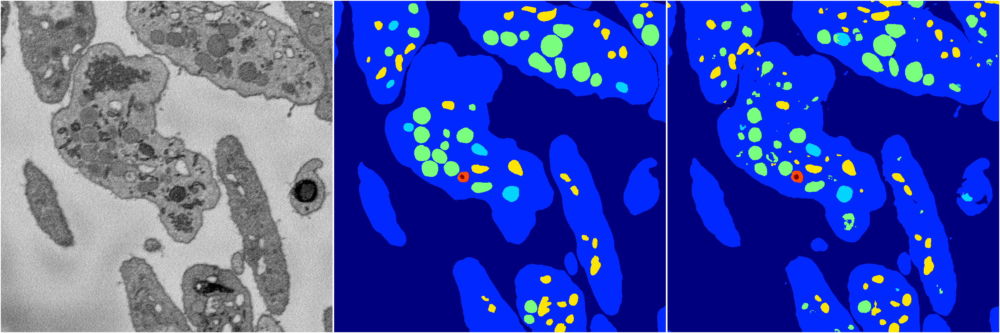
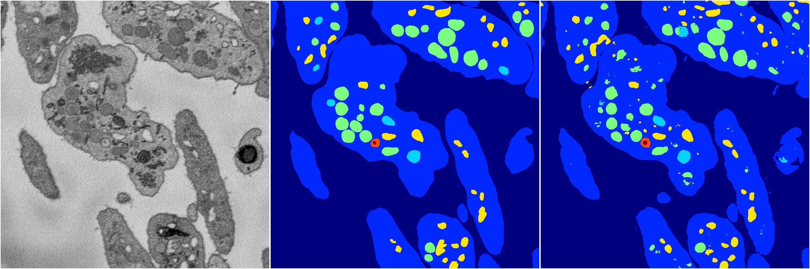

[Back](..)&nbsp;&nbsp;&nbsp;&nbsp;&nbsp;[Home](https://leapmanlab.github.io/snapshots)

---

<a href="23"><h2>hybrid_3d_crf / 0404 / 23</h2></a>
Created 18 Apr 2019, 16:41:09

<i>Click image for more details</i>

4 nets

**ari**: min -0.0000. max -0.0000. mean -0.0000.  ([best net](23/0))

**miou**: min 0.0659. max 0.0659. mean 0.0659.  ([best net](23/0))

**accuracy**: min 0.4612. max 0.4612. mean 0.4612.  ([best net](23/0))

**n_params**: min 1743930.0000. max 1743930.0000. mean 1743930.0000.  ([best net](23/0))

---

<a href="20"><h2>hybrid_3d_crf / 0404 / 20</h2></a>
Created 18 Apr 2019, 16:41:09

<i>Click image for more details</i>

4 nets

**ari**: min -0.0000. max -0.0000. mean -0.0000.  ([best net](20/2))

**miou**: min 0.0659. max 0.0659. mean 0.0659.  ([best net](20/2))

**accuracy**: min 0.4612. max 0.4612. mean 0.4612.  ([best net](20/2))

**n_params**: min 1743930.0000. max 1743930.0000. mean 1743930.0000.  ([best net](20/2))

---

<a href="22"><h2>hybrid_3d_crf / 0404 / 22</h2></a>
Created 18 Apr 2019, 16:41:09

<i>Click image for more details</i>

4 nets

**ari**: min -0.0000. max -0.0000. mean -0.0000.  ([best net](22/0))

**miou**: min 0.0659. max 0.0659. mean 0.0659.  ([best net](22/0))

**accuracy**: min 0.4612. max 0.4612. mean 0.4612.  ([best net](22/0))

**n_params**: min 1743930.0000. max 1743930.0000. mean 1743930.0000.  ([best net](22/0))

---

<a href="21"><h2>hybrid_3d_crf / 0404 / 21</h2></a>
Created 18 Apr 2019, 16:41:09

<i>Click image for more details</i>

4 nets

**ari**: min -0.0000. max -0.0000. mean -0.0000.  ([best net](21/1))

**miou**: min 0.0659. max 0.0659. mean 0.0659.  ([best net](21/1))

**accuracy**: min 0.4612. max 0.4612. mean 0.4612.  ([best net](21/1))

**n_params**: min 1743930.0000. max 1743930.0000. mean 1743930.0000.  ([best net](21/1))

---

<a href="18"><h2>hybrid_3d_crf / 0404 / 18</h2></a>
Created 18 Apr 2019, 16:41:09

<i>Click image for more details</i>

4 nets

**ari**: min -0.0000. max -0.0000. mean -0.0000.  ([best net](18/0))

**miou**: min 0.0659. max 0.0659. mean 0.0659.  ([best net](18/0))

**accuracy**: min 0.4612. max 0.4612. mean 0.4612.  ([best net](18/0))

**n_params**: min 1743930.0000. max 1743930.0000. mean 1743930.0000.  ([best net](18/0))

---

<a href="19"><h2>hybrid_3d_crf / 0404 / 19</h2></a>
Created 18 Apr 2019, 16:41:09

<i>Click image for more details</i>

4 nets

**ari**: min -0.0000. max -0.0000. mean -0.0000.  ([best net](19/1))

**miou**: min 0.0659. max 0.0659. mean 0.0659.  ([best net](19/1))

**accuracy**: min 0.4612. max 0.4612. mean 0.4612.  ([best net](19/1))

**n_params**: min 1743930.0000. max 1743930.0000. mean 1743930.0000.  ([best net](19/1))

---

<a href="16"><h2>hybrid_3d_crf / 0404 / 16</h2></a>
Created 18 Apr 2019, 16:41:09

<i>Click image for more details</i>

4 nets

**ari**: min -0.0000. max -0.0000. mean -0.0000.  ([best net](16/2))

**miou**: min 0.0659. max 0.0659. mean 0.0659.  ([best net](16/2))

**accuracy**: min 0.4612. max 0.4612. mean 0.4612.  ([best net](16/2))

**n_params**: min 1743930.0000. max 1743930.0000. mean 1743930.0000.  ([best net](16/2))

---

<a href="15"><h2>hybrid_3d_crf / 0404 / 15</h2></a>
Created 18 Apr 2019, 16:41:09

<i>Click image for more details</i>

4 nets

**ari**: min -0.0000. max 0.8264. mean 0.2066.  ([best net](15/2))

**miou**: min 0.0659. max 0.5308. mean 0.1821.  ([best net](15/2))

**accuracy**: min 0.4612. max 0.9354. mean 0.5798.  ([best net](15/2))

**n_params**: min 1743930.0000. max 1743930.0000. mean 1743930.0000.  ([best net](15/0))

---

<a href="17"><h2>hybrid_3d_crf / 0404 / 17</h2></a>
Created 18 Apr 2019, 16:41:09

<i>Click image for more details</i>

4 nets

**ari**: min -0.0000. max -0.0000. mean -0.0000.  ([best net](17/1))

**miou**: min 0.0659. max 0.0659. mean 0.0659.  ([best net](17/1))

**accuracy**: min 0.4612. max 0.4612. mean 0.4612.  ([best net](17/1))

**n_params**: min 1743930.0000. max 1743930.0000. mean 1743930.0000.  ([best net](17/1))

---

<a href="14"><h2>hybrid_3d_crf / 0404 / 14</h2></a>
Created 18 Apr 2019, 16:41:09

<i>Click image for more details</i>

4 nets

**ari**: min 0.8263. max 0.8282. mean 0.8270.  ([best net](14/1))

**miou**: min 0.6302. max 0.6405. mean 0.6345.  ([best net](14/1))

**accuracy**: min 0.9357. max 0.9368. mean 0.9361.  ([best net](14/1))

**n_params**: min 1743930.0000. max 1743930.0000. mean 1743930.0000.  ([best net](14/0))

---

<a href="13"><h2>hybrid_3d_crf / 0404 / 13</h2></a>
Created 18 Apr 2019, 16:41:09

<i>Click image for more details</i>

4 nets

**ari**: min 0.8261. max 0.8266. mean 0.8264.  ([best net](13/0))

**miou**: min 0.6313. max 0.6392. mean 0.6364.  ([best net](13/3))

**accuracy**: min 0.9358. max 0.9360. mean 0.9359.  ([best net](13/2))

**n_params**: min 1743930.0000. max 1743930.0000. mean 1743930.0000.  ([best net](13/0))

---

<a href="12"><h2>hybrid_3d_crf / 0404 / 12</h2></a>
Created 18 Apr 2019, 16:41:09

<i>Click image for more details</i>

3 nets

**ari**: min 0.8273. max 0.8276. mean 0.8275.  ([best net](12/2))

**miou**: min 0.6288. max 0.6367. mean 0.6325.  ([best net](12/3))

**accuracy**: min 0.9364. max 0.9365. mean 0.9364.  ([best net](12/2))

**n_params**: min 1743930.0000. max 1743930.0000. mean 1743930.0000.  ([best net](12/0))

---

<a href="11"><h2>hybrid_3d_crf / 0404 / 11</h2></a>
Created 18 Apr 2019, 16:41:09

<i>Click image for more details</i>

4 nets

**ari**: min 0.8263. max 0.8269. mean 0.8266.  ([best net](11/0))

**miou**: min 0.6316. max 0.6355. mean 0.6328.  ([best net](11/1))

**accuracy**: min 0.9358. max 0.9360. mean 0.9359.  ([best net](11/1))

**n_params**: min 1743930.0000. max 1743930.0000. mean 1743930.0000.  ([best net](11/1))

---

<a href="8"><h2>hybrid_3d_crf / 0404 / 8</h2></a>
Created 18 Apr 2019, 16:41:09

<i>Click image for more details</i>

4 nets

**ari**: min 0.8257. max 0.8266. mean 0.8263.  ([best net](8/2))

**miou**: min 0.6331. max 0.6404. mean 0.6361.  ([best net](8/1))

**accuracy**: min 0.9354. max 0.9360. mean 0.9357.  ([best net](8/0))

**n_params**: min 1743930.0000. max 1743930.0000. mean 1743930.0000.  ([best net](8/3))

---

<a href="9"><h2>hybrid_3d_crf / 0404 / 9</h2></a>
Created 18 Apr 2019, 16:41:09

<i>Click image for more details</i>

4 nets

**ari**: min 0.8270. max 0.8274. mean 0.8273.  ([best net](9/3))

**miou**: min 0.6279. max 0.6435. mean 0.6346.  ([best net](9/3))

**accuracy**: min 0.9361. max 0.9364. mean 0.9362.  ([best net](9/3))

**n_params**: min 1743930.0000. max 1743930.0000. mean 1743930.0000.  ([best net](9/2))

---

<a href="10"><h2>hybrid_3d_crf / 0404 / 10</h2></a>
Created 18 Apr 2019, 16:41:09

<i>Click image for more details</i>

4 nets

**ari**: min 0.8265. max 0.8276. mean 0.8270.  ([best net](10/1))

**miou**: min 0.6322. max 0.6392. mean 0.6368.  ([best net](10/0))

**accuracy**: min 0.9358. max 0.9363. mean 0.9361.  ([best net](10/0))

**n_params**: min 1743930.0000. max 1743930.0000. mean 1743930.0000.  ([best net](10/2))

---

<a href="7"><h2>hybrid_3d_crf / 0404 / 7</h2></a>
Created 18 Apr 2019, 16:41:09

<i>Click image for more details</i>

4 nets

**ari**: min 0.8275. max 0.8280. mean 0.8277.  ([best net](7/1))

**miou**: min 0.6317. max 0.6358. mean 0.6342.  ([best net](7/3))

**accuracy**: min 0.9362. max 0.9365. mean 0.9363.  ([best net](7/1))

**n_params**: min 1743930.0000. max 1743930.0000. mean 1743930.0000.  ([best net](7/0))

---

<a href="6"><h2>hybrid_3d_crf / 0404 / 6</h2></a>
Created 18 Apr 2019, 16:41:09

<i>Click image for more details</i>

4 nets

**ari**: min 0.8271. max 0.8282. mean 0.8277.  ([best net](6/3))

**miou**: min 0.6331. max 0.6381. mean 0.6350.  ([best net](6/1))

**accuracy**: min 0.9361. max 0.9366. mean 0.9363.  ([best net](6/3))

**n_params**: min 1743930.0000. max 1743930.0000. mean 1743930.0000.  ([best net](6/3))

---

<a href="5"><h2>hybrid_3d_crf / 0404 / 5</h2></a>
Created 18 Apr 2019, 16:41:09

<i>Click image for more details</i>

4 nets

**ari**: min 0.8274. max 0.8289. mean 0.8279.  ([best net](5/2))

**miou**: min 0.6349. max 0.6418. mean 0.6383.  ([best net](5/1))

**accuracy**: min 0.9363. max 0.9369. mean 0.9365.  ([best net](5/2))

**n_params**: min 1743930.0000. max 1743930.0000. mean 1743930.0000.  ([best net](5/0))

---

<a href="3"><h2>hybrid_3d_crf / 0404 / 3</h2></a>
Created 18 Apr 2019, 16:41:09

<i>Click image for more details</i>

4 nets

**ari**: min 0.8270. max 0.8287. mean 0.8279.  ([best net](3/0))

**miou**: min 0.6355. max 0.6377. mean 0.6367.  ([best net](3/0))

**accuracy**: min 0.9360. max 0.9369. mean 0.9365.  ([best net](3/0))

**n_params**: min 1743930.0000. max 1743930.0000. mean 1743930.0000.  ([best net](3/3))

---

<a href="4"><h2>hybrid_3d_crf / 0404 / 4</h2></a>
Created 18 Apr 2019, 16:41:09

<i>Click image for more details</i>

4 nets

**ari**: min 0.8268. max 0.8280. mean 0.8273.  ([best net](4/1))

**miou**: min 0.6338. max 0.6395. mean 0.6364.  ([best net](4/3))

**accuracy**: min 0.9360. max 0.9365. mean 0.9363.  ([best net](4/1))

**n_params**: min 1743930.0000. max 1743930.0000. mean 1743930.0000.  ([best net](4/1))

---

<a href="2"><h2>hybrid_3d_crf / 0404 / 2</h2></a>
Created 18 Apr 2019, 16:41:09

<i>Click image for more details</i>

4 nets

**ari**: min 0.8277. max 0.8294. mean 0.8284.  ([best net](2/1))

**miou**: min 0.6337. max 0.6389. mean 0.6364.  ([best net](2/3))

**accuracy**: min 0.9364. max 0.9372. mean 0.9368.  ([best net](2/1))

**n_params**: min 1743930.0000. max 1743930.0000. mean 1743930.0000.  ([best net](2/0))

---

<a href="1"><h2>hybrid_3d_crf / 0404 / 1</h2></a>
Created 18 Apr 2019, 16:41:09

<i>Click image for more details</i>

4 nets

**ari**: min 0.8260. max 0.8282. mean 0.8269.  ([best net](1/2))

**miou**: min 0.6342. max 0.6393. mean 0.6367.  ([best net](1/1))

**accuracy**: min 0.9357. max 0.9366. mean 0.9361.  ([best net](1/2))

**n_params**: min 1743930.0000. max 1743930.0000. mean 1743930.0000.  ([best net](1/1))

---

<a href="0"><h2>hybrid_3d_crf / 0404 / 0</h2></a>
Created 18 Apr 2019, 16:41:09

<i>Click image for more details</i>

4 nets

**ari**: min 0.8261. max 0.8284. mean 0.8276.  ([best net](0/2))

**miou**: min 0.6317. max 0.6387. mean 0.6366.  ([best net](0/2))

**accuracy**: min 0.9358. max 0.9370. mean 0.9366.  ([best net](0/2))

**n_params**: min 1743930.0000. max 1743930.0000. mean 1743930.0000.  ([best net](0/0))

---

[Back](..)&nbsp;&nbsp;&nbsp;&nbsp;&nbsp;[Home](https://leapmanlab.github.io/snapshots)

---