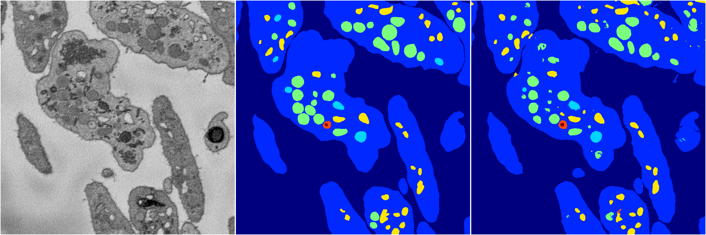

[Back](..)&nbsp;&nbsp;&nbsp;&nbsp;&nbsp;[Home](https://leapmanlab.github.io/snapshots)

---

<a href="0319"><h2>hybrid_3d_crf / 0319</h2></a>
Created 20 Mar 2019, 13:22:35

<i>Click image for more details</i>

24 nets

**ari**: min 0.0000. max 0.8385. mean 0.6622.  ([best net](0319/0/8))

**miou**: min 0.0646. max 0.6520. mean 0.5155.  ([best net](0319/0/7))

**accuracy**: min 0.4522. max 0.9401. mean 0.8377.  ([best net](0319/0/7))

**n_params**: min 691951.0000. max 691951.0000. mean 691951.0000.  ([best net](0319/0/23))

---

<a href="0318"><h2>hybrid_3d_crf / 0318</h2></a>
Created 20 Mar 2019, 13:22:34

<i>Click image for more details</i>

24 nets

**ari**: min 0.8349. max 0.8388. mean 0.8364.  ([best net](0318/0/17))

**miou**: min 0.6404. max 0.6507. mean 0.6459.  ([best net](0318/0/19))

**accuracy**: min 0.9385. max 0.9406. mean 0.9393.  ([best net](0318/0/17))

**n_params**: min 691951.0000. max 691951.0000. mean 691951.0000.  ([best net](0318/0/14))

---

<a href="0316"><h2>hybrid_3d_crf / 0316</h2></a>
Created 20 Mar 2019, 13:22:32

<i>Click image for more details</i>

20 nets

**ari**: min 0.8335. max 0.8368. mean 0.8355.  ([best net](0316/0/8))

**miou**: min 0.6302. max 0.6507. mean 0.6462.  ([best net](0316/0/2))

**accuracy**: min 0.9382. max 0.9398. mean 0.9391.  ([best net](0316/0/8))

**n_params**: min 691951.0000. max 691951.0000. mean 691951.0000.  ([best net](0316/0/2))

---

<a href="0312"><h2>hybrid_3d_crf / 0312</h2></a>
Created 20 Mar 2019, 13:22:31

<i>Click image for more details</i>

1 nets

**ari**: min 0.8348. max 0.8348. mean 0.8348.  ([best net](0312/1))

**miou**: min 0.6353. max 0.6353. mean 0.6353.  ([best net](0312/1))

**accuracy**: min 0.9382. max 0.9382. mean 0.9382.  ([best net](0312/1))

**n_params**: min 99439.0000. max 99439.0000. mean 99439.0000.  ([best net](0312/1))

---

[Back](..)&nbsp;&nbsp;&nbsp;&nbsp;&nbsp;[Home](https://leapmanlab.github.io/snapshots)

---