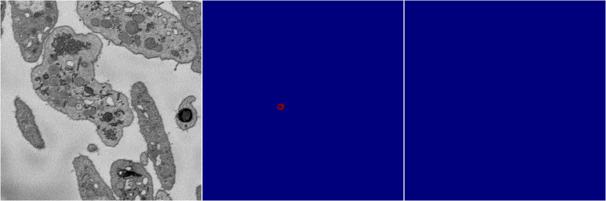

[Back](..)&nbsp;&nbsp;&nbsp;&nbsp;&nbsp;[Home](https://leapmanlab.github.io/snapshots)

---

<a href="0"><h2>multi_binary / 1220 / 4 / 0</h2></a>
Created 21 Dec 2018, 01:15:55

<i>Click for more details</i>

**ari**: 0.7269. **miou**: 0.4993. **accuracy**: 0.9986. **n_params**: 31030658.0000. 

---

<a href="4"><h2>multi_binary / 1220 / 4 / 4</h2></a>
Created 21 Dec 2018, 01:15:55

<i>Click for more details</i>

**ari**: 0.7269. **miou**: 0.4993. **accuracy**: 0.9986. **n_params**: 31030658.0000. 

---

<a href="2"><h2>multi_binary / 1220 / 4 / 2</h2></a>
Created 21 Dec 2018, 01:15:55

<i>Click for more details</i>

**ari**: 0.7269. **miou**: 0.4993. **accuracy**: 0.9986. **n_params**: 31030658.0000. 

---

[Back](..)&nbsp;&nbsp;&nbsp;&nbsp;&nbsp;[Home](https://leapmanlab.github.io/snapshots)

---