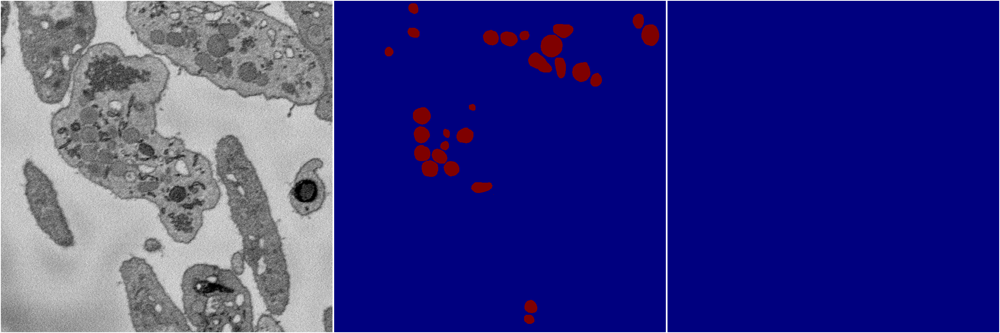
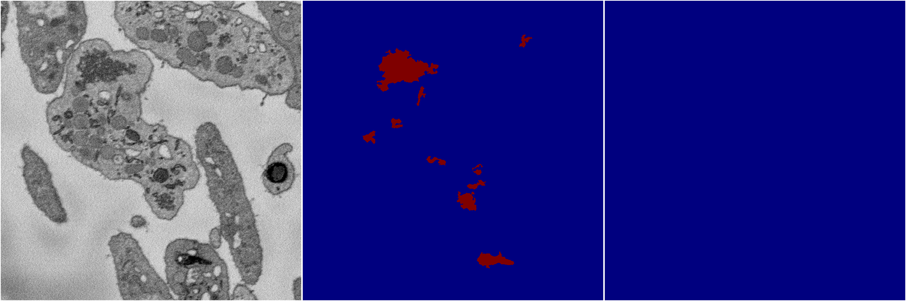
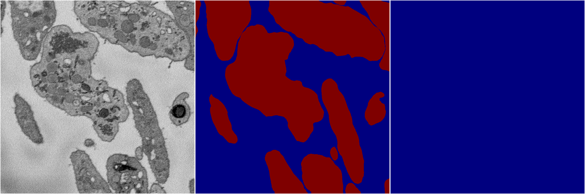
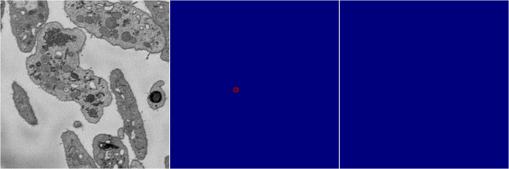

[Back](..)&nbsp;&nbsp;&nbsp;&nbsp;&nbsp;[Home](https://leapmanlab.github.io/snapshots)

---

<a href="2"><h2>multi_binary / 1220 / 2</h2></a>
Created 21 Dec 2018, 01:15:55

<i>Click image for more details</i>

3 nets

**ari**: min 0.0278. max 0.0278. mean 0.0278.  ([best net](2/3))

**miou**: min 0.4891. max 0.4891. mean 0.4891.  ([best net](2/3))

**accuracy**: min 0.9782. max 0.9782. mean 0.9782.  ([best net](2/4))

**n_params**: min 31030658.0000. max 31030658.0000. mean 31030658.0000.  ([best net](2/3))

---

<a href="6"><h2>multi_binary / 1220 / 6</h2></a>
Created 21 Dec 2018, 01:15:55

<i>Click image for more details</i>

2 nets

**ari**: min 0.0093. max 0.0093. mean 0.0093.  ([best net](6/0))

**miou**: min 0.4863. max 0.4863. mean 0.4863.  ([best net](6/0))

**accuracy**: min 0.9726. max 0.9726. mean 0.9726.  ([best net](6/0))

**n_params**: min 31030658.0000. max 31030658.0000. mean 31030658.0000.  ([best net](6/0))

---

<a href="0"><h2>multi_binary / 1220 / 0</h2></a>
Created 21 Dec 2018, 01:15:55

<i>Click image for more details</i>

1 nets

**ari**: min -0.0000. max -0.0000. mean -0.0000.  ([best net](0/0))

**miou**: min 0.2369. max 0.2369. mean 0.2369.  ([best net](0/0))

**accuracy**: min 0.4738. max 0.4738. mean 0.4738.  ([best net](0/0))

**n_params**: min 31030658.0000. max 31030658.0000. mean 31030658.0000.  ([best net](0/0))

---

<a href="4"><h2>multi_binary / 1220 / 4</h2></a>
Created 21 Dec 2018, 01:15:55

<i>Click image for more details</i>

3 nets

**ari**: min 0.7269. max 0.7269. mean 0.7269.  ([best net](4/0))

**miou**: min 0.4993. max 0.4993. mean 0.4993.  ([best net](4/0))

**accuracy**: min 0.9986. max 0.9986. mean 0.9986.  ([best net](4/0))

**n_params**: min 31030658.0000. max 31030658.0000. mean 31030658.0000.  ([best net](4/0))

---

<a href="5"><h2>multi_binary / 1220 / 5</h2></a>
Created 21 Dec 2018, 01:15:55

<i>Click image for more details</i>

4 nets

**ari**: min 0.8056. max 0.8056. mean 0.8056.  ([best net](5/0))

**miou**: min 0.4998. max 0.4998. mean 0.4998.  ([best net](5/0))

**accuracy**: min 0.9997. max 0.9997. mean 0.9997.  ([best net](5/0))

**n_params**: min 31030658.0000. max 31030658.0000. mean 31030658.0000.  ([best net](5/0))

---

[Back](..)&nbsp;&nbsp;&nbsp;&nbsp;&nbsp;[Home](https://leapmanlab.github.io/snapshots)

---