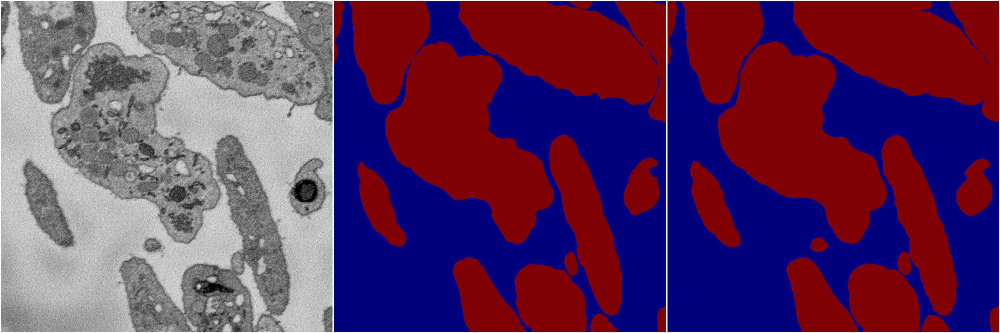
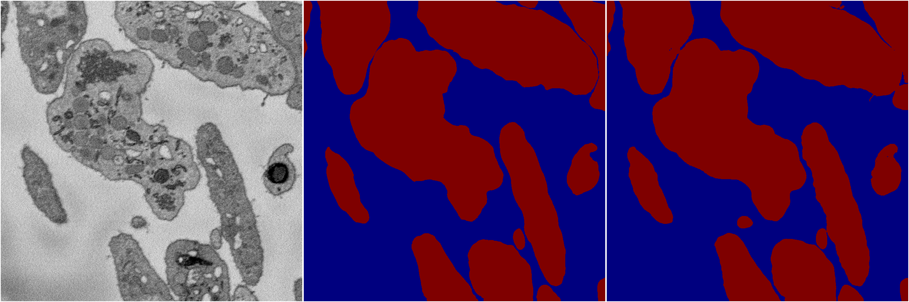

[Back](..)&nbsp;&nbsp;&nbsp;&nbsp;&nbsp;[Home](https://leapmanlab.github.io/snapshots)

---

<a href="4"><h2>multi_binary / 1221 / 0 / 4</h2></a>
Created 21 Dec 2018, 14:17:46

<i>Click for more details</i>

**ari**: 0.8955. **miou**: 0.9477. **accuracy**: 0.9733. **n_params**: 31030658.0000. 

---

<a href="3"><h2>multi_binary / 1221 / 0 / 3</h2></a>
Created 21 Dec 2018, 14:17:46

<i>Click for more details</i>

**ari**: 0.8943. **miou**: 0.9471. **accuracy**: 0.9729. **n_params**: 31030658.0000. 

---

<a href="2"><h2>multi_binary / 1221 / 0 / 2</h2></a>
Created 21 Dec 2018, 14:17:46

<i>Click for more details</i>

**ari**: 0.8952. **miou**: 0.9476. **accuracy**: 0.9732. **n_params**: 31030658.0000. 

---

<a href="1"><h2>multi_binary / 1221 / 0 / 1</h2></a>
Created 21 Dec 2018, 14:17:46

<i>Click for more details</i>

**ari**: 0.8963. **miou**: 0.9482. **accuracy**: 0.9735. **n_params**: 31030658.0000. 

---

<a href="0"><h2>multi_binary / 1221 / 0 / 0</h2></a>
Created 21 Dec 2018, 14:17:46

<i>Click for more details</i>

**ari**: 0.8936. **miou**: 0.9468. **accuracy**: 0.9728. **n_params**: 31030658.0000. 

---

[Back](..)&nbsp;&nbsp;&nbsp;&nbsp;&nbsp;[Home](https://leapmanlab.github.io/snapshots)

---