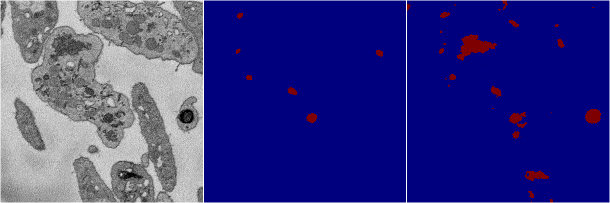
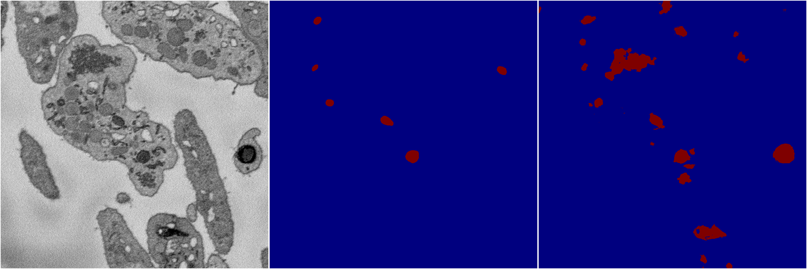

[Back](..)&nbsp;&nbsp;&nbsp;&nbsp;&nbsp;[Home](https://leapmanlab.github.io/snapshots)

---

<a href="4"><h2>multi_binary / 1221 / 1 / 4</h2></a>
Created 21 Dec 2018, 14:17:46

<i>Click for more details</i>

**ari**: 0.4016. **miou**: 0.6180. **accuracy**: 0.9668. **n_params**: 31030658.0000. 

---

<a href="2"><h2>multi_binary / 1221 / 1 / 2</h2></a>
Created 21 Dec 2018, 14:17:46

<i>Click for more details</i>

**ari**: 0.3482. **miou**: 0.5867. **accuracy**: 0.9552. **n_params**: 31030658.0000. 

---

<a href="3"><h2>multi_binary / 1221 / 1 / 3</h2></a>
Created 21 Dec 2018, 14:17:46

<i>Click for more details</i>

**ari**: 0.3656. **miou**: 0.6009. **accuracy**: 0.9613. **n_params**: 31030658.0000. 

---

<a href="1"><h2>multi_binary / 1221 / 1 / 1</h2></a>
Created 21 Dec 2018, 14:17:46

<i>Click for more details</i>

**ari**: 0.3827. **miou**: 0.6080. **accuracy**: 0.9629. **n_params**: 31030658.0000. 

---

[Back](..)&nbsp;&nbsp;&nbsp;&nbsp;&nbsp;[Home](https://leapmanlab.github.io/snapshots)

---