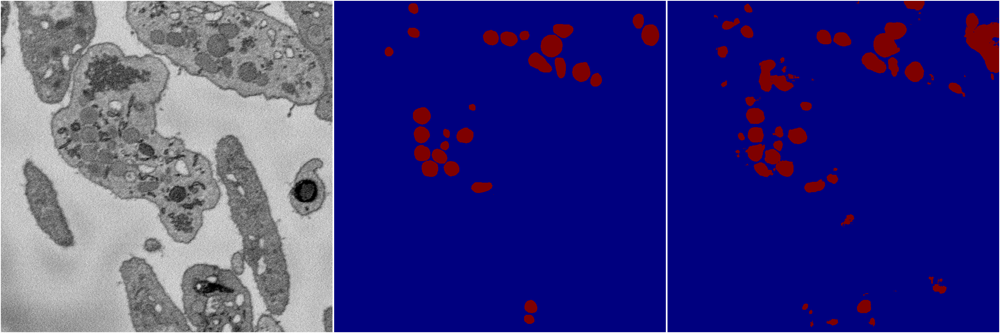
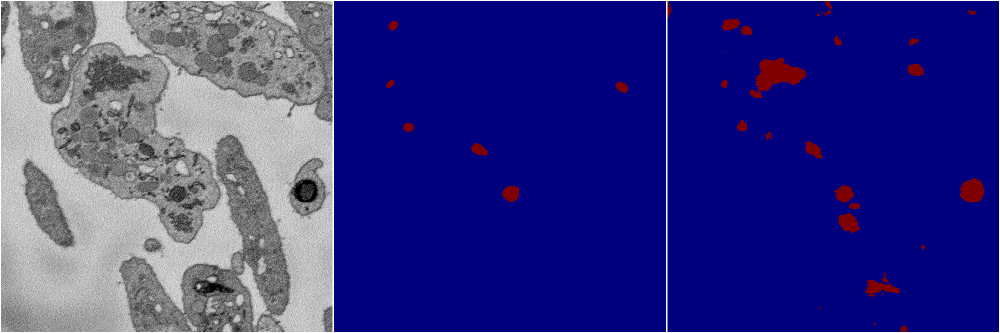
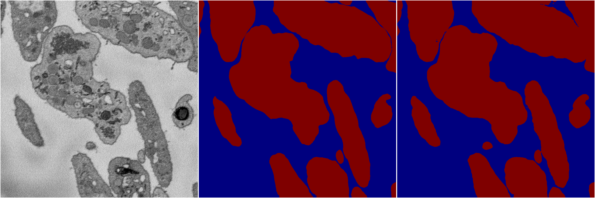

[Back](..)&nbsp;&nbsp;&nbsp;&nbsp;&nbsp;[Home](https://leapmanlab.github.io/snapshots)

---

<a href="2"><h2>multi_binary / 1221 / 2</h2></a>
Created 21 Dec 2018, 14:17:47

<i>Click image for more details</i>

1 nets

**ari**: min 0.5447. max 0.5447. mean 0.5447.  ([best net](2/2))

**miou**: min 0.7055. max 0.7055. mean 0.7055.  ([best net](2/2))

**accuracy**: min 0.9749. max 0.9749. mean 0.9749.  ([best net](2/2))

**n_params**: min 31030658.0000. max 31030658.0000. mean 31030658.0000.  ([best net](2/2))

---

<a href="1"><h2>multi_binary / 1221 / 1</h2></a>
Created 21 Dec 2018, 14:17:46

<i>Click image for more details</i>

4 nets

**ari**: min 0.3482. max 0.4016. mean 0.3745.  ([best net](1/4))

**miou**: min 0.5867. max 0.6180. mean 0.6034.  ([best net](1/4))

**accuracy**: min 0.9552. max 0.9668. mean 0.9615.  ([best net](1/4))

**n_params**: min 31030658.0000. max 31030658.0000. mean 31030658.0000.  ([best net](1/1))

---

<a href="0"><h2>multi_binary / 1221 / 0</h2></a>
Created 21 Dec 2018, 14:17:46

<i>Click image for more details</i>

5 nets

**ari**: min 0.8936. max 0.8963. mean 0.8950.  ([best net](0/1))

**miou**: min 0.9468. max 0.9482. mean 0.9475.  ([best net](0/1))

**accuracy**: min 0.9728. max 0.9735. mean 0.9731.  ([best net](0/1))

**n_params**: min 31030658.0000. max 31030658.0000. mean 31030658.0000.  ([best net](0/0))

---

[Back](..)&nbsp;&nbsp;&nbsp;&nbsp;&nbsp;[Home](https://leapmanlab.github.io/snapshots)

---