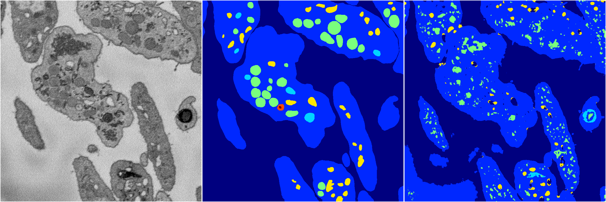
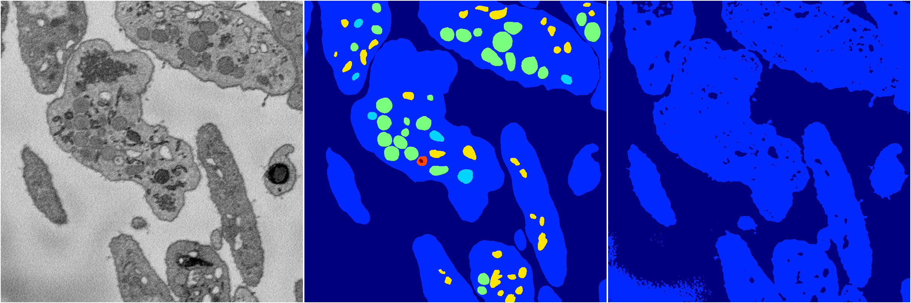
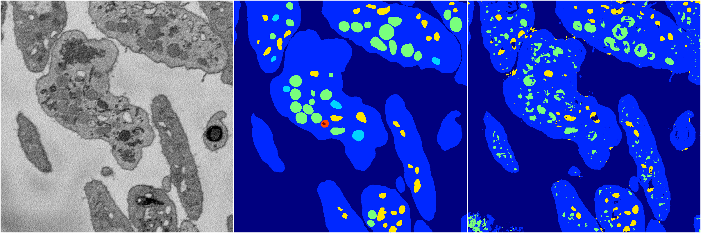
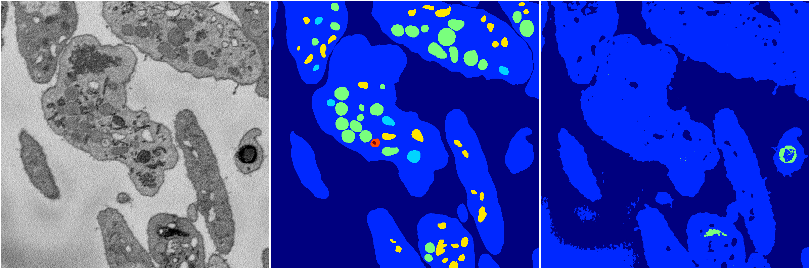

[Back](..)&nbsp;&nbsp;&nbsp;&nbsp;&nbsp;[Home](https://leapmanlab.github.io/snapshots)

---

<a href="0"><h2>random_2d_ed / 1210 / 0 / 0</h2></a>
Created 13 Dec 2018, 09:43:01

<i>Click for more details</i>

**ari**: 0.6553. **miou**: 0.2992. **accuracy**: 0.8560. **n_params**: 259856.0000. 

---

<a href="3"><h2>random_2d_ed / 1210 / 0 / 3</h2></a>
Created 13 Dec 2018, 09:43:01

<i>Click for more details</i>

**ari**: 0.6313. **miou**: 0.2343. **accuracy**: 0.8611. **n_params**: 259856.0000. 

---

<a href="1"><h2>random_2d_ed / 1210 / 0 / 1</h2></a>
Created 13 Dec 2018, 09:43:01

<i>Click for more details</i>

**ari**: 0.7520. **miou**: 0.3614. **accuracy**: 0.8930. **n_params**: 259856.0000. 

---

<a href="4"><h2>random_2d_ed / 1210 / 0 / 4</h2></a>
Created 13 Dec 2018, 09:43:01

<i>Click for more details</i>

**ari**: 0.6258. **miou**: 0.2336. **accuracy**: 0.8587. **n_params**: 259856.0000. 

---

<a href="2"><h2>random_2d_ed / 1210 / 0 / 2</h2></a>
Created 13 Dec 2018, 09:43:01

<i>Click for more details</i>

**ari**: 0.6615. **miou**: 0.2783. **accuracy**: 0.8653. **n_params**: 259856.0000. 

---

[Back](..)&nbsp;&nbsp;&nbsp;&nbsp;&nbsp;[Home](https://leapmanlab.github.io/snapshots)

---