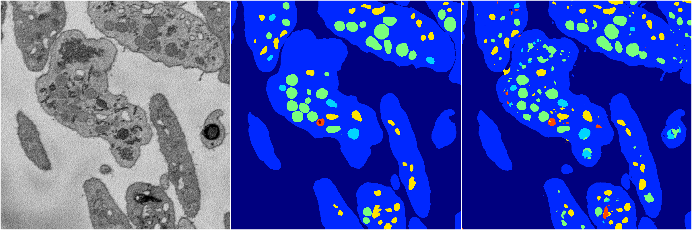
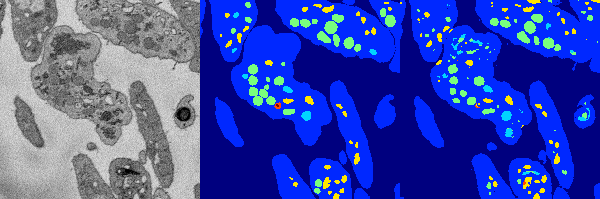
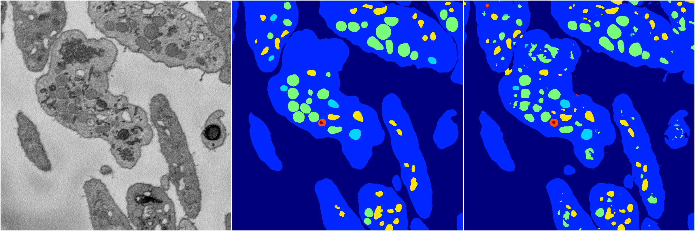
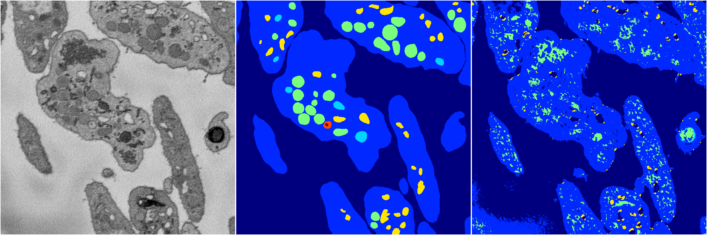

[Back](..)&nbsp;&nbsp;&nbsp;&nbsp;&nbsp;[Home](https://leapmanlab.github.io/snapshots)

---

<a href="5"><h2>random_2d_ed / 1210 / 1 / 5</h2></a>
Created 16 Dec 2018, 10:15:12

<i>Click for more details</i>

**ari**: 0.7940. **miou**: 0.4895. **accuracy**: 0.9156. **n_params**: 6273536.0000. 

---

<a href="3"><h2>random_2d_ed / 1210 / 1 / 3</h2></a>
Created 16 Dec 2018, 10:15:12

<i>Click for more details</i>

**ari**: 0.8043. **miou**: 0.4899. **accuracy**: 0.9205. **n_params**: 6273536.0000. 

---

<a href="2"><h2>random_2d_ed / 1210 / 1 / 2</h2></a>
Created 16 Dec 2018, 10:15:12

<i>Click for more details</i>

**ari**: 0.8106. **miou**: 0.5053. **accuracy**: 0.9258. **n_params**: 6273536.0000. 

---

<a href="0"><h2>random_2d_ed / 1210 / 1 / 0</h2></a>
Created 16 Dec 2018, 10:15:12

<i>Click for more details</i>

**ari**: 0.8044. **miou**: 0.5853. **accuracy**: 0.9228. **n_params**: 6273536.0000. 

---

<a href="1"><h2>random_2d_ed / 1210 / 1 / 1</h2></a>
Created 16 Dec 2018, 10:15:12

<i>Click for more details</i>

**ari**: 0.6605. **miou**: 0.2794. **accuracy**: 0.8538. **n_params**: 6273536.0000. 

---

[Back](..)&nbsp;&nbsp;&nbsp;&nbsp;&nbsp;[Home](https://leapmanlab.github.io/snapshots)

---