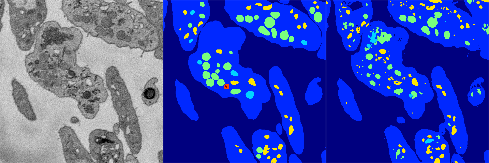
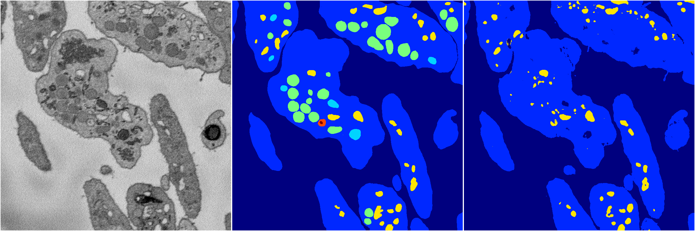
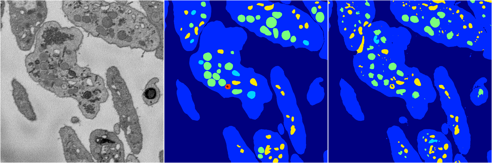
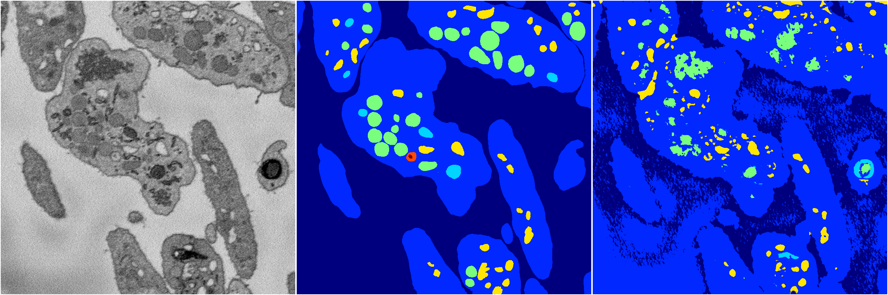
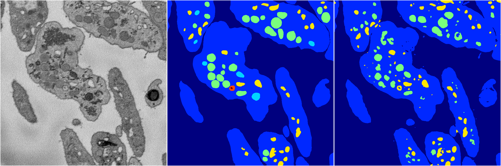

[Back](..)&nbsp;&nbsp;&nbsp;&nbsp;&nbsp;[Home](https://leapmanlab.github.io/snapshots)

---

<a href="0"><h2>random_2d_ed / 1210 / 10 / 0</h2></a>
Created 21 Dec 2018, 01:15:55

<i>Click for more details</i>

**ari**: 0.7669. **miou**: 0.4054. **accuracy**: 0.9115. **n_params**: 14119602.0000. 

---

<a href="3"><h2>random_2d_ed / 1210 / 10 / 3</h2></a>
Created 21 Dec 2018, 01:15:55

<i>Click for more details</i>

**ari**: 0.7659. **miou**: 0.3343. **accuracy**: 0.9178. **n_params**: 14119602.0000. 

---

<a href="1"><h2>random_2d_ed / 1210 / 10 / 1</h2></a>
Created 21 Dec 2018, 01:15:55

<i>Click for more details</i>

**ari**: 0.7897. **miou**: 0.4115. **accuracy**: 0.9201. **n_params**: 14119602.0000. 

---

<a href="4"><h2>random_2d_ed / 1210 / 10 / 4</h2></a>
Created 21 Dec 2018, 01:15:55

<i>Click for more details</i>

**ari**: 0.3520. **miou**: 0.2707. **accuracy**: 0.7337. **n_params**: 14119602.0000. 

---

<a href="2"><h2>random_2d_ed / 1210 / 10 / 2</h2></a>
Created 21 Dec 2018, 01:15:55

<i>Click for more details</i>

**ari**: 0.7952. **miou**: 0.3889. **accuracy**: 0.9233. **n_params**: 14119602.0000. 

---

[Back](..)&nbsp;&nbsp;&nbsp;&nbsp;&nbsp;[Home](https://leapmanlab.github.io/snapshots)

---