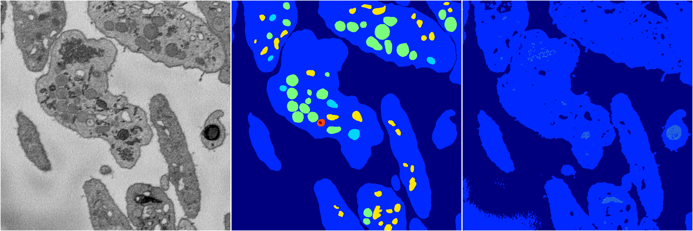
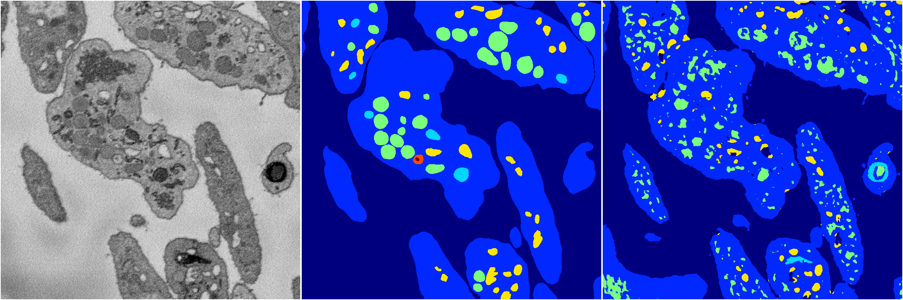
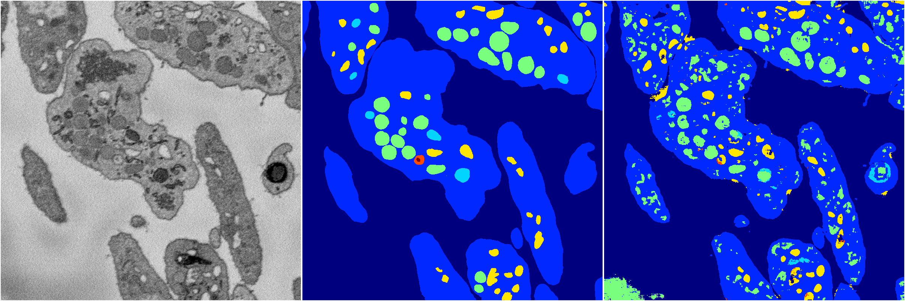
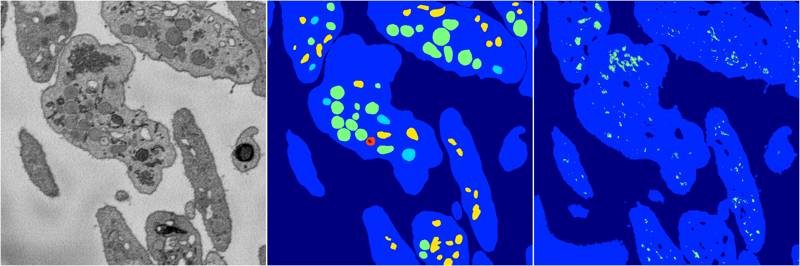

[Back](..)&nbsp;&nbsp;&nbsp;&nbsp;&nbsp;[Home](https://leapmanlab.github.io/snapshots)

---

<a href="4"><h2>random_2d_ed / 1210 / 11 / 4</h2></a>
Created 17 Dec 2018, 23:35:03

<i>Click for more details</i>

**ari**: 0.6366. **miou**: 0.2353. **accuracy**: 0.8616. **n_params**: 271445.0000. 

---

<a href="3"><h2>random_2d_ed / 1210 / 11 / 3</h2></a>
Created 17 Dec 2018, 23:35:03

<i>Click for more details</i>

**ari**: 0.6835. **miou**: 0.3336. **accuracy**: 0.8644. **n_params**: 271445.0000. 

---

<a href="2"><h2>random_2d_ed / 1210 / 11 / 2</h2></a>
Created 17 Dec 2018, 23:35:03

<i>Click for more details</i>

**ari**: 0.7392. **miou**: 0.4483. **accuracy**: 0.8829. **n_params**: 271445.0000. 

---

<a href="1"><h2>random_2d_ed / 1210 / 11 / 1</h2></a>
Created 17 Dec 2018, 23:35:03

<i>Click for more details</i>

**ari**: 0.6407. **miou**: 0.2448. **accuracy**: 0.8593. **n_params**: 271445.0000. 

---

<a href="0"><h2>random_2d_ed / 1210 / 11 / 0</h2></a>
Created 17 Dec 2018, 23:35:03

<i>Click for more details</i>

**ari**: 0.7577. **miou**: 0.4545. **accuracy**: 0.8955. **n_params**: 271445.0000. 

---

[Back](..)&nbsp;&nbsp;&nbsp;&nbsp;&nbsp;[Home](https://leapmanlab.github.io/snapshots)

---