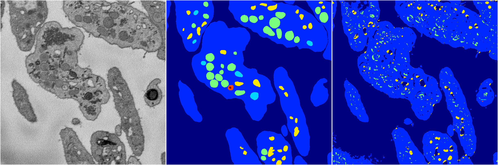
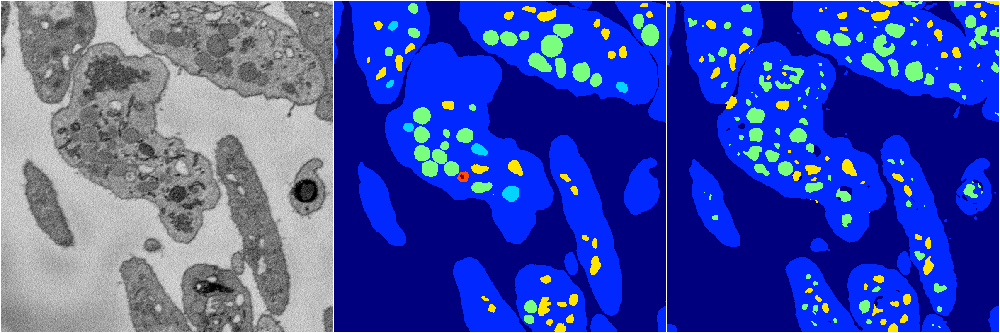
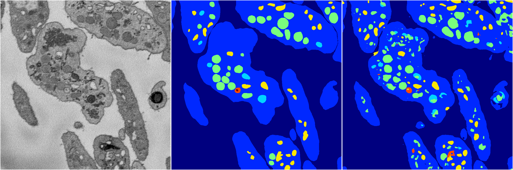
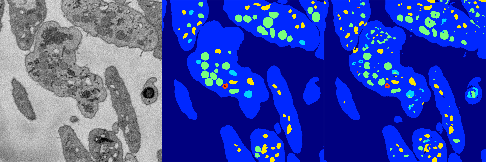

[Back](..)&nbsp;&nbsp;&nbsp;&nbsp;&nbsp;[Home](https://leapmanlab.github.io/snapshots)

---

<a href="3"><h2>random_2d_ed / 1210 / 12 / 3</h2></a>
(Created 13 Dec 2018, 16:44:46. Modified 13 Dec 2018, 16:44:46)

<i>Click for more details</i>

**ari**: 0.7007. **miou**: 0.2992. **accuracy**: 0.8808. **n_params**: 14260710.0000. 

---

<a href="4"><h2>random_2d_ed / 1210 / 12 / 4</h2></a>
(Created 13 Dec 2018, 16:44:46. Modified 13 Dec 2018, 16:44:46)

<i>Click for more details</i>

**ari**: 0.7798. **miou**: 0.3901. **accuracy**: 0.9088. **n_params**: 14260710.0000. 

---

<a href="1"><h2>random_2d_ed / 1210 / 12 / 1</h2></a>
(Created 13 Dec 2018, 16:44:46. Modified 13 Dec 2018, 16:44:46)

<i>Click for more details</i>

**ari**: 0.7932. **miou**: 0.4854. **accuracy**: 0.9168. **n_params**: 14260710.0000. 

---

<a href="2"><h2>random_2d_ed / 1210 / 12 / 2</h2></a>
(Created 13 Dec 2018, 16:44:46. Modified 13 Dec 2018, 16:44:46)

<i>Click for more details</i>

**ari**: 0.7865. **miou**: 0.4737. **accuracy**: 0.9096. **n_params**: 14260710.0000. 

---

<a href="0"><h2>random_2d_ed / 1210 / 12 / 0</h2></a>
(Created 13 Dec 2018, 16:44:46. Modified 13 Dec 2018, 16:44:46)

<i>Click for more details</i>

**ari**: 0.8067. **miou**: 0.4927. **accuracy**: 0.9225. **n_params**: 14260710.0000. 

---

[Back](..)&nbsp;&nbsp;&nbsp;&nbsp;&nbsp;[Home](https://leapmanlab.github.io/snapshots)

---