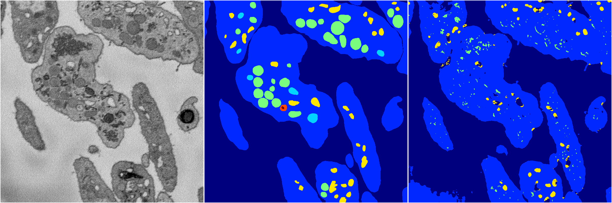
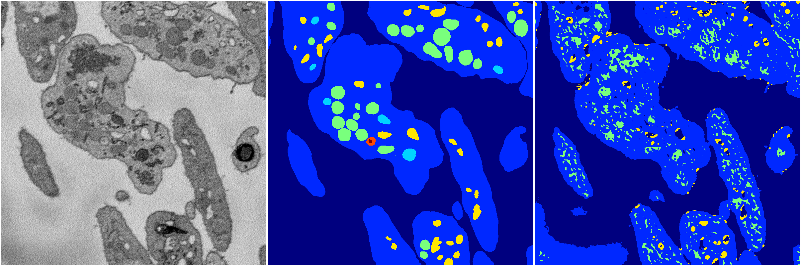
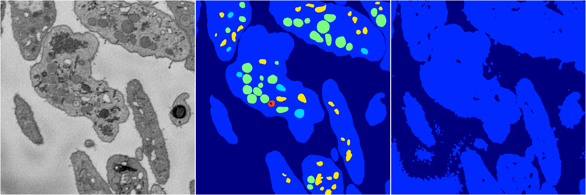
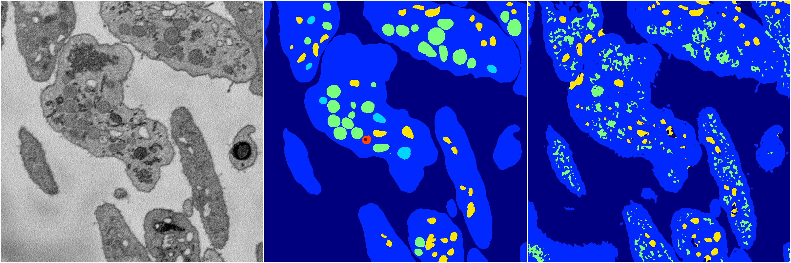

[Back](..)&nbsp;&nbsp;&nbsp;&nbsp;&nbsp;[Home](https://leapmanlab.github.io/snapshots)

---

<a href="0"><h2>random_2d_ed / 1210 / 13 / 0</h2></a>
Created 13 Dec 2018, 10:03:55

<i>Click for more details</i>

**ari**: 0.5729. **miou**: 0.3067. **accuracy**: 0.8932. **n_params**: 46196228.0000. 

---

<a href="3"><h2>random_2d_ed / 1210 / 13 / 3</h2></a>
Created 13 Dec 2018, 10:03:55

<i>Click for more details</i>

**ari**: 0.5231. **miou**: 0.2964. **accuracy**: 0.8567. **n_params**: 46196228.0000. 

---

<a href="1"><h2>random_2d_ed / 1210 / 13 / 1</h2></a>
Created 13 Dec 2018, 10:03:55

<i>Click for more details</i>

**ari**: 0.3781. **miou**: 0.2219. **accuracy**: 0.8425. **n_params**: 46196228.0000. 

---

<a href="4"><h2>random_2d_ed / 1210 / 13 / 4</h2></a>
Created 13 Dec 2018, 10:03:55

<i>Click for more details</i>

**ari**: 0.5576. **miou**: 0.3324. **accuracy**: 0.8747. **n_params**: 46196228.0000. 

---

<a href="2"><h2>random_2d_ed / 1210 / 13 / 2</h2></a>
Created 13 Dec 2018, 10:03:55

<i>Click for more details</i>

**ari**: 0.5303. **miou**: 0.3283. **accuracy**: 0.8679. **n_params**: 46196228.0000. 

---

[Back](..)&nbsp;&nbsp;&nbsp;&nbsp;&nbsp;[Home](https://leapmanlab.github.io/snapshots)

---