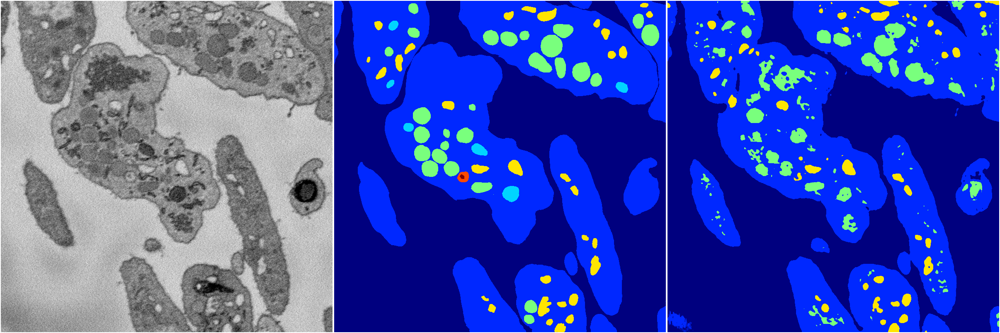
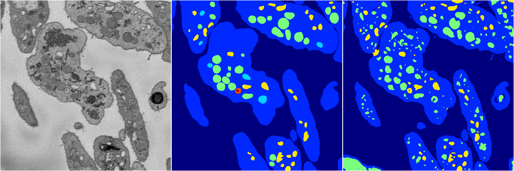
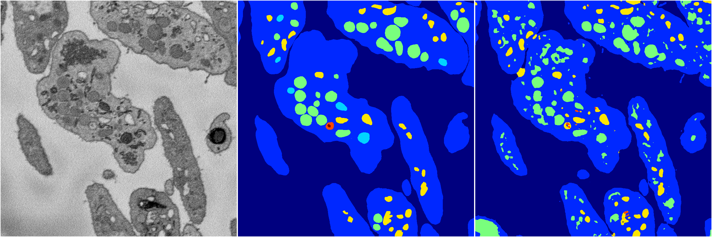
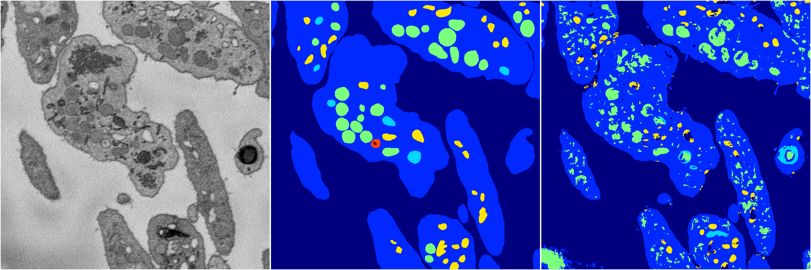

[Back](..)&nbsp;&nbsp;&nbsp;&nbsp;&nbsp;[Home](https://leapmanlab.github.io/snapshots)

---

<a href="2"><h2>random_2d_ed / 1210 / 14 / 2</h2></a>
Created 13 Dec 2018, 16:45:47

<i>Click for more details</i>

**ari**: 0.8091. **miou**: 0.4627. **accuracy**: 0.9260. **n_params**: 10409771.0000. 

---

<a href="4"><h2>random_2d_ed / 1210 / 14 / 4</h2></a>
Created 13 Dec 2018, 16:45:47

<i>Click for more details</i>

**ari**: 0.7825. **miou**: 0.3789. **accuracy**: 0.9125. **n_params**: 10409771.0000. 

---

<a href="3"><h2>random_2d_ed / 1210 / 14 / 3</h2></a>
Created 13 Dec 2018, 16:45:47

<i>Click for more details</i>

**ari**: 0.7696. **miou**: 0.3781. **accuracy**: 0.9052. **n_params**: 10409771.0000. 

---

<a href="1"><h2>random_2d_ed / 1210 / 14 / 1</h2></a>
Created 13 Dec 2018, 16:45:47

<i>Click for more details</i>

**ari**: 0.7752. **miou**: 0.3956. **accuracy**: 0.9082. **n_params**: 10409771.0000. 

---

<a href="0"><h2>random_2d_ed / 1210 / 14 / 0</h2></a>
Created 13 Dec 2018, 16:45:47

<i>Click for more details</i>

**ari**: 0.7362. **miou**: 0.3532. **accuracy**: 0.8889. **n_params**: 10409771.0000. 

---

[Back](..)&nbsp;&nbsp;&nbsp;&nbsp;&nbsp;[Home](https://leapmanlab.github.io/snapshots)

---