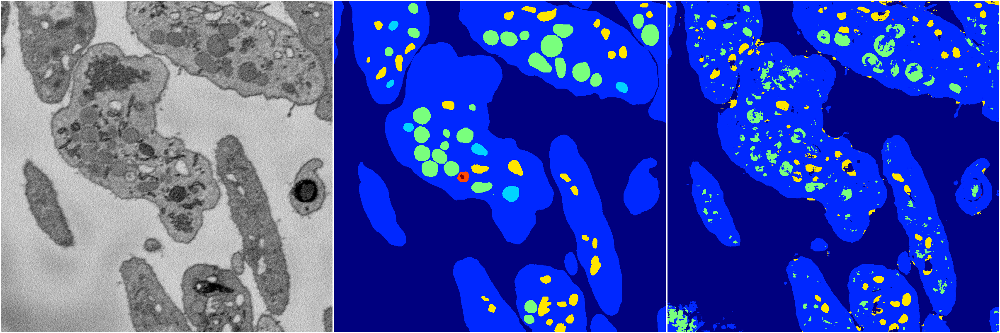
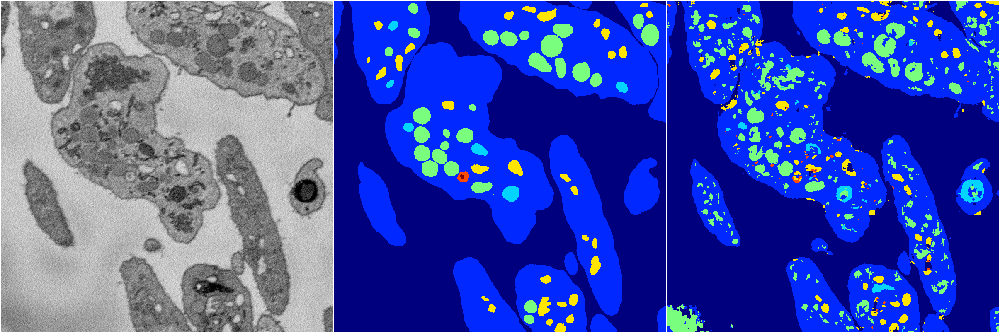
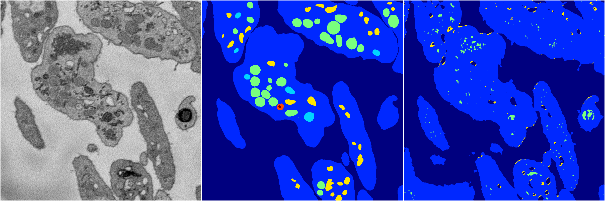
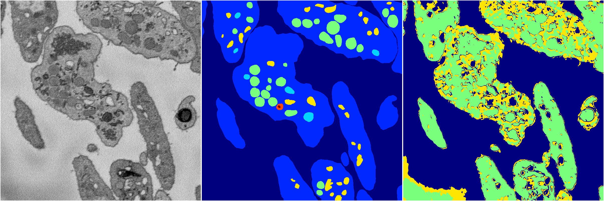
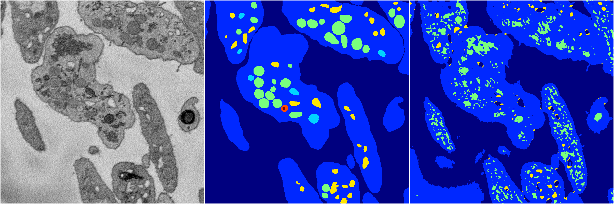

[Back](..)&nbsp;&nbsp;&nbsp;&nbsp;&nbsp;[Home](https://leapmanlab.github.io/snapshots)

---

<a href="4"><h2>random_2d_ed / 1210 / 15 / 4</h2></a>
Created 13 Dec 2018, 16:45:47

<i>Click for more details</i>

**ari**: 0.7470. **miou**: 0.3788. **accuracy**: 0.8906. **n_params**: 1183171.0000. 

---

<a href="3"><h2>random_2d_ed / 1210 / 15 / 3</h2></a>
Created 13 Dec 2018, 16:45:47

<i>Click for more details</i>

**ari**: 0.7283. **miou**: 0.4193. **accuracy**: 0.8785. **n_params**: 1183171.0000. 

---

<a href="2"><h2>random_2d_ed / 1210 / 15 / 2</h2></a>
Created 13 Dec 2018, 16:45:47

<i>Click for more details</i>

**ari**: 0.6476. **miou**: 0.2552. **accuracy**: 0.8619. **n_params**: 1183171.0000. 

---

<a href="1"><h2>random_2d_ed / 1210 / 15 / 1</h2></a>
Created 13 Dec 2018, 16:45:47

<i>Click for more details</i>

**ari**: 0.3910. **miou**: 0.1304. **accuracy**: 0.4426. **n_params**: 1183171.0000. 

---

<a href="0"><h2>random_2d_ed / 1210 / 15 / 0</h2></a>
Created 13 Dec 2018, 16:45:47

<i>Click for more details</i>

**ari**: 0.6370. **miou**: 0.2879. **accuracy**: 0.8397. **n_params**: 1183171.0000. 

---

[Back](..)&nbsp;&nbsp;&nbsp;&nbsp;&nbsp;[Home](https://leapmanlab.github.io/snapshots)

---