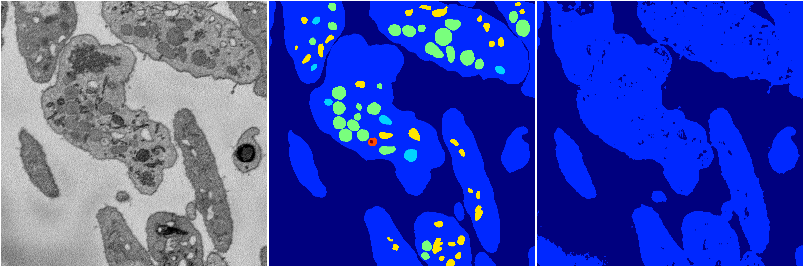
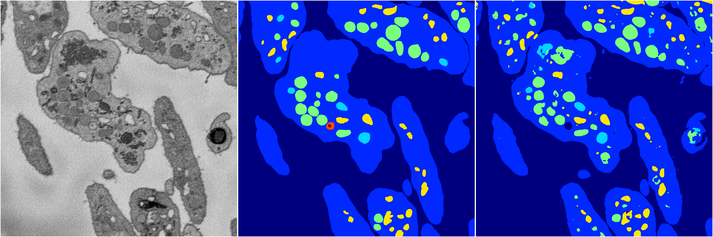
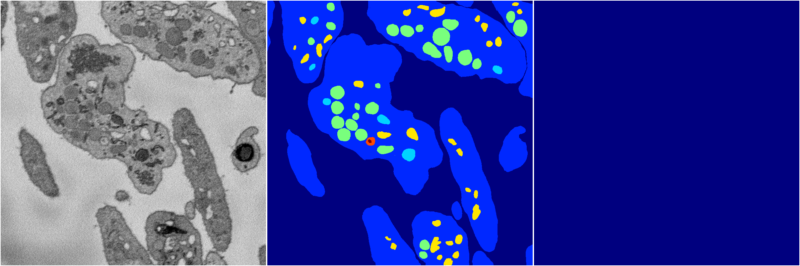
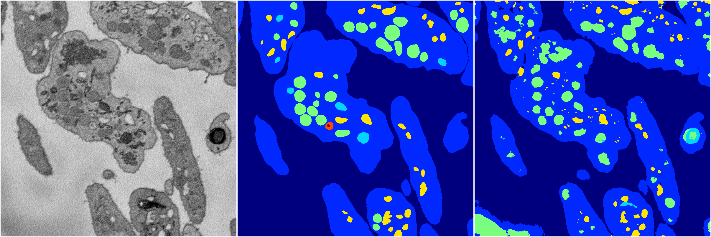

[Back](..)&nbsp;&nbsp;&nbsp;&nbsp;&nbsp;[Home](https://leapmanlab.github.io/snapshots)

---

<a href="3"><h2>random_2d_ed / 1210 / 16 / 3</h2></a>
Created 13 Dec 2018, 10:03:55

<i>Click for more details</i>

**ari**: 0.8121. **miou**: 0.5620. **accuracy**: 0.9259. **n_params**: 15057909.0000. 

---

<a href="1"><h2>random_2d_ed / 1210 / 16 / 1</h2></a>
Created 13 Dec 2018, 10:03:55

<i>Click for more details</i>

**ari**: 0.7003. **miou**: 0.2427. **accuracy**: 0.8903. **n_params**: 15057909.0000. 

---

<a href="4"><h2>random_2d_ed / 1210 / 16 / 4</h2></a>
Created 13 Dec 2018, 10:03:55

<i>Click for more details</i>

**ari**: 0.8067. **miou**: 0.4610. **accuracy**: 0.9246. **n_params**: 15057909.0000. 

---

<a href="2"><h2>random_2d_ed / 1210 / 16 / 2</h2></a>
Created 13 Dec 2018, 10:03:55

<i>Click for more details</i>

**ari**: 0.0000. **miou**: 0.0691. **accuracy**: 0.4836. **n_params**: 15057909.0000. 

---

<a href="0"><h2>random_2d_ed / 1210 / 16 / 0</h2></a>
Created 13 Dec 2018, 10:03:55

<i>Click for more details</i>

**ari**: 0.7608. **miou**: 0.3579. **accuracy**: 0.8962. **n_params**: 15057909.0000. 

---

[Back](..)&nbsp;&nbsp;&nbsp;&nbsp;&nbsp;[Home](https://leapmanlab.github.io/snapshots)

---