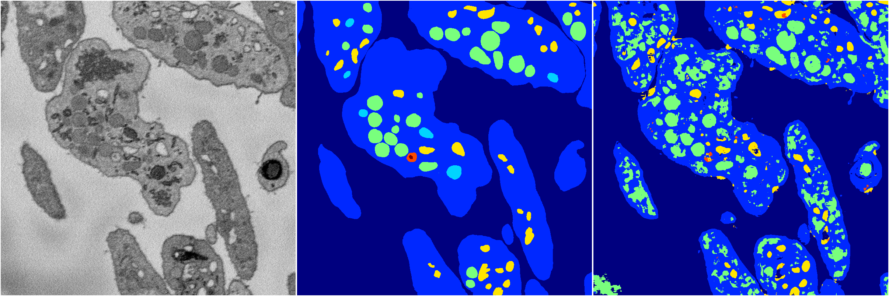
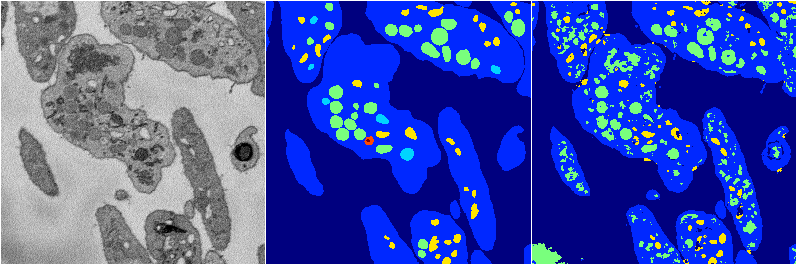
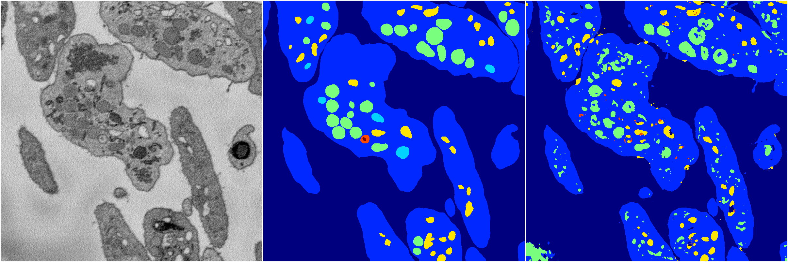

[Back](..)&nbsp;&nbsp;&nbsp;&nbsp;&nbsp;[Home](https://leapmanlab.github.io/snapshots)

---

<a href="3"><h2>random_2d_ed / 1210 / 17 / 3</h2></a>
Created 14 Dec 2018, 11:38:26

<i>Click for more details</i>

**ari**: 0.7533. **miou**: 0.4321. **accuracy**: 0.8915. **n_params**: 929291.0000. 

---

<a href="4"><h2>random_2d_ed / 1210 / 17 / 4</h2></a>
Created 14 Dec 2018, 11:38:26

<i>Click for more details</i>

**ari**: 0.6777. **miou**: 0.3650. **accuracy**: 0.8398. **n_params**: 929291.0000. 

---

<a href="2"><h2>random_2d_ed / 1210 / 17 / 2</h2></a>
Created 14 Dec 2018, 11:38:26

<i>Click for more details</i>

**ari**: 0.7239. **miou**: 0.3535. **accuracy**: 0.8718. **n_params**: 929291.0000. 

---

<a href="1"><h2>random_2d_ed / 1210 / 17 / 1</h2></a>
Created 14 Dec 2018, 11:38:26

<i>Click for more details</i>

**ari**: 0.7578. **miou**: 0.3916. **accuracy**: 0.8944. **n_params**: 929291.0000. 

---

<a href="0"><h2>random_2d_ed / 1210 / 17 / 0</h2></a>
Created 14 Dec 2018, 11:38:26

<i>Click for more details</i>

**ari**: 0.7759. **miou**: 0.4231. **accuracy**: 0.9069. **n_params**: 929291.0000. 

---

[Back](..)&nbsp;&nbsp;&nbsp;&nbsp;&nbsp;[Home](https://leapmanlab.github.io/snapshots)

---