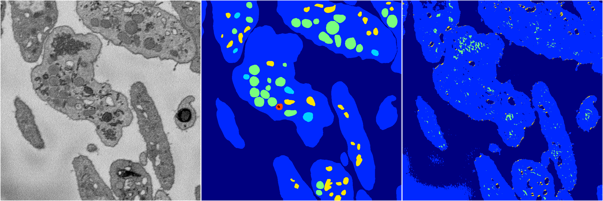
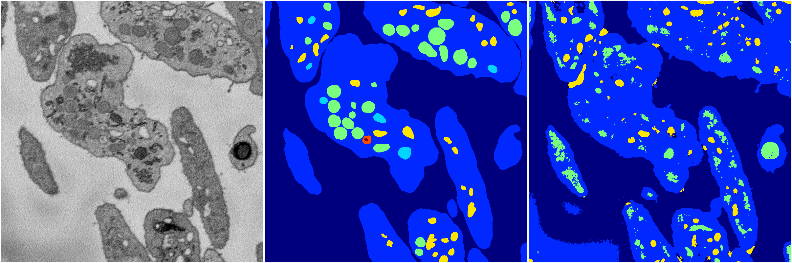
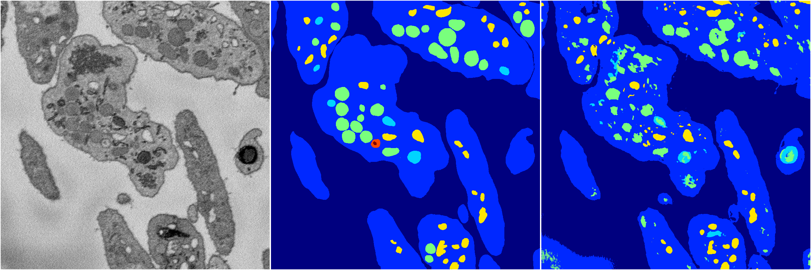
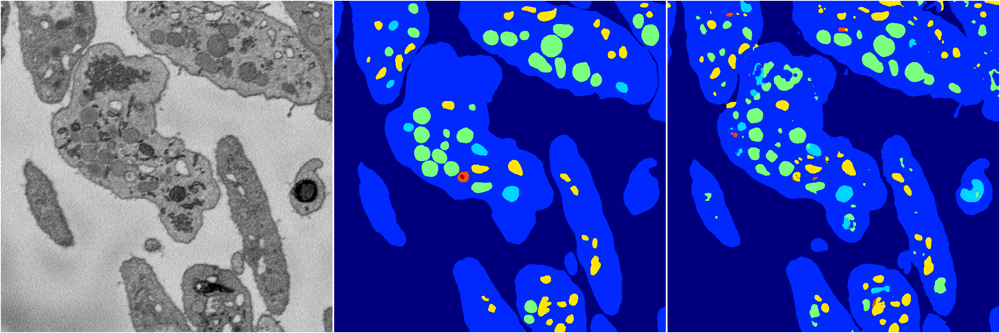

[Back](..)&nbsp;&nbsp;&nbsp;&nbsp;&nbsp;[Home](https://leapmanlab.github.io/snapshots)

---

<a href="3"><h2>random_2d_ed / 1210 / 18 / 3</h2></a>
Created 17 Dec 2018, 02:57:33

<i>Click for more details</i>

**ari**: 0.8092. **miou**: 0.5491. **accuracy**: 0.9249. **n_params**: 28513233.0000. 

---

<a href="4"><h2>random_2d_ed / 1210 / 18 / 4</h2></a>
Created 17 Dec 2018, 02:57:33

<i>Click for more details</i>

**ari**: 0.6635. **miou**: 0.2532. **accuracy**: 0.8679. **n_params**: 28513233.0000. 

---

<a href="2"><h2>random_2d_ed / 1210 / 18 / 2</h2></a>
Created 17 Dec 2018, 02:57:33

<i>Click for more details</i>

**ari**: 0.6327. **miou**: 0.2834. **accuracy**: 0.8420. **n_params**: 28513233.0000. 

---

<a href="1"><h2>random_2d_ed / 1210 / 18 / 1</h2></a>
Created 17 Dec 2018, 02:57:33

<i>Click for more details</i>

**ari**: 0.7577. **miou**: 0.4156. **accuracy**: 0.9013. **n_params**: 28513233.0000. 

---

<a href="0"><h2>random_2d_ed / 1210 / 18 / 0</h2></a>
Created 17 Dec 2018, 02:57:33

<i>Click for more details</i>

**ari**: 0.7960. **miou**: 0.4789. **accuracy**: 0.9162. **n_params**: 28513233.0000. 

---

[Back](..)&nbsp;&nbsp;&nbsp;&nbsp;&nbsp;[Home](https://leapmanlab.github.io/snapshots)

---