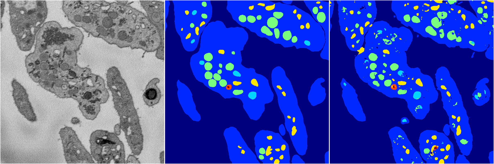
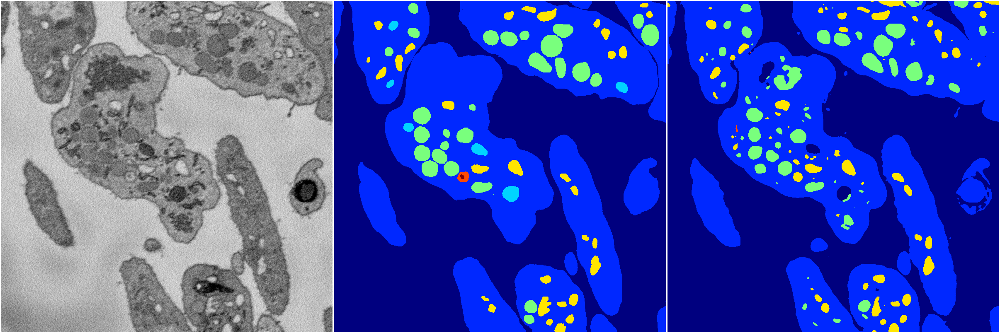
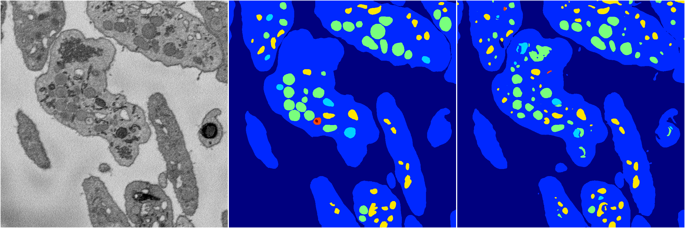
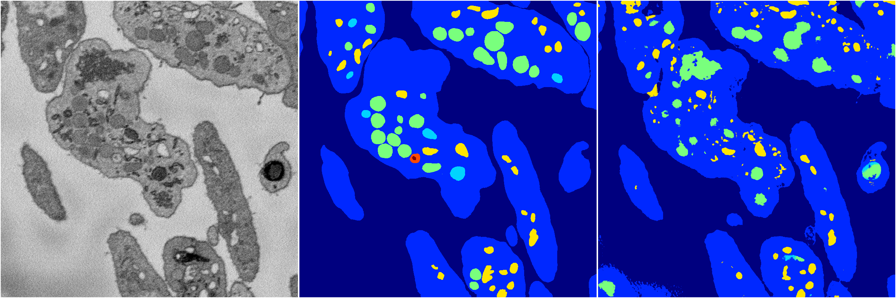
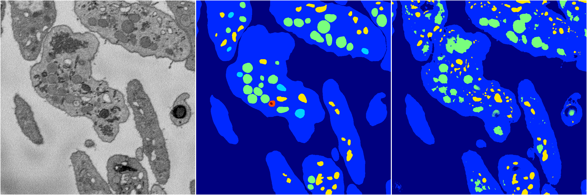

[Back](..)&nbsp;&nbsp;&nbsp;&nbsp;&nbsp;[Home](https://leapmanlab.github.io/snapshots)

---

<a href="4"><h2>random_2d_ed / 1210 / 2 / 4</h2></a>
Created 16 Dec 2018, 15:39:17

<i>Click for more details</i>

**ari**: 0.8023. **miou**: 0.5596. **accuracy**: 0.9264. **n_params**: 157031444.0000. 

---

<a href="3"><h2>random_2d_ed / 1210 / 2 / 3</h2></a>
Created 16 Dec 2018, 15:39:17

<i>Click for more details</i>

**ari**: 0.7975. **miou**: 0.4290. **accuracy**: 0.9231. **n_params**: 157031444.0000. 

---

<a href="1"><h2>random_2d_ed / 1210 / 2 / 1</h2></a>
Created 16 Dec 2018, 15:39:17

<i>Click for more details</i>

**ari**: 0.8138. **miou**: 0.4739. **accuracy**: 0.9310. **n_params**: 157031444.0000. 

---

<a href="2"><h2>random_2d_ed / 1210 / 2 / 2</h2></a>
Created 16 Dec 2018, 15:39:17

<i>Click for more details</i>

**ari**: 0.7415. **miou**: 0.3402. **accuracy**: 0.8995. **n_params**: 157031444.0000. 

---

<a href="0"><h2>random_2d_ed / 1210 / 2 / 0</h2></a>
Created 16 Dec 2018, 15:39:17

<i>Click for more details</i>

**ari**: 0.7626. **miou**: 0.3621. **accuracy**: 0.9038. **n_params**: 157031444.0000. 

---

[Back](..)&nbsp;&nbsp;&nbsp;&nbsp;&nbsp;[Home](https://leapmanlab.github.io/snapshots)

---