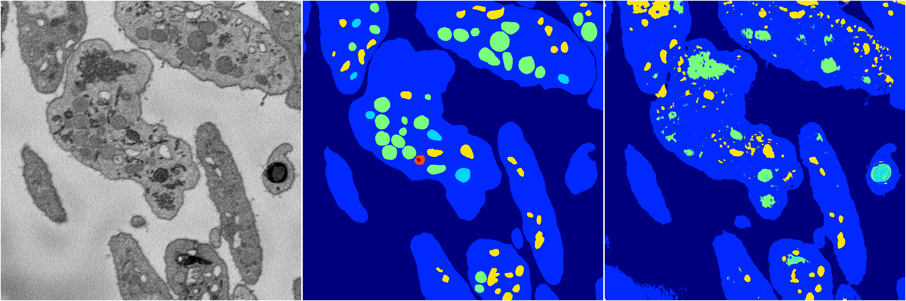
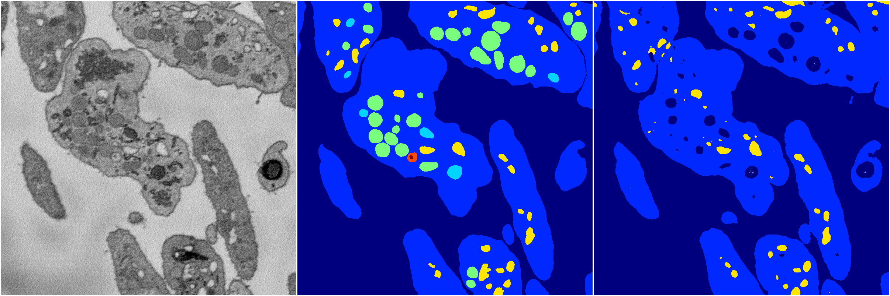
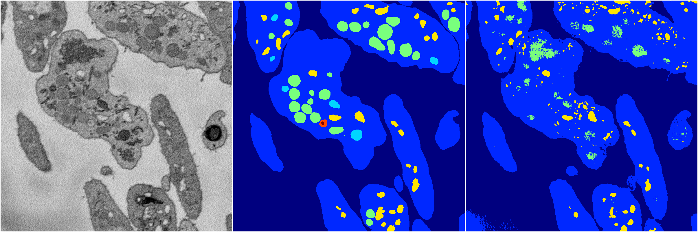

[Back](..)&nbsp;&nbsp;&nbsp;&nbsp;&nbsp;[Home](https://leapmanlab.github.io/snapshots)

---

<a href="3"><h2>random_2d_ed / 1210 / 20 / 3</h2></a>
Created 13 Dec 2018, 10:03:55

<i>Click for more details</i>

**ari**: 0.7622. **miou**: 0.4016. **accuracy**: 0.9127. **n_params**: 154377280.0000. 

---

<a href="1"><h2>random_2d_ed / 1210 / 20 / 1</h2></a>
Created 13 Dec 2018, 10:03:55

<i>Click for more details</i>

**ari**: 0.7001. **miou**: 0.3055. **accuracy**: 0.8772. **n_params**: 154377280.0000. 

---

<a href="4"><h2>random_2d_ed / 1210 / 20 / 4</h2></a>
Created 13 Dec 2018, 10:03:55

<i>Click for more details</i>

**ari**: 0.7502. **miou**: 0.3298. **accuracy**: 0.9138. **n_params**: 154377280.0000. 

---

<a href="2"><h2>random_2d_ed / 1210 / 20 / 2</h2></a>
Created 13 Dec 2018, 10:03:55

<i>Click for more details</i>

**ari**: 0.7344. **miou**: 0.3199. **accuracy**: 0.9024. **n_params**: 154377280.0000. 

---

<a href="0"><h2>random_2d_ed / 1210 / 20 / 0</h2></a>
Created 13 Dec 2018, 10:03:55

<i>Click for more details</i>

**ari**: 0.7973. **miou**: 0.4745. **accuracy**: 0.9295. **n_params**: 154377280.0000. 

---

[Back](..)&nbsp;&nbsp;&nbsp;&nbsp;&nbsp;[Home](https://leapmanlab.github.io/snapshots)

---