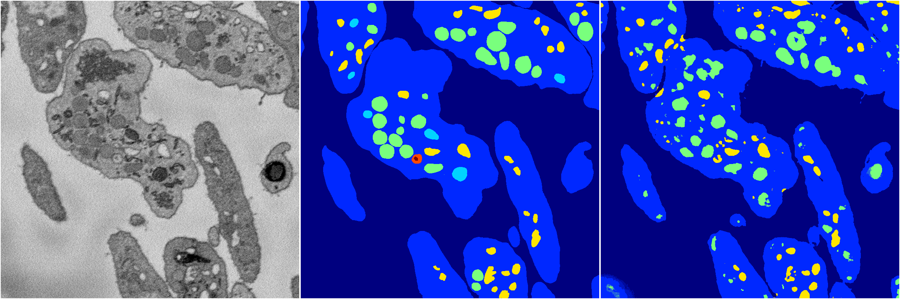
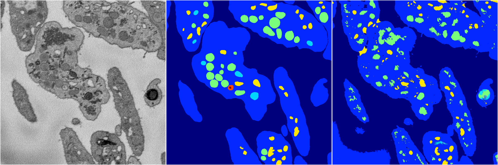
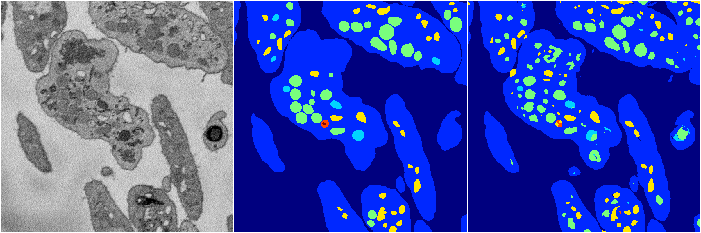

[Back](..)&nbsp;&nbsp;&nbsp;&nbsp;&nbsp;[Home](https://leapmanlab.github.io/snapshots)

---

<a href="4"><h2>random_2d_ed / 1210 / 21 / 4</h2></a>
Created 13 Dec 2018, 16:45:48

<i>Click for more details</i>

**ari**: 0.8066. **miou**: 0.4936. **accuracy**: 0.9214. **n_params**: 3965798.0000. 

---

<a href="1"><h2>random_2d_ed / 1210 / 21 / 1</h2></a>
Created 13 Dec 2018, 16:45:48

<i>Click for more details</i>

**ari**: 0.7886. **miou**: 0.5602. **accuracy**: 0.9107. **n_params**: 3965798.0000. 

---

<a href="3"><h2>random_2d_ed / 1210 / 21 / 3</h2></a>
Created 13 Dec 2018, 16:45:48

<i>Click for more details</i>

**ari**: 0.7876. **miou**: 0.3791. **accuracy**: 0.9080. **n_params**: 3965798.0000. 

---

<a href="0"><h2>random_2d_ed / 1210 / 21 / 0</h2></a>
Created 13 Dec 2018, 16:45:48

<i>Click for more details</i>

**ari**: 0.6942. **miou**: 0.3305. **accuracy**: 0.8710. **n_params**: 3965798.0000. 

---

<a href="2"><h2>random_2d_ed / 1210 / 21 / 2</h2></a>
Created 13 Dec 2018, 16:45:48

<i>Click for more details</i>

**ari**: 0.7994. **miou**: 0.5551. **accuracy**: 0.9161. **n_params**: 3965798.0000. 

---

[Back](..)&nbsp;&nbsp;&nbsp;&nbsp;&nbsp;[Home](https://leapmanlab.github.io/snapshots)

---