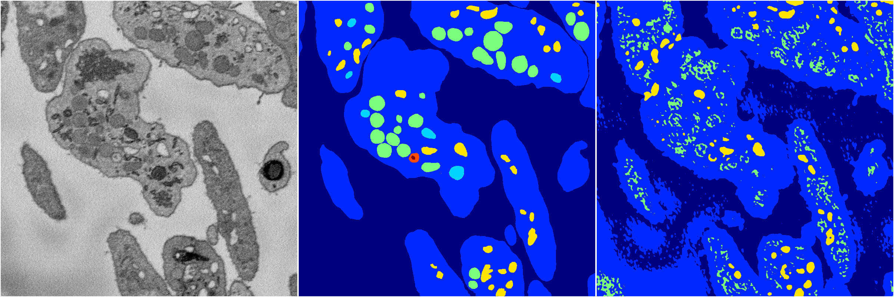
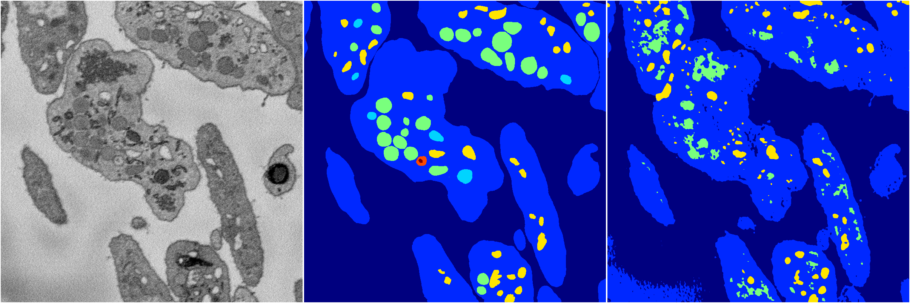

[Back](..)&nbsp;&nbsp;&nbsp;&nbsp;&nbsp;[Home](https://leapmanlab.github.io/snapshots)

---

<a href="4"><h2>random_2d_ed / 1210 / 22 / 4</h2></a>
Created 21 Dec 2018, 14:17:36

<i>Click for more details</i>

**ari**: 0.5647. **miou**: 0.2836. **accuracy**: 0.8914. **n_params**: 57430773.0000. 

---

<a href="3"><h2>random_2d_ed / 1210 / 22 / 3</h2></a>
Created 21 Dec 2018, 14:17:36

<i>Click for more details</i>

**ari**: 0.6377. **miou**: 0.3763. **accuracy**: 0.9053. **n_params**: 57430773.0000. 

---

<a href="1"><h2>random_2d_ed / 1210 / 22 / 1</h2></a>
Created 21 Dec 2018, 14:17:36

<i>Click for more details</i>

**ari**: 0.2999. **miou**: 0.2979. **accuracy**: 0.7927. **n_params**: 57430773.0000. 

---

<a href="2"><h2>random_2d_ed / 1210 / 22 / 2</h2></a>
Created 21 Dec 2018, 14:17:36

<i>Click for more details</i>

**ari**: 0.5639. **miou**: 0.3277. **accuracy**: 0.8739. **n_params**: 57430773.0000. 

---

<a href="0"><h2>random_2d_ed / 1210 / 22 / 0</h2></a>
Created 21 Dec 2018, 14:17:36

<i>Click for more details</i>

**ari**: 0.5540. **miou**: 0.3383. **accuracy**: 0.8686. **n_params**: 57430773.0000. 

---

[Back](..)&nbsp;&nbsp;&nbsp;&nbsp;&nbsp;[Home](https://leapmanlab.github.io/snapshots)

---