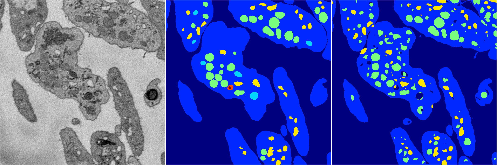
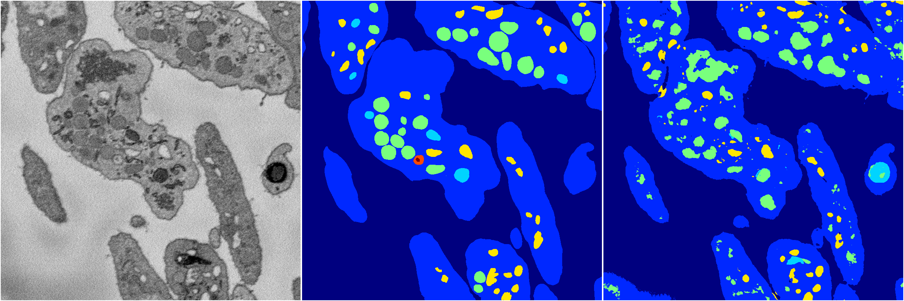
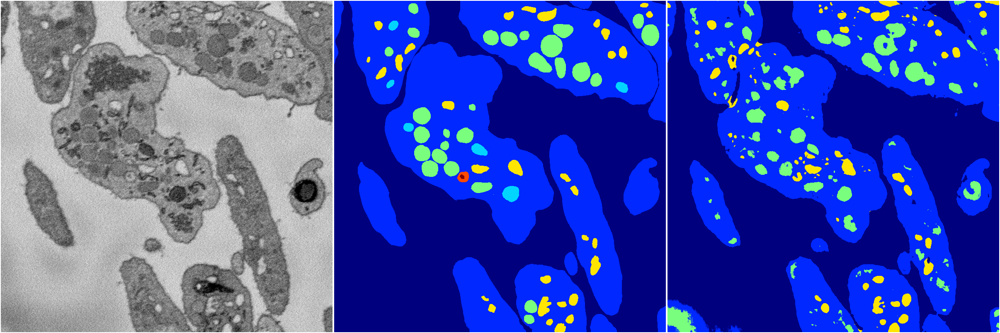
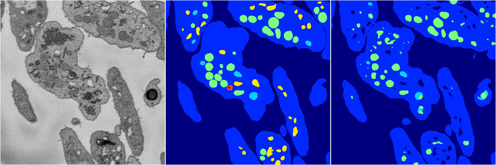
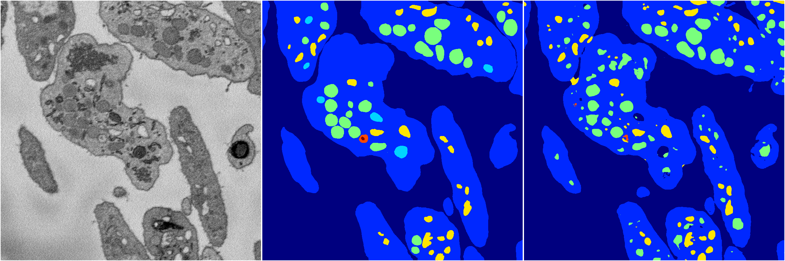

[Back](..)&nbsp;&nbsp;&nbsp;&nbsp;&nbsp;[Home](https://leapmanlab.github.io/snapshots)

---

<a href="4"><h2>random_2d_ed / 1210 / 23 / 4</h2></a>
(Created 13 Dec 2018, 09:21:58. Modified 13 Dec 2018, 09:21:58)

<i>Click for more details</i>

**ari**: 0.7643. **miou**: 0.3846. **accuracy**: 0.9000. **n_params**: 20733906.0000. 

---

<a href="3"><h2>random_2d_ed / 1210 / 23 / 3</h2></a>
(Created 13 Dec 2018, 09:21:58. Modified 13 Dec 2018, 09:21:58)

<i>Click for more details</i>

**ari**: 0.7543. **miou**: 0.3733. **accuracy**: 0.8919. **n_params**: 20733906.0000. 

---

<a href="2"><h2>random_2d_ed / 1210 / 23 / 2</h2></a>
(Created 13 Dec 2018, 09:21:58. Modified 13 Dec 2018, 09:21:58)

<i>Click for more details</i>

**ari**: 0.7723. **miou**: 0.3703. **accuracy**: 0.9008. **n_params**: 20733906.0000. 

---

<a href="1"><h2>random_2d_ed / 1210 / 23 / 1</h2></a>
(Created 13 Dec 2018, 09:21:58. Modified 13 Dec 2018, 09:21:58)

<i>Click for more details</i>

**ari**: 0.7873. **miou**: 0.3709. **accuracy**: 0.9113. **n_params**: 20733906.0000. 

---

<a href="0"><h2>random_2d_ed / 1210 / 23 / 0</h2></a>
(Created 13 Dec 2018, 09:21:58. Modified 13 Dec 2018, 09:21:58)

<i>Click for more details</i>

**ari**: 0.7909. **miou**: 0.4337. **accuracy**: 0.9126. **n_params**: 20733906.0000. 

---

[Back](..)&nbsp;&nbsp;&nbsp;&nbsp;&nbsp;[Home](https://leapmanlab.github.io/snapshots)

---