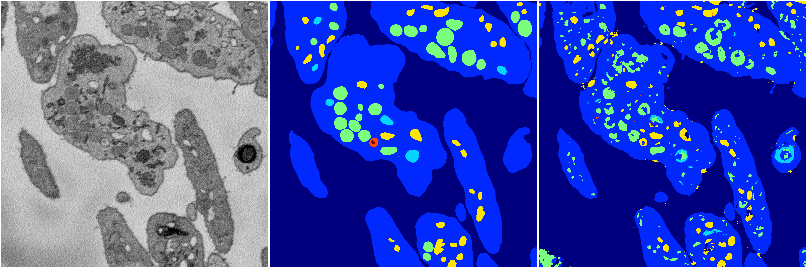
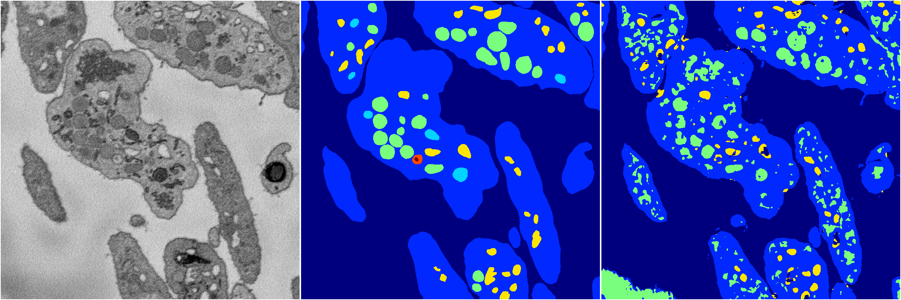
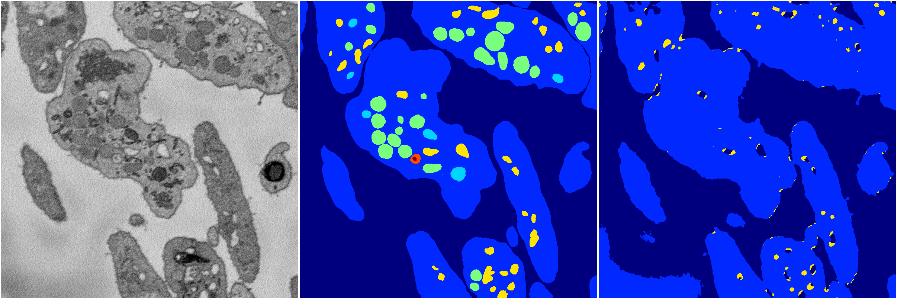
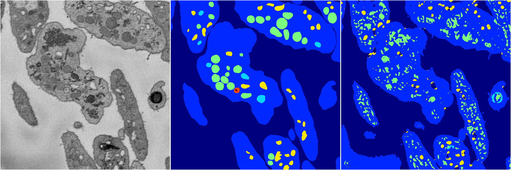
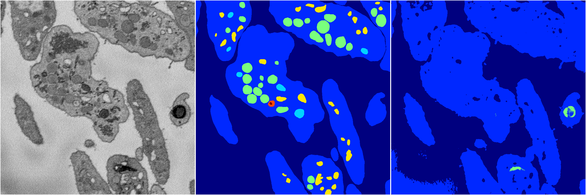

[Back](..)&nbsp;&nbsp;&nbsp;&nbsp;&nbsp;[Home](https://leapmanlab.github.io/snapshots)

---

<a href="4"><h2>random_2d_ed / 1210 / 24 / 4</h2></a>
Created 16 Dec 2018, 15:39:18

<i>Click for more details</i>

**ari**: 0.7660. **miou**: 0.4192. **accuracy**: 0.8978. **n_params**: 658000.0000. 

---

<a href="3"><h2>random_2d_ed / 1210 / 24 / 3</h2></a>
Created 16 Dec 2018, 15:39:18

<i>Click for more details</i>

**ari**: 0.7196. **miou**: 0.3530. **accuracy**: 0.8705. **n_params**: 658000.0000. 

---

<a href="2"><h2>random_2d_ed / 1210 / 24 / 2</h2></a>
Created 16 Dec 2018, 15:39:18

<i>Click for more details</i>

**ari**: 0.6665. **miou**: 0.2710. **accuracy**: 0.8731. **n_params**: 658000.0000. 

---

<a href="0"><h2>random_2d_ed / 1210 / 24 / 0</h2></a>
Created 16 Dec 2018, 15:39:18

<i>Click for more details</i>

**ari**: 0.6605. **miou**: 0.3113. **accuracy**: 0.8524. **n_params**: 658000.0000. 

---

<a href="1"><h2>random_2d_ed / 1210 / 24 / 1</h2></a>
Created 16 Dec 2018, 15:39:18

<i>Click for more details</i>

**ari**: 0.6458. **miou**: 0.2365. **accuracy**: 0.8650. **n_params**: 658000.0000. 

---

[Back](..)&nbsp;&nbsp;&nbsp;&nbsp;&nbsp;[Home](https://leapmanlab.github.io/snapshots)

---