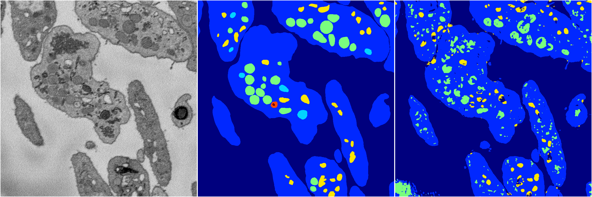
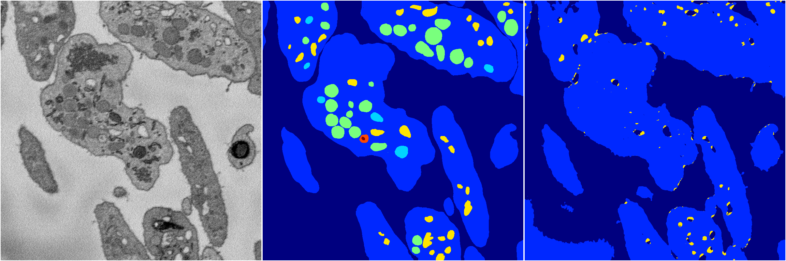
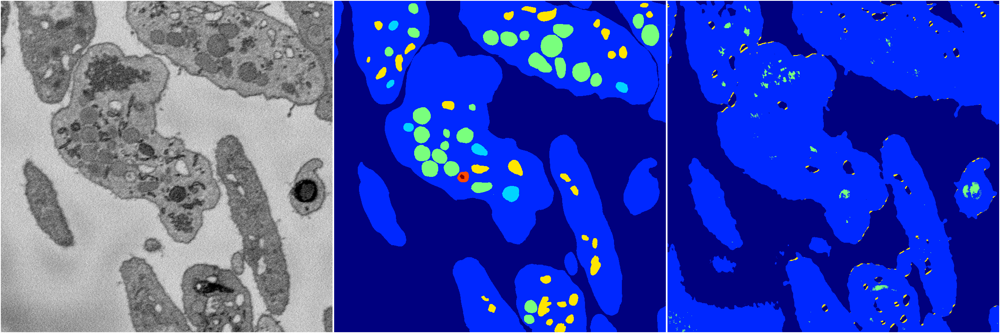

[Back](..)&nbsp;&nbsp;&nbsp;&nbsp;&nbsp;[Home](https://leapmanlab.github.io/snapshots)

---

<a href="4"><h2>random_2d_ed / 1210 / 25 / 4</h2></a>
Created 21 Dec 2018, 14:17:36

<i>Click for more details</i>

**ari**: 0.7329. **miou**: 0.3625. **accuracy**: 0.8811. **n_params**: 436660.0000. 

---

<a href="3"><h2>random_2d_ed / 1210 / 25 / 3</h2></a>
Created 21 Dec 2018, 14:17:36

<i>Click for more details</i>

**ari**: 0.7440. **miou**: 0.3506. **accuracy**: 0.8862. **n_params**: 436660.0000. 

---

<a href="2"><h2>random_2d_ed / 1210 / 25 / 2</h2></a>
Created 21 Dec 2018, 14:17:36

<i>Click for more details</i>

**ari**: 0.6693. **miou**: 0.2670. **accuracy**: 0.8729. **n_params**: 436660.0000. 

---

<a href="0"><h2>random_2d_ed / 1210 / 25 / 0</h2></a>
Created 21 Dec 2018, 14:17:36

<i>Click for more details</i>

**ari**: 0.7442. **miou**: 0.3808. **accuracy**: 0.8878. **n_params**: 436660.0000. 

---

<a href="1"><h2>random_2d_ed / 1210 / 25 / 1</h2></a>
Created 21 Dec 2018, 14:17:36

<i>Click for more details</i>

**ari**: 0.6444. **miou**: 0.2539. **accuracy**: 0.8596. **n_params**: 436660.0000. 

---

[Back](..)&nbsp;&nbsp;&nbsp;&nbsp;&nbsp;[Home](https://leapmanlab.github.io/snapshots)

---