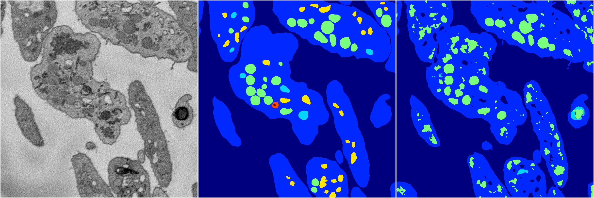
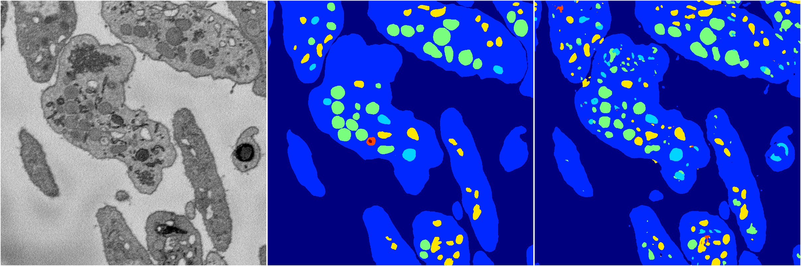
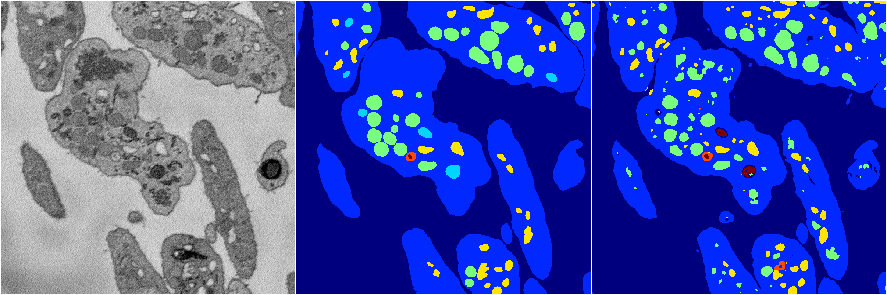

[Back](..)&nbsp;&nbsp;&nbsp;&nbsp;&nbsp;[Home](https://leapmanlab.github.io/snapshots)

---

<a href="4"><h2>random_2d_ed / 1210 / 26 / 4</h2></a>
(Created 13 Dec 2018, 09:21:58. Modified 13 Dec 2018, 09:21:58)

<i>Click for more details</i>

**ari**: 0.7215. **miou**: 0.2987. **accuracy**: 0.8733. **n_params**: 4316592.0000. 

---

<a href="3"><h2>random_2d_ed / 1210 / 26 / 3</h2></a>
(Created 13 Dec 2018, 09:21:58. Modified 13 Dec 2018, 09:21:58)

<i>Click for more details</i>

**ari**: 0.8156. **miou**: 0.5620. **accuracy**: 0.9255. **n_params**: 4316592.0000. 

---

<a href="2"><h2>random_2d_ed / 1210 / 26 / 2</h2></a>
(Created 13 Dec 2018, 09:21:58. Modified 13 Dec 2018, 09:21:58)

<i>Click for more details</i>

**ari**: 0.7967. **miou**: 0.4843. **accuracy**: 0.9165. **n_params**: 4316592.0000. 

---

<a href="0"><h2>random_2d_ed / 1210 / 26 / 0</h2></a>
(Created 13 Dec 2018, 09:21:58. Modified 13 Dec 2018, 09:21:58)

<i>Click for more details</i>

**ari**: 0.7948. **miou**: 0.4563. **accuracy**: 0.9113. **n_params**: 4316592.0000. 

---

<a href="1"><h2>random_2d_ed / 1210 / 26 / 1</h2></a>
(Created 13 Dec 2018, 09:21:58. Modified 13 Dec 2018, 09:21:58)

<i>Click for more details</i>

**ari**: 0.7917. **miou**: 0.4499. **accuracy**: 0.9126. **n_params**: 4316592.0000. 

---

[Back](..)&nbsp;&nbsp;&nbsp;&nbsp;&nbsp;[Home](https://leapmanlab.github.io/snapshots)

---