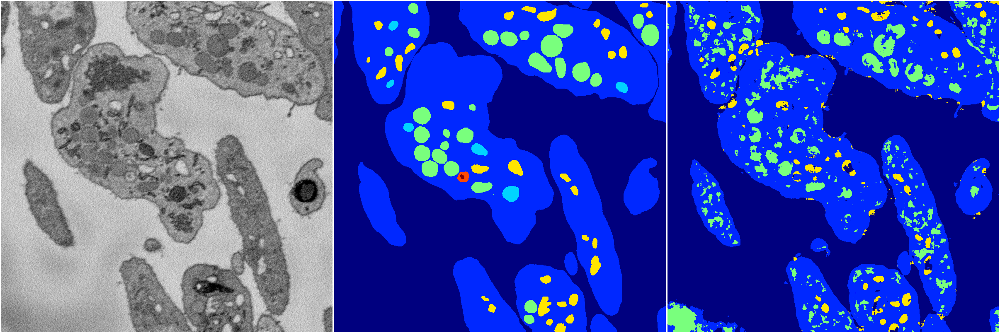
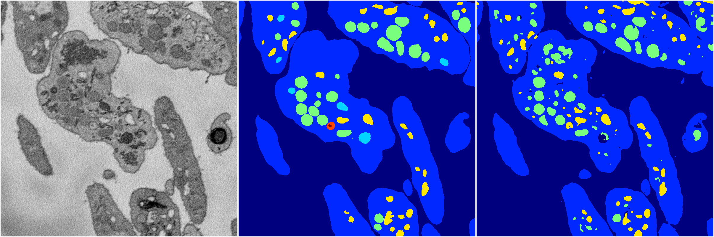
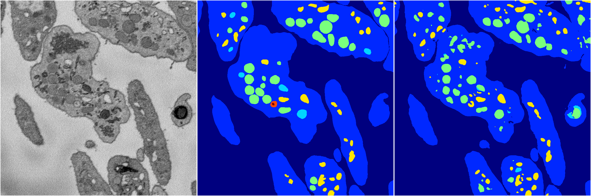
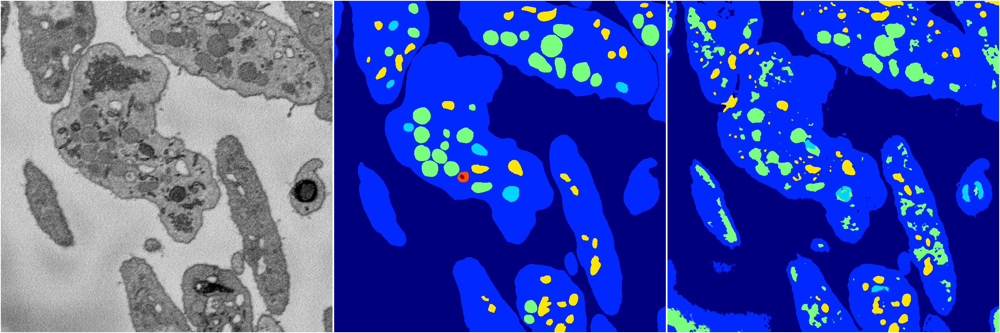

[Back](..)&nbsp;&nbsp;&nbsp;&nbsp;&nbsp;[Home](https://leapmanlab.github.io/snapshots)

---

<a href="0"><h2>random_2d_ed / 1210 / 27 / 0</h2></a>
Created 21 Dec 2018, 01:15:55

<i>Click for more details</i>

**ari**: 0.7273. **miou**: 0.3352. **accuracy**: 0.8844. **n_params**: 16314706.0000. 

---

<a href="3"><h2>random_2d_ed / 1210 / 27 / 3</h2></a>
Created 21 Dec 2018, 01:15:55

<i>Click for more details</i>

**ari**: 0.8065. **miou**: 0.3982. **accuracy**: 0.9235. **n_params**: 16314706.0000. 

---

<a href="1"><h2>random_2d_ed / 1210 / 27 / 1</h2></a>
Created 21 Dec 2018, 01:15:55

<i>Click for more details</i>

**ari**: 0.8152. **miou**: 0.4136. **accuracy**: 0.9250. **n_params**: 16314706.0000. 

---

<a href="4"><h2>random_2d_ed / 1210 / 27 / 4</h2></a>
Created 21 Dec 2018, 01:15:55

<i>Click for more details</i>

**ari**: 0.7404. **miou**: 0.3912. **accuracy**: 0.8970. **n_params**: 16314706.0000. 

---

<a href="2"><h2>random_2d_ed / 1210 / 27 / 2</h2></a>
Created 21 Dec 2018, 01:15:55

<i>Click for more details</i>

**ari**: 0.7809. **miou**: 0.4242. **accuracy**: 0.9109. **n_params**: 16314706.0000. 

---

[Back](..)&nbsp;&nbsp;&nbsp;&nbsp;&nbsp;[Home](https://leapmanlab.github.io/snapshots)

---