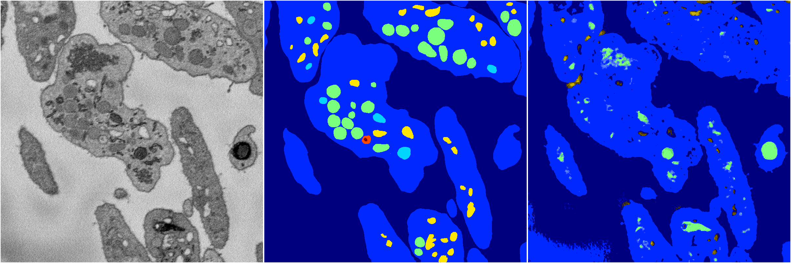
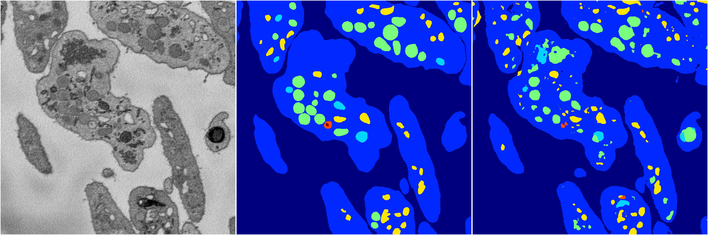
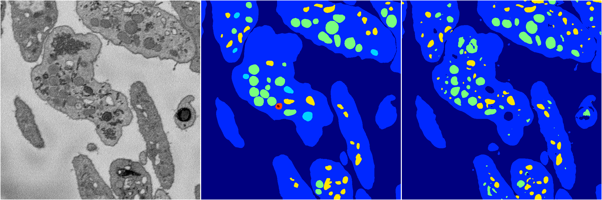
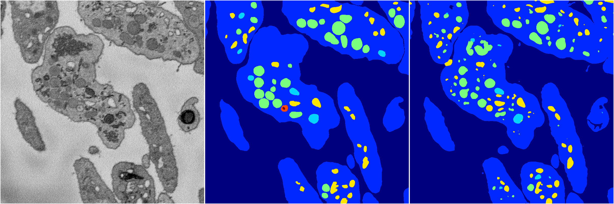

[Back](..)&nbsp;&nbsp;&nbsp;&nbsp;&nbsp;[Home](https://leapmanlab.github.io/snapshots)

---

<a href="4"><h2>random_2d_ed / 1210 / 28 / 4</h2></a>
(Created 13 Dec 2018, 16:44:47. Modified 13 Dec 2018, 16:44:47)

<i>Click for more details</i>

**ari**: 0.6482. **miou**: 0.2460. **accuracy**: 0.8652. **n_params**: 21265141.0000. 

---

<a href="2"><h2>random_2d_ed / 1210 / 28 / 2</h2></a>
(Created 13 Dec 2018, 16:44:47. Modified 13 Dec 2018, 16:44:47)

<i>Click for more details</i>

**ari**: 0.7932. **miou**: 0.4466. **accuracy**: 0.9188. **n_params**: 21265141.0000. 

---

<a href="3"><h2>random_2d_ed / 1210 / 28 / 3</h2></a>
(Created 13 Dec 2018, 16:44:47. Modified 13 Dec 2018, 16:44:47)

<i>Click for more details</i>

**ari**: 0.8022. **miou**: 0.4471. **accuracy**: 0.9233. **n_params**: 21265141.0000. 

---

<a href="1"><h2>random_2d_ed / 1210 / 28 / 1</h2></a>
(Created 13 Dec 2018, 16:44:47. Modified 13 Dec 2018, 16:44:47)

<i>Click for more details</i>

**ari**: 0.7926. **miou**: 0.4000. **accuracy**: 0.9210. **n_params**: 21265141.0000. 

---

<a href="0"><h2>random_2d_ed / 1210 / 28 / 0</h2></a>
(Created 13 Dec 2018, 16:44:47. Modified 13 Dec 2018, 16:44:47)

<i>Click for more details</i>

**ari**: 0.7972. **miou**: 0.4487. **accuracy**: 0.9241. **n_params**: 21265141.0000. 

---

[Back](..)&nbsp;&nbsp;&nbsp;&nbsp;&nbsp;[Home](https://leapmanlab.github.io/snapshots)

---