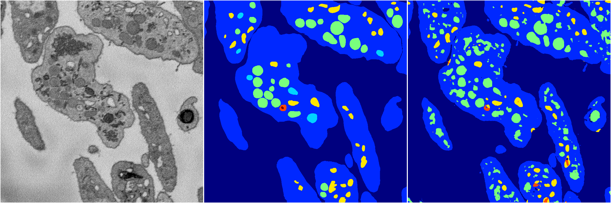
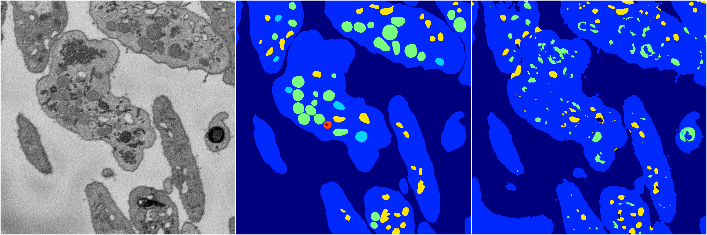
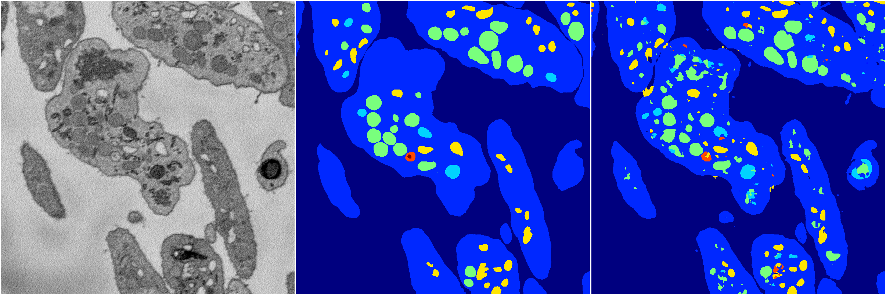
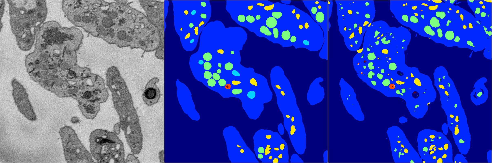

[Back](..)&nbsp;&nbsp;&nbsp;&nbsp;&nbsp;[Home](https://leapmanlab.github.io/snapshots)

---

<a href="4"><h2>random_2d_ed / 1210 / 29 / 4</h2></a>
Created 16 Dec 2018, 10:15:13

<i>Click for more details</i>

**ari**: 0.7425. **miou**: 0.3908. **accuracy**: 0.8810. **n_params**: 1002928.0000. 

---

<a href="3"><h2>random_2d_ed / 1210 / 29 / 3</h2></a>
Created 16 Dec 2018, 10:15:13

<i>Click for more details</i>

**ari**: 0.6915. **miou**: 0.3221. **accuracy**: 0.8749. **n_params**: 1002928.0000. 

---

<a href="2"><h2>random_2d_ed / 1210 / 29 / 2</h2></a>
Created 16 Dec 2018, 10:15:13

<i>Click for more details</i>

**ari**: 0.7850. **miou**: 0.4901. **accuracy**: 0.9106. **n_params**: 1002928.0000. 

---

<a href="1"><h2>random_2d_ed / 1210 / 29 / 1</h2></a>
Created 16 Dec 2018, 10:15:13

<i>Click for more details</i>

**ari**: 0.7862. **miou**: 0.4606. **accuracy**: 0.9116. **n_params**: 1002928.0000. 

---

<a href="0"><h2>random_2d_ed / 1210 / 29 / 0</h2></a>
Created 16 Dec 2018, 10:15:13

<i>Click for more details</i>

**ari**: 0.7777. **miou**: 0.5209. **accuracy**: 0.9076. **n_params**: 1002928.0000. 

---

[Back](..)&nbsp;&nbsp;&nbsp;&nbsp;&nbsp;[Home](https://leapmanlab.github.io/snapshots)

---