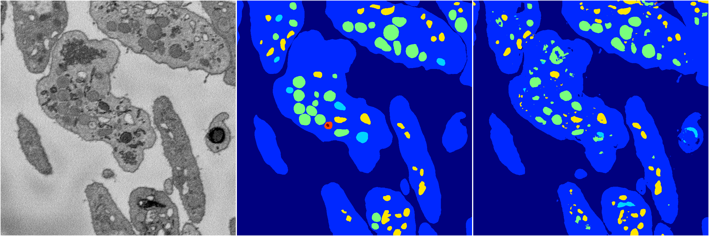
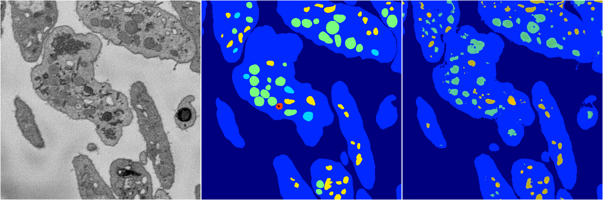
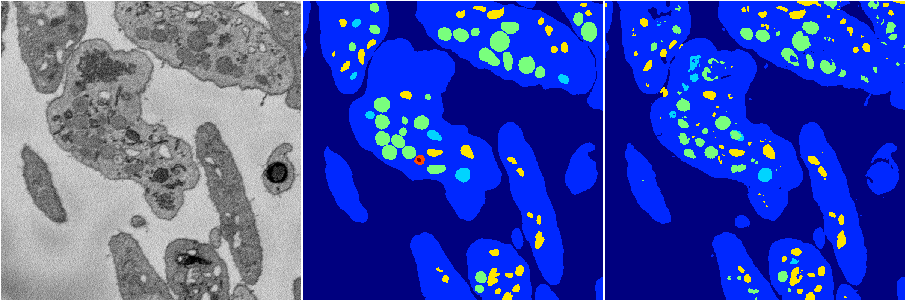
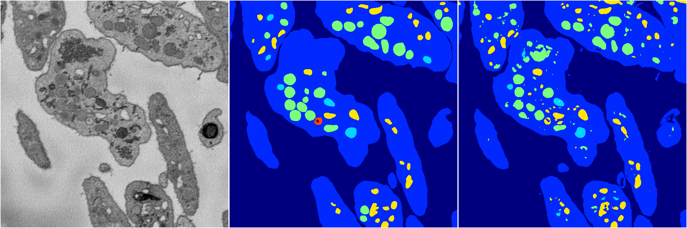
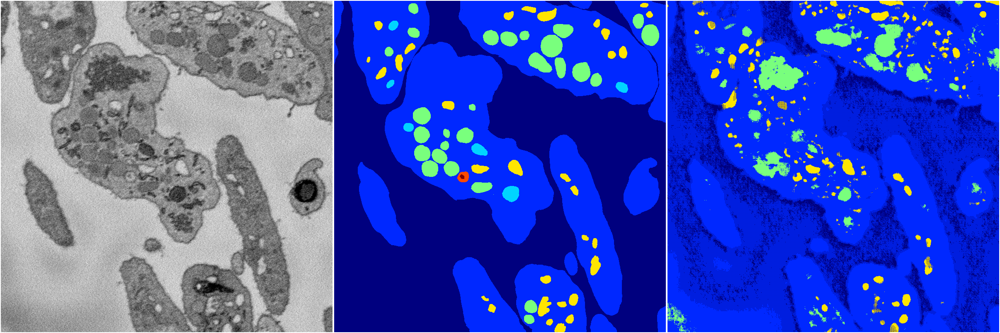

[Back](..)&nbsp;&nbsp;&nbsp;&nbsp;&nbsp;[Home](https://leapmanlab.github.io/snapshots)

---

<a href="4"><h2>random_2d_ed / 1210 / 3 / 4</h2></a>
Created 13 Dec 2018, 16:45:47

<i>Click for more details</i>

**ari**: 0.8016. **miou**: 0.4436. **accuracy**: 0.9241. **n_params**: 2874765.0000. 

---

<a href="3"><h2>random_2d_ed / 1210 / 3 / 3</h2></a>
Created 13 Dec 2018, 16:45:47

<i>Click for more details</i>

**ari**: 0.7776. **miou**: 0.3609. **accuracy**: 0.9122. **n_params**: 2874765.0000. 

---

<a href="1"><h2>random_2d_ed / 1210 / 3 / 1</h2></a>
Created 13 Dec 2018, 16:45:47

<i>Click for more details</i>

**ari**: 0.8048. **miou**: 0.4333. **accuracy**: 0.9237. **n_params**: 2874765.0000. 

---

<a href="2"><h2>random_2d_ed / 1210 / 3 / 2</h2></a>
Created 13 Dec 2018, 16:45:47

<i>Click for more details</i>

**ari**: 0.8088. **miou**: 0.4475. **accuracy**: 0.9242. **n_params**: 2874765.0000. 

---

<a href="0"><h2>random_2d_ed / 1210 / 3 / 0</h2></a>
Created 13 Dec 2018, 16:45:47

<i>Click for more details</i>

**ari**: 0.1980. **miou**: 0.2242. **accuracy**: 0.6532. **n_params**: 2874765.0000. 

---

[Back](..)&nbsp;&nbsp;&nbsp;&nbsp;&nbsp;[Home](https://leapmanlab.github.io/snapshots)

---